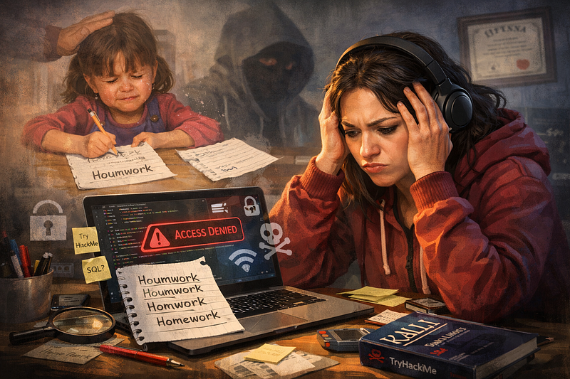

# Cybersecurity Taught Me How to Stop Taking Mistakes Personally

---

My very first day of primary school was terrible. Thirty new kids around me. A loud bell every 45 minutes. Short breaks. Tough discipline. But worse was my first day AFTER school when I was doing my first homework ever.

I still remember a poor 6-year-old girl, sitting with a brand-new notebook and writing the word *homework* for the first time in her life.

*Houmwork*

Bam. A loud ringing in my head.

It was my mum who smacked me on the head. I made a spelling mistake and she ripped the page out of my notebook — I had to start again. I wasn’t supposed to make mistakes — not in the first word, on the first page, of my first notebook.

*Homwork*

Another Bam. Another smack. Another page gone.

*Home work*

And again: third smack and minus three pages now.

Finally, exhausted, my mom grabbed the pen and wrote it for me:

*Homework*

And just like that, I memorized the spelling forever.

This is how negative reinforcement works: You make a mistake. You get punished. You try again. You get punished again. And eventually the “correct answer” appears — not because you learned it, but because someone forced it into your brain while shaming you for not knowing.

I should say this method worked because I learned it immediately and forever. But here is the real question:

Did anyone teach me how to spell it *before* punishing me?

No.

Did anyone explain it? Give examples? Help me practice?

No.

I was simply expected to know.  
 And I was punished for not knowing.

This describes precisely how I felt when I started learning cybersecurity at the age of 35.

#### **When “Cybersecurity is not for me” started**

No one was smacking me anymore.

But every time something didn’t work, I did it myself.

Bam.

Not on my head, but on my self-esteem.

Before I enrolled in a college cybersecurity Associate’s Degree programme, I took an online course where the instructor demonstrated Metasploit and explained how to set **RHOSTS** (the target) and **LHOST** (the attacker) but failed to clearly communicate the difference between R and L hosts.

So, I mixed up the IP addresses and couldn’t get a shell.

I tried again.

Nothing worked.

And immediately, my brain went to the same place it went when I was six:

I’m stupid. I can’t do this. Cybersecurity is not for me.

Eventually, I quit that course.

#### **TryHackMe made me feel the same way**

The next Bam came from TryHackMe.

First, things went well and I progressed fast. But some of the Beginner-level learning rooms exposed me to quite a similar struggle — they implied some knowledge that I didn’t have and asked to do things I had never been taught to.

I took it personally again: I am unable, stupid, incapable.

This time I started using ChatGPT to fill the gaps. It helped to explain the concepts but went into technical depth so I felt even more frustrated. It helped — but sometimes it went too deep and made me feel even more overwhelmed.

So I started asking it to explain concepts “like I’m five years old.”

And honestly… I felt like I was five years old.

#### **College didn’t fix the problem (it exposed it)**

My first college course in Network Security went well at the beginning.

I felt confident — I had some exposure already.

Then one day, out of nowhere, the professor decided to show us SQL.

And that familiar feeling came back.

I didn’t need a sound this time. I recognized it instantly.

But this time, I wasn’t alone.

I looked around the classroom and saw the same panic on other students’ faces.

The course was accelerated. The materials threw abbreviations at us without enough practice.

And yet, most students passed.

How?

We relied on ChatGPT to survive.

Did we master every abbreviation? Did we learn how to use SQL?

No.

We used AI as a crutch.

It didn’t feel right but it seemed like the only option that time.

#### **Even walkthroughs didn’t save me**

The last *Bam* came when I started using walkthroughs for the challenging rooms and still couldn’t get the flag. A couple of times I just didn’t have the same SUID exposed on a machine that the authors had. I tried three time — I just didn’t see the xxd binary and that’s why I couldn’t get the root.

It set the mindset that everybody else is way ahead of me, while I still couldn’t do the basic tasks. They just didn’t work.

#### **The question that changed everything**

Then I talked to a friend — a teacher and child psychologist.

We’ve had many conversations about childhood trauma, learning, and growth… but this one felt like a life buoy for someone drowning in the sea of doubt called “Cybersecurity”.

She asked me one simple question:

“How would you react if this was your friend in the same situation?”

I said, “I would support them immediately. I would tell them it’s not their fault.”

She smiled and said:

“You see? So why is it always your fault when it’s you?”

Great question.

She was right.

It wasn’t.

#### **My mistakes were never the real problem**

The real problem started with that first “Homework” page.

That moment taught me a rule that followed me into adulthood:

Mistakes are bad.  
Mistakes mean you’re lazy, inattentive, or not smart enough.  
Mistakes must be fixed immediately — and hidden, before someone sees how “stupid” you are.

Later in life, when I became a teacher myself, I learned something different:

Most mistakes happen because of:

- Lack of practice

- Unclear explanations

- Missing steps

- Not enough repetition

Mistakes are not proof of failure.

Mistakes are proof of learning.

I teach English to adults raised under the same system — on wherein people are terrified of making mistakes. Some of them use ChatGPT to write their homework because they don’t want to be “caught.”

And I recognize myself in them.

I always tell them:

“I’m happy when you make mistakes.”

I truly am — because if they do, it means I have something to teach them and they have somewhere to grow. We talk it through, they learn, practice and go ahead. Mistakes are great!

#### **The new mindset: not my fault — but my responsibility**

That realization helped me stop taking cybersecurity mistakes personally.

Failing a TryHackMe room isn’t proof that I’m stupid.

Getting stuck in a lab isn’t proof that I don’t belong.

Sometimes the material is confusing.

Sometimes the room is inconsistent.

Sometimes the explanation is incomplete.

That’s the good news.

But there’s bad news too:

Even if it’s ***not my fault***, it’s still ***my responsibility***.

So now I treat every failure as a discovery path.

It doesn’t work?

Good.

That means I’m about to learn something.

I will create my own way and will use all the resources available — AI, Google, Reddit, Discord groups, and even my own cybersecurity students (yes, I teach them English).

I came to a conclusion that failure to complete the challenge is much more fun, because when I simply get the flag it means that I haven’t learned anything new — I just demonstrate something I already know.

But when I fail?

That’s where the real learning begins.

