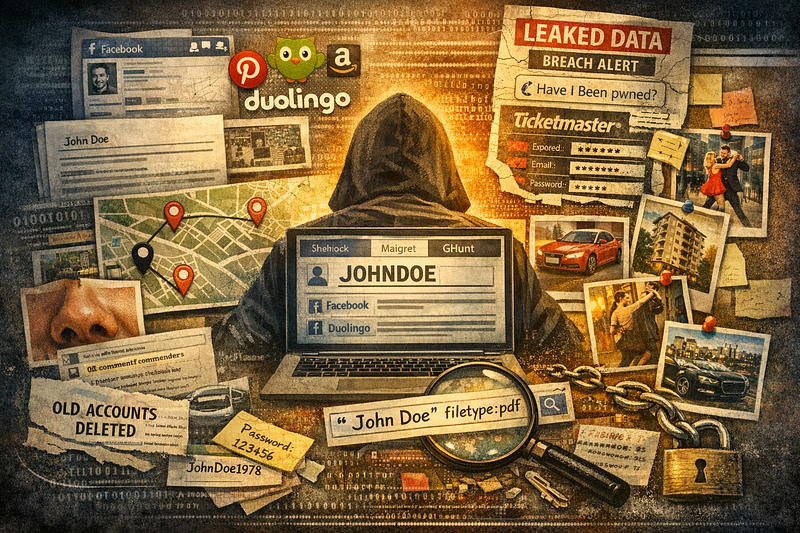
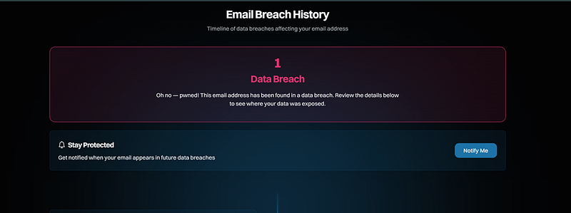

# I Tried to Find Myself Online — and Here is What Strangers Can See

---

## **I Tried to Find Myself Online — and Here is What Strangers Can See**



No hacking. No brute forcing — just a username, an email, a few OSINT tools, and Google.

In less than an hour, I found more about myself than I expected — and honestly, more than I’m comfortable with.

#### **Username that Revealed who I was (and am)**

The start was quite simple — I checked the username I’ve been using for years in Sherlock, Maigret and Holehe in Kali Linux.


```bash
python3 sherlock @johndoe
```

```text
maigret @johndoe
```

```text
holehe johndoe@email.com
```


Firstly, I found my accounts in Pinterest, Duolingo, DIY car websites and medical forums I registered more than 15 years ago. I accessed my own comments, where I complained about cutting the wrong wires while installing lights in the glove compartment of my first car and shared my own unconventional methods of dealing with chronic sinusitis… with a close-up picture of my nostrils. Thank God I didn’t photograph any other parts of my body.

What’s more, I found my account by using the same username in legal forums, Amazon, and Facebook. Before I started learning cybersecurity, I thought it’s OK to use the same username in multiple websites because it’s easy to remember. Now I look at it from a different perspective: this is all me. A single person with a consistent digital footprint. All in one place.

#### **The Quiet Language of Likes**

The next step was studying my Facebook account from an external lens. All my likes, comments and photographs were easily tracked and painted a good picture of what I like, where I lived and who I talked to online. There were a couple of dance videos, car exhibitions events which I marked as “attended” (thus revealing geolocation, time and date), ads about an apartment search which told the story about the cities I lived and replies to peoples’ comments about… the damn sinusitis!

The picture after then became even fuller.

#### **Movements and Preferences “map”**

Thirdly, I launched the tool GHunt to check everything it knows about my Google account.


```text
ghunt email johndoe@gmail.com
```


It showed an awful lot. All the reviews I left were opened, all the places I visited were marked — the reviews about doctors I liked and disliked, the reviews about the restaurants and bars I visited, the reviews about services I had performed in different cities. There was a complete map of my movements and preference which I willingly spread on the Internet myself.

#### **A Leak You Don’t Know about**

Then came something less visible, but more serious.

My email.

<https://haveibeenpwned.com/>

I checked it using Have I Been Pwned, half-expecting nothing. Instead, I found it tied to a breach involving Ticketmaster.



No dramatic moment. No notification. No clear memory of when it happened. Just the quiet understanding that my information had already traveled places I never intended.

#### **Ghosts in PDF Form**


```text
John Doe filetype:pdf
```


The last one was a Google dork search that revealed my old uni work, published in a scientific magazine about languages. This one I was actually happy to find; it was like a blast from the past. There wasn’t anything private there apart from the date, university I attended and my research supervisor’s name.

#### **Closing Doors, One by One**

I started with passwords and first changed the ones that could potentially be exposed after the TicketMaster breach. Then came logins. I logged into all of these forums and platforms I mentioned above and deleted accounts or changed my login name wherever it was possible. Each account became separate, no longer tied by convenience.

Then I turned to my Google profile and pulled it back from public view. Removed what revealed too much. Quietly reduced what could be seen.

I let go of my old habit of reusing usernames, understanding now how easily identity travels when it has a single name.

Facebook became less “out there”: I removed the people I’ve never talked to, left the groups I don’t use anymore and made it more private. Less of a window, more of a wall.

#### **Now I Look First**

It has been about a year since I discovered what I discovered and took these actions. From time to time I search for myself on purpose. Not out of fear, but awareness.

I try different paths. Different combinations. I follow the same trails someone else might follow.

Sometimes I find nothing new.

Sometimes I do. And fix it if I can.

And each time, I understand a little more about what it means to exist online.

#### The Story We Leave Behind

The truth is simple but not obvious.

I wasn’t exposed because of one mistake.

I was exposed because of many small, ordinary decisions. The kind that feels too insignificant to matter.

A username reused. A review posted. A profile left open.

Alone, they are nothing; together, though, they come together to tell a story.

I didn’t get hacked.

I just looked myself up.

And that was enough.


