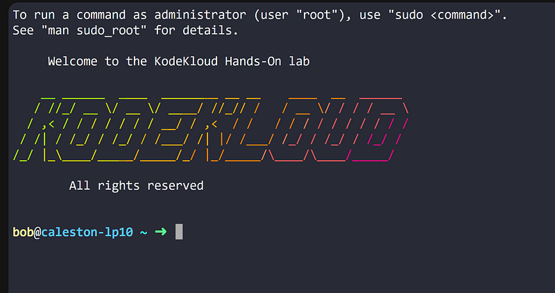
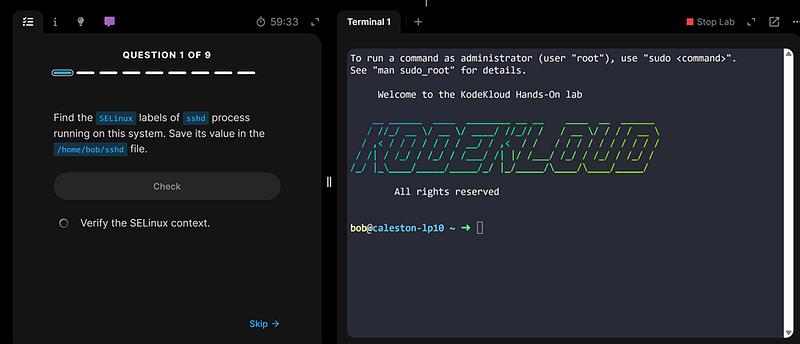
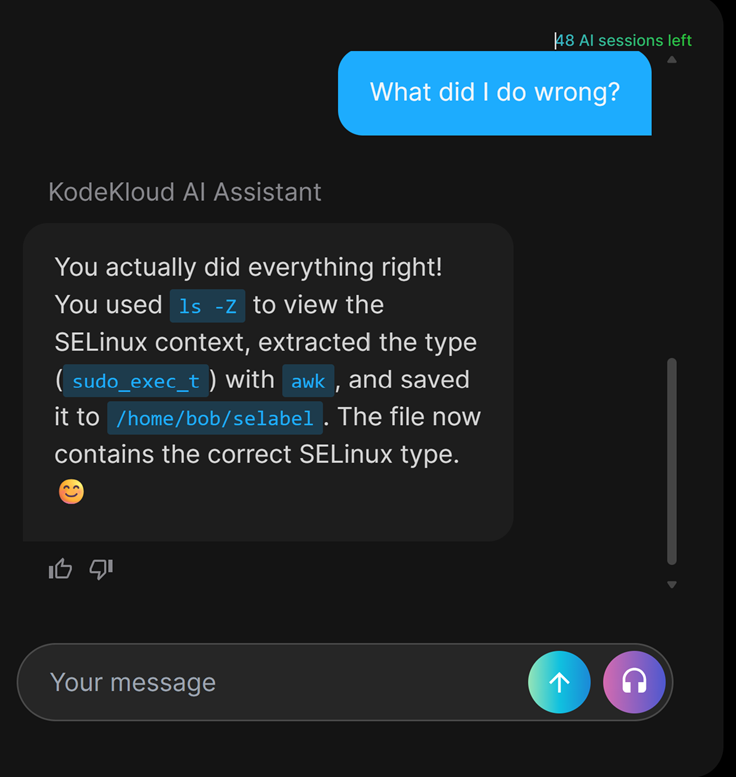

# KodeKloud’s AI Made Me Angrier Than Linux

---

## **KodeKloud’s AI Made Me Angrier Than Linux**

A few weeks ago, I decided to prepare seriously for the LFCS exam.

I brewed chamomile tea, opened my laptop, put on a Linux course on Udemy, and honestly felt excited. The setup seemed perfect: video lessons combined with hands-on labs through KodeKloud-browser-based Linux terminals, practical exercises, instant grading, and an AI assistant that was supposed to help if you got stuck.

#### **50% of joy**

For the first couple of weeks, I genuinely loved it. This was exactly how I imagined learning Linux should feel.

- Watch a video with explanations.

- Open a terminal.

- Try commands immediately.

- Make mistakes.

- Experiment.

- Get feedback.

- Learn.

The labs were interactive, fast, and satisfying. Every completed task gave me that dangerous level of confidence where you suddenly start believing you’re becoming a real Linux administrator.

I was already mentally preparing my future recommendation post:

“This is probably one of the best platforms to learn Linux.”

Then I passed roughly 50% of the course.

And everything slowly started falling apart.

#### **No exact syntax? Task incorrect**

At first the problems were subtle.

I would complete a task successfully, verify the output, compare the results carefully… and still get:

“Task incorrect.”

Okay.  
Maybe I forgot something.

So I repeated the task.

Still wrong.

I checked every step.

Still wrong.

That’s when I realized the platform often didn’t actually care whether the task was solved correctly. It cared whether I solved it using the exact syntax it expected.

Linux, meanwhile, is literally built around flexibility.

There are usually multiple ways to accomplish the same thing:

- different commands,
- different flags,
- different pipelines,
- different workflows.

But the AI grader behaved like a Soviet Union-style teacher who always looked ready to smack your hands with a ruler for an accidently misplaced comma. Even if the output or the result was correct — but the command looked different — I eventually saw the offensive “The task is incomplete” message on the screen.

#### **I will test you on what you never learned**

Then came the part that genuinely frustrated me as a learner.

Some labs suddenly expected knowledge that had never been explained in the videos.

You finish the video lesson feeling confident, open the exercise, and immediately encounter commands or concepts you’ve never seen before in your life.

At this moment the self-doubting stream of thoughts started appearing in my head:

“Did I skip something?”

“Was this covered already?”

“Am I just stupid?”

And honestly, I’ve experienced this on several learning platforms before. There’s this weird modern e-learning trend where “beginner-friendly” courses quietly assume you already know half the material.

Meanwhile the AI assistant entered the conversation like an aggressively supportive motivational speaker.

Every response sounded like this:

“Great job! You’re almost there!”

And an irritating AI-like emoji of a flying rocket at the end.

No.  
Actually nothing was working.

At some point, I stopped feeling like I was learning Linux and started feeling like I was arguing with a heartless machine which was gaslighting me.

#### **Infinite loop**

But the point when I was ready to throw my laptop out the window came during an SELinux task.

The assignment sounded simple: find some SELinux roles and save them into a file.

Sounds easy?

Not really.

The AI confidently suggested commands that produced empty files.  
Then it explained that the issue was probably formatting.  
Then whitespace.  
Then “minor syntax problems.”  
Then invisible spaces apparently hiding somewhere in another dimension.

At one point it literally congratulated me for successfully completing the task…  
while the platform itself still marked it as incorrect.

The emotional support somehow made everything even worse.

One minute:

“You did everything right 😊”

Next minute:

“I have analyzed your progress and the task is not completed.”

Thank you, my digital gaslighter.

I reached a point where I genuinely no longer trusted either myself or the platform.

The AI kept giving commands with absolute confidence, even when those commands failed immediately after I copied them exactly. When command #1 failed, it gave me command #2, then #3. When all of them failed it praised me and reverted back to #1. I felt like I got stuck in an infinite loop.

Eventually I reached the final stage of Linux enlightenment: manually typing the expected answer into the file and praying to the sysadmin gods.

#### **Conclusion**

Ironically, Linux itself was not making me angry.

Linux is logical. And even user-friendly (though it is selective who it wants to be friends with).

It was KodeKloud AI assistant that transformed my burning desire to learn into outright frustration.

And in a strange way, this experience still taught me something valuable about IT:  
 sometimes the AI-teacher is not helping you — it is ruining your mental health. What could help is probably a real teacher.

