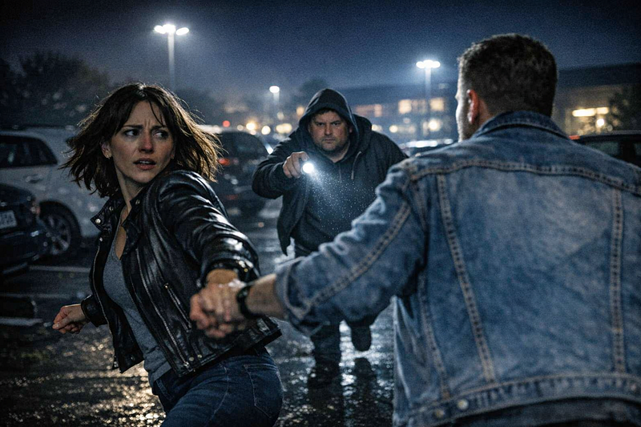
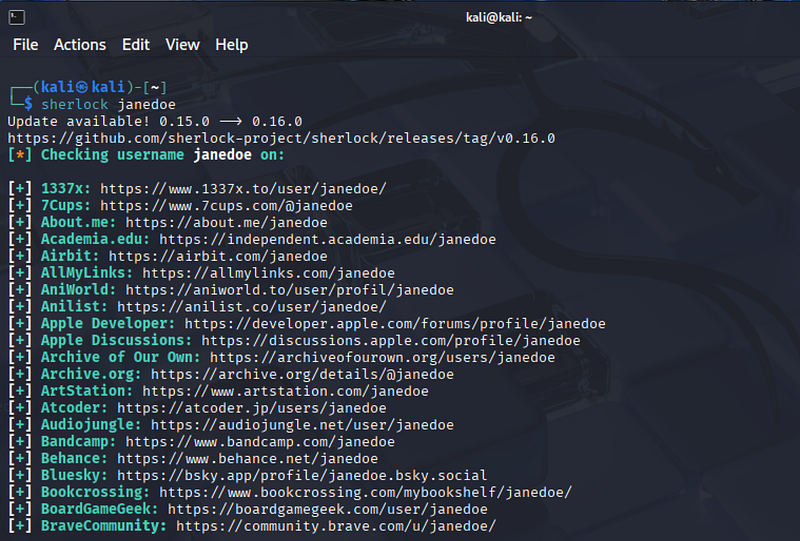
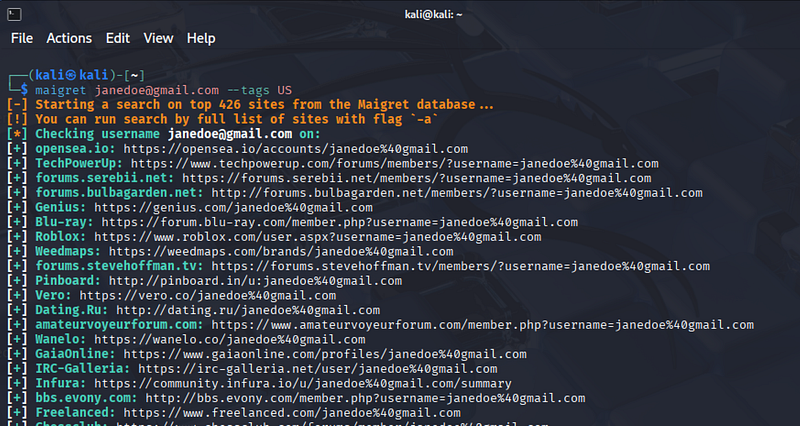
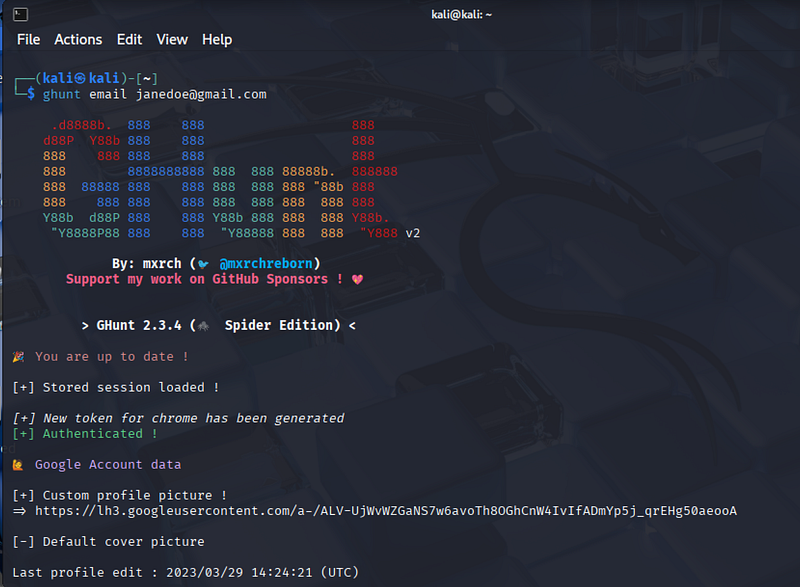

# OSINT Tricks That Revealed Everything About My Harasser

---

## **OSINT Tricks That Revealed Everything About My Harasser**



*This is a story about how OSINT helped me to learn everything about an unknown man who harassed me and my family.*

This is a story I wish I never had to tell. But my research may help others who are dealing with similar situations.

Not long ago, my husband and I moved to a new city into a quiet, community-style neighborhood. It had everything: nice facilities, a calm atmosphere, kids playing outside, and people walking their dogs in the evenings after dinner. The neighbors are also friendly and helpful. Almost perfect. Except for one person — the rotten apple.

#### **Rotten Apple — the first encounter**

I had seen him only once before everything started. We crossed paths in the driveway. I had just dropped my keys and was crouching to pick them up when I felt him watching me from a pretty close distance. As I stood up, he didn’t move — just looked straight at me and said:

> “You should keep an eye on things.”

The moment felt… off. No hello, no smile — just a weird, unnecessary warning.

I brushed it off and forgot about it.

Until six months later.

#### **When It Started**

One evening, my husband and I came back from the gym and parked our car in our usual spot. As soon as we opened the doors, the Rotten Apple appeared. He was walking towards us, visibly irritated, waving his hands and accusing us of blocking the windows of his house. We were parked in a shared lot that overlooks his place — the same spot everyone uses. Nothing unusual — multiple cars are parked there every single day.

We didn’t engage and just walked toward our house.

But he kept yelling behind, repeating the same words. We thought that he probably didn’t like the bright color of our car. Or mixed us up with somebody. Or it might be a retrograde Mercury that day. Anyway, things happen.

But that was just the beginning.

#### **The Pattern**

Three hours later the same evening, my husband was walking our dog in the opposite side of the street. Suddenly he saw him again. This time, the Rotten Apple was following him, looking aggressively and mumbling something. It was clear he knew where we live.

The next day — it happened again.

We arrived at our usual time — he was already there. Waiting. This time with a flashlight, pointed at us.

And the following day again.

And again.

At some point, it stopped feeling random. It became a pattern.

He was simply always there — appearing at the same time, walking nearby, shining the flashlight, keeping just enough distance to avoid direct confrontation.

Watching. Following. Waiting. With a gruesome look on his face. Retrograde Mercury had already been done by this point, and there was no one (and nothing) to blame anymore.

#### **The Fear and The Decision**

We started to feel unsafe.

Coming home at night became stressful. Walking the dog felt uncomfortable, even when we changed routes. There’s a very specific kind of anxiety, the anticipation of something bad happening soon — when you feel on red alert and want to make sure nobody comes to you from the back. With a flashlight. Or a knife. Depending on your luck (or lack thereof).

And the worst part was:

> I didn’t even know his name.

After a week of this, I realized I needed to understand who he was. If I couldn’t avoid him, I needed clarity. That’s when I turned to OSINT.

#### **Step 1 — Starting With an Address**

The only thing I knew was where he lived.

A simple search led me to the name of the property owner — a woman I had seen him with before. She seemed significantly older, so I assumed they were related.

#### **Step 2 — Finding the Relatives**

I Googled her and found the name of the property’s owner — probably the mother. What helped me to prove this was *an obituary*. Obituaries are often overlooked but are a real wealth of information. After a simple google search, I found an obituary of an older person with the same surname and the list of relatives who were listed as mourning the dead. This info helped me to establish a grandmother-mother-son connection and revealed my harasser’s name and surname, mentioned as “grandson”.

For the sake of privacy, I’ll keep calling him Rotten Apple and refer to his mother as Jane Doe.

Her email was surprisingly easy to find — a simple combination of her name and surname, something like:

*janedoe@gmail.com*

At that point, I expected to find at least something about him. But there was nothing. No social media, no email traces, not even a hint of his age.

Which made the situation even more unsettling.

#### **Step 3 — OSINT tools: Sherlock**

I started with Sherlock, checking whether Jane Doe’s name appeared on any platforms. I just used the username from the email.


```bash
git clone https://github.com/sherlock-project/sherlock.git
```

```bash
cd sherlock
```

```bash
python3 sherlock janedoe
```


The results were mostly noise as Sherlock gives a lot of false positives, so I had to check all pages manually.



There was only one lead which pointed me to Jane’s Pinterest page. Luckily, the profile picture showed both of them together. That was my first confirmation.

#### **Step 4 — OSINT tools: Maigret and Holehe**

Next, I ran the email itself through two more OSINT instruments: *Maigret* and *Holehe*.


```text
pip install maigret
```

```text
maigret janedoe@gmail.com
```

```text
holehe janedoe@gmail.com
```


You can check here both emails and usernames and use filters to limit your search to the US or globally. For a local search use tags:



Having checked the email and the username — janedoe — I found her Facebook, LinkedIn, and others. Before that Facebook search didn’t give me anything for my request.

From there, I carefully reviewed the profiles. There were photos, places they had lived before, everyday details.

Eventually, I found Rotten Apple in his mom’s friend list and was able to learn basic information — his age, interests, places he visited. He appeared to be 27, a single baseball lover who drinks beer, has a cat, and a cactus.

At first, everything looked completely ordinary.

#### **Step 5 — Ghunt**

Another OSINT tool that helped me is Ghunt. It identifies Google accounts and gives access to a person’s reviews, photos, last profile edit, profile picture, and even calendars (if they are public).

Keep in mind that to use the tool you will need a Gmail account. It’s better to use a fake one — just in case.


```bash
git 
clone
 https://github.com/mxrch/GHunt.git
cd
 GHunt
pip3 install -r requirements.txt
python3 ghunt.py login
```




In my case, it helped me establish the places Jane Doe and her son had visited. It turned out that the mom had left quite a few reviews about restaurants and local services, which allowed me to identify patterns in their movements and even trace their previous place of residence — Ohio.

#### **Step 6 — Court Records**

Then I decided to check local court records. I began with large databases. Examples for some states (Pennsylvania, Wisconsin, Minnesota, Massachusetts) are below:


```ruby
https:
/
/ujsportal.pacourts.us/casesearch
https:
/
/www.wicourts.gov/casesearch
.htm?utm_source=chatgpt.com
https:
/
/publicaccess.courts.state.mn.us/
CaseSearch
https:
/
/www.mass.gov/search
-court-dockets-calendars-
and
-
case
-information
```


Federal cases can also be checked here:


```bash
https://dockets.justia.com
```


Knowing the name of at least one person involved, it is easy to find relevant lawsuits. I found a couple of cases belonging to them both — Jane Does’ divorce case, her son’s speed-driving case (he pleaded guilty) and… a case that revealed the info that Jane is in debt — a local bank had sued her over missed payments on a loan. Things then became more interesting.

Next, I turned my attention to the smaller local civil court websites. The second one was a hit: I found a lawsuit involving Rotten Apple. I downloaded all 230 documents that appeared in the search that were related to the case and asked AI to analyze them. It revealed a ton of interesting things, including personal information of multiple neighbors. Quite fascinating how in the US you can find this info in an open source.

So, what I found was that he had filed claims against several people living in the same area, all related to incidents with their dogs. The documents described physical injuries, psychological distress, and many more. As a result, Rotten Apple asked the neighbors for significant compensation — $70,000 in damages.

Wow!

> I thought it was quite an interesting way to help settle your mom’s unpaid loans.

It also mentioned that the plaintiff (Rotten Apple) developed a couple of diagnoses, allegedly as a result of the battle with his neighbors and their dogs. Some of these medical reports looked quite serious.

#### **Step 7— Psychological Profile**

Altogether, the info I found painted a clearer picture: a single man with a tendency to drink (multiple pictures with beer), often in conflict with neighbors, with a record of impulsive behavior (speed driving), psychological problems (all diagnoses from the lawsuit), financial (bank lawsuit) and psychological stress (parents’ divorce) at home.

Things became clear, but I wanted to dig deeper. Using the names from the case, I was able to find some of the people involved and speak with them. That helped me understand that what we were experiencing wasn’t unique. We were all in the same boat.

Something had to be done.

#### **The Outcome**

By that point, I had:

- clear identification,
- background context,
- court records,
- and multiple pieces of video evidence from our side how Rotten Apple was chasing and yelling at us.

My suspicion was that he wanted us to be involved in a potential fight with him and tried to provoke us in order to sue us later. The info I discovered and the talks with the neighbors helped me not to fall for it.

We decided that we already had enough to take legal action ourselves and to strike first by filing the complaint to the HOA and the police for harassment.

#### **Final Thought**

OSINT is often associated with cybersecurity, investigations, or research. But sometimes, it becomes something much more personal.

> Sometimes, it’s simply a way to feel safe again.

If you know other OSINT tools or techniques that could help in situations like this, I’d genuinely love to learn more.


