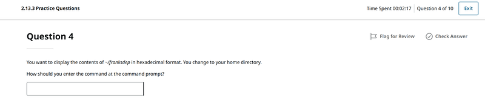
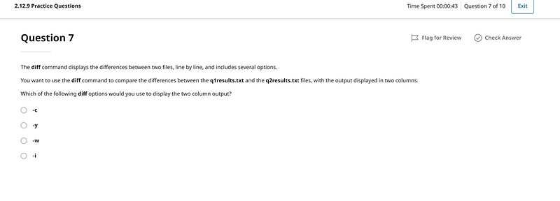
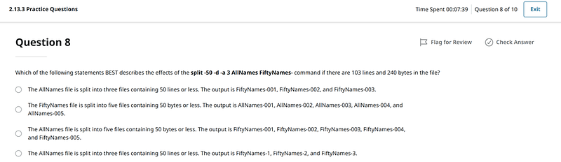
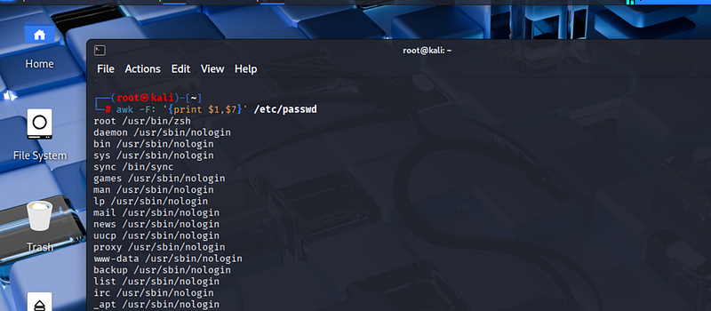

# CompTIA Linux+ vs. Real Linux: Where Did the Multiple-Choice Questions Go?

---

As an English teacher, I know the difference between learning vocabulary and learning a language. I have seen students memorize rules, pass school tests, and still struggle to speak. And now, sitting on the other side of the desk as a student myself, I suddenly recognize the same pattern — this time, not with English, but with Linux.

I am currently taking a college course (CMSC253) which is based on CompTIA Linux+. On paper, everything looks fine. The syllabus is clear. The topics are solid. The exam is industry-recognized.

But very quickly, that familiar feeling — the difference between learning words and learning a language — returns.

#### **I will test you on something you never learned**

As the chapters unfolded and my progress within the course reached 20%, I slowly realized that Linux+ is mostly theory, with occasional labs that we should treat as a bonus. Some sections throw a list of commands with flags on you and then immediately give you multiple-choice or fill-the-gap questions.

Example:

In one question, they ask you to display the content of a file in **hexadecimal format**. Yes, they did teach you how to do it in a previous section. The problem is that they didn’t explain **what hexadecimal format is** or **why on earth a Linux user may need it**. It feels like pure memorization without understanding — **similar to being taught a grammar rule in English without ever hearing it used in real speech.**

One more example: completely new info that suddenly appears in Practice Questions at the end of the chapter:

The question is — how am I suppose to know it if you never taught it?

#### **Linux+ vs. Real Life**

Linux+ feels controlled and final. You get one attempt, one “correct” answer, and then you move on. There is no space for hesitation, no room to explore, no chance to be wrong in a meaningful way.

Real Linux is the opposite.

You open the terminal. You type a command. It fails. You fix the syntax. It fails again. You try another flag. Something changes — not necessarily success, but a different error, a different response. And slowly, through repetition and friction, understanding begins to appear.

That difference matters. Linux+ questions are often too theoretical and too specific. They encourage memorization: learn it, pass it, forget it — because chances are, you won’t use it again in exactly that form on a day-to-day basis.

This realization made me wonder whether I was just being nitpicky — were things really that bad? Maybe I was approaching the course the wrong way. That’s when I came across a blog post on Medium written by someone who had taken and actually passed the **CompTIA Linux+** exam. She described getting stuck at a certain point, not because the material was too difficult, but because she started memorizing answers to specific questions, not understanding actual content. Literally, the answer to this *exact* question is always *B.* It impeded her progress.

Reading that felt uncomfortably familiar.

These MCQs didn’t teach me anything apart from the fact that the answer to #6 is *B* and #8 is *A* — simply because repetition made the letters stick.

#### **How Did I Survive and Actually Succeed in This College Course?**

I have my Kali Linux installed on Virtual Box, where I went and practiced each command on my own. I made mistakes, tried different flags with the commands they taught, and played with syntax. I saw how it actually worked on a real machine and what the response is if you make a mistake or change a flag.

That was the moment when learning finally started to feel real.

The whole experience reminded me of English classes at school vs. English classes with a tutor.

At school we learned to translate and distinguish Present Perfect from Present Perfect Continuous. I thought I was smart because I was on the top of the class and had all As. When I went abroad the first time and faced English-speaking people it was a revelation — I couldn’t even ask them a question because… I kept translating from my language into English and couldn’t understand how to speak.

When I turned 25, I hired a personal tutor who taught me how to speak and stop translating. We had to start from the alphabet because I couldn’t spell my name properly — I always mixed up A and E.

And that’s when it clicked:  
 maybe learning Linux required the same approach.

Around the same time, I started looking into other certifications and came across **LFCS**. What immediately caught my attention was that it is **not multiple-choice at all**. It is purely practical. You are given tasks and a real system, and you have to actually *do* things — not recognize the right letter.

That idea resonated with me deeply.

I don’t know yet if LFCS is the right next step for me, but the learning philosophy behind it feels much closer to how I believe real learning works — whether it’s a language or an operating system.

If you’ve taken **LFCS**, or if you have recommendations for **hands-on, practical Linux certifications or learning paths**, I’d genuinely love to hear your experience.

#### **On the Bright Side**

To be fair, Linux+ isn’t useless. Some parts of the course genuinely helped me later — even if I didn’t realize it right away.

The sections on configuring users and groups, for example, stuck with me. At the time, they felt abstract and a bit rushed. But later, when I was doing CTFs on TryHackMe, I suddenly recognized the patterns. Things that had once felt like dry theory started to make sense in practice, especially when it came to understanding privilege escalation vectors.

Still, that understanding didn’t come from the course alone. I had to practice on my own, break things, and ask questions — lots of them. I often turned to ChatGPT and asked for clarification and additional info in plain English, without unnecessary terminology or “fancy” words. That combination — some structure from Linux+, real experimentation on my own + ChatGPT practical examples — is what finally helped the pieces fall into place.

Linux+ gave me vocabulary, and that has value. But real learning started only when I practiced, made mistakes, and let the system respond honestly. Errors, silence, and unexpected output taught me far more than any multiple-choice question ever could.

As an English teacher, I’ve seen this pattern for years. Now, as a Linux learner, I’m living it myself.

