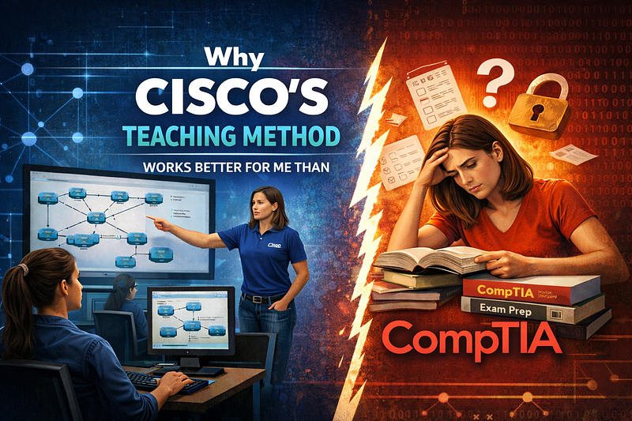

# Why Cisco’s Teaching Method Works Better for Me Than CompTIA

---

## **Why Cisco’s Teaching Method Works Better for Me Than CompTIA**

*An ESL teacher’s perspective on Cisco labs, repetition, and why smaller lessons with loads of practice work better than information overload.*

Many IT courses look the same: long technical videos, a boring whiteboard, lots of explanations and only a small amount of practice which never gives you a real chance to understand how it actually works.

Every time I took CompTiA+ courses, such as A+, Linux+ or Security+, I felt that I was not fast enough, not smart enough, not technical enough, and in general… not enough enough. In reality, the problem was not always the student. Sometimes it was the way the material was being taught.

If I had a choice, I would probably use Udemy or YouTube, where many instructors structure their lessons clearly and easily. But in college, students have no choice — they must complete the official CompTIA-based curriculum. What remained was teaching myself much of the material outside of class.

## **The CompTIA learning struggle**

Having taken A+, Security+, and Linux+, I noticed that the structure of all three courses is very similar. Each course is divided into 15–17 modules, with several subchapters inside each module. The typical format looks like this:

- A video explanation next to a white screen

- A large amount of theory and commands introduced quickly

- A walkthrough section

- A couple of labs

- Multiple-choice “Practical Questions” — even though they are purely theoretical

The walkthroughs and labs are usually the most helpful part. However, by the time you reach them, you may already feel overwhelmed by the amount of new material presented beforehand.

Even for fast learners this is simply not how material should be taught if you want students to succeed.

## **A Teacher’s Perspective: Why This Is Hard**

As a Cambridge-certified ESL teacher with a M.A degree and over ten years of teaching experience, I learned two important rules about how people learn:

***Less is more.******Repetition is the mother of learning.***

In other words, if you want your students to actually learn something and use it in practice, each lesson should consist of no more than 3 topics, contain lots of practice and constant repetition. That’s a golden standard that all humans learn by even without realizing it.

Imagine teaching a child how to use a fork.

You give the child a fork and show him/her how to use it. They try. They drop it. They “feed” their clothes, ears and the dog’s water bowl. They try again. With daily practice, constant mistakes, and repetition, in 3 months they become seasoned fork users. Hooray!

Now imagine a different approach.

First, someone explains to a child the history of the fork. Then they describe different types of forks. Then they show silver forks, plastic forks, dessert forks, oyster forks, and five different ways to hold them. By the time the child finally receives a fork to try using it, they are already in tears.

Then they try once. It fails. They try again. Still no success. They try the third time — this stubborn cucumber piece is almost on the pin… Almost… One more time… and… Suddenly the teacher says:

“Time is up. Let’s move on to the next topic — chopsticks.”

The result is obvious — a floor-rolling munchkin refusing to touch any cutlery ever again.

This is very similar to how I felt with all the CompTIA courses I’ve taken. Even though I mostly avoided accelerated IT college courses, the time to learn was never enough and the pace almost always felt insane.

## **What helped me to survive CompTIA courses**

For A+ I got a present from my beloved husband in a form of a Raspberry Pi. I assembled it myself and configured some basics without instructions. Intentionally. It was a miniature experience of building my own computer in the 2000s which helped me to recall my long-forgotten childhood memories.

The best way to learn for me has always been through touch. I like to touch things, examine them, feel them, and yes, occasionally break them. Yes, I am rubbish at remembering names of the cables and number of pins the slots have, as A+ asks you to. But I was wondering if I even need to remember it if I could assemble a desktop computer without this knowledge?

To truly understand Linux+ and Security+, I had to practice outside of the course itself.

I set up Kali Linux on my own virtual machine and began experimenting. I created users and groups, changed permissions, locked accounts, deleted files, and configured services.

I also installed several additional machines: Metasploitable, Ubuntu, and others. I connected to them using Telnet and SSH, tried to secure them, and — of course — occasionally broke them.

At one point I reinstalled Linux three times while struggling with VirtualBox Guest Additions. I even had a small midnight existential crisis with a glass of cider. I thought I would never understand how to configure it. But I did.

Because being a teacher helped me here. I knew that repetition and hands-on experimentation were essential. The more you repeat — the better. And there is no point in moving to the next topic until you master the previous one, unless you want to forget it as soon as you pass your exam. I don’t.

Other resources that helped included YouTube videos, Udemy courses, and a Linux IPTV course I bought from Etsy for 5 bucks. It appeared to be the best investment of my life.

## **Why Cisco felt different**

After my experiences with CompTIA-based courses, I was skeptical about the Cisco networking course I had to take for my AAS degree. But Cisco pleasantly surprised me.

First, the course was completely free, while many CompTIA courses cost around $200 even with a student discount.

Second, the structure felt different: they always start with the paragraph explaining why the topic matters and drawing analogies which are simple and visual, like comparing subnetting to cutting a pie, or communication protocols to sending an email.

Most importantly, Cisco provides many hands-on labs.

Students can download the labs and repeat them offline as many times as they want. There is no expiration date and no strict limit on attempts.

Finally, they give you lots of practice on the same commands and syntax check exercises. If you get stuck, you can reveal the correct answers and try again. By the time you finish the course, you will have repeated the same configuration commands so many times so you will be able to do it with your eyes closed.

The only drawback I saw with Cisco is that it’s not vendor-neutral. Some of the materials naturally promote their products and technologies. However, these campaigns are quite subtle and do not impact learning.

## **Conclusion**

All in all, both CompTIA and Cisco are necessary evils to acquire an AAS cybersecurity degree in an American college. However, from a teaching perspective, I feel that Cisco’s methodology is more effective because it is more student-friendly. Smaller lessons, frequent practice, simple wording and repeated labs help to crystalize concepts better.

It is also quite obvious that CompTIA has strong agreements with educational institutions, which is why many programs are built around their materials. From a business standpoint, this is a great strategy for the company. But not so great for future IT specialists who often end up outsourcing help or turning to AI to work through theoretical overload and unnecessarily long-winded explanations.

