# Packed Light TryHackMe walkthrough

---

**Day 4** of TryHackMe’s Hacker Holidays challenge focuses on network forensics. We’ll investigate a packet capture, analyze a suspicious Python script, uncover a covert communication channel, and recover the hidden flag.

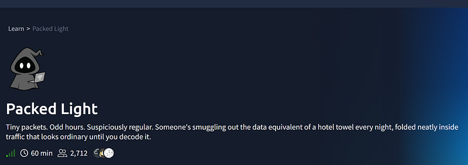

## Step 1: Look at the HTTP requests

After downloading the task files, we can see that the challenge provides a Wireshark packet capture (`.pcapng`). Since we're looking for data being sent over the network, the easiest place to start is by examining the outgoing HTTP requests. Apply the following Wireshark filter:


```text
http.request
```


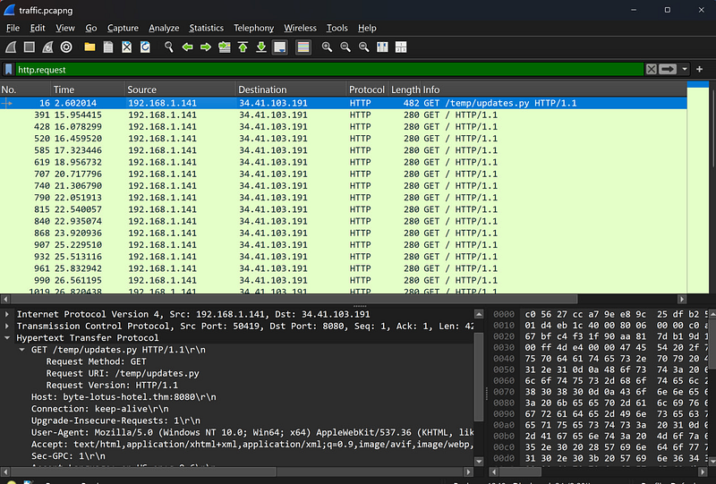

As we can see, packet#16 clearly stands our — it contains a Python script (updates.py) which is suspicious.

Let’s export it. Proceed with File > Export Objects > HTTP.

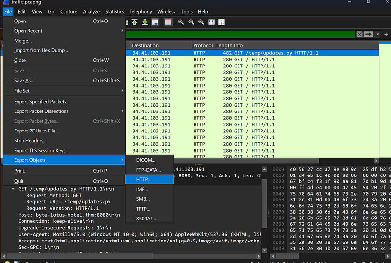

I saved the script on my Desktop and opened it in VS Code to study.

## Step 2: Read the script

Inside the script you’ll find

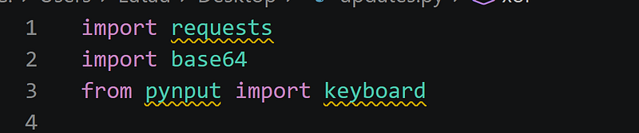

This already tells us a lot:

- `pynput.keyboard` captures keyboard input.
- `requests` sends HTTP requests.
- `base64` encodes data.

Scrolling down we can see where the data is hidden:

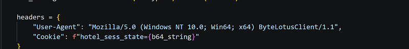

**Covert channel:**


```css
HTTP Cookie 
header
hotel_sess_state
```


## Step 3: Determine how the data is encoded

A few lines above you’ll find:

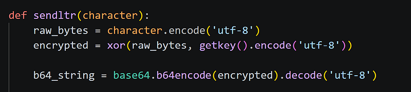

This tells us that every character is processed like this: Original character > XOR > Base64 > Stored inside the cookie header. Therefore, to recover the original text we must reverse the process: Cookie > Base 64 > XOR > Original

## Step 4: Extract the cookies

Return to Wireshark.

Every HTTP request after downloading `updates.py` contains a Cookie similar to:


```text
Cookie: hotel_sess_state=HA==
```


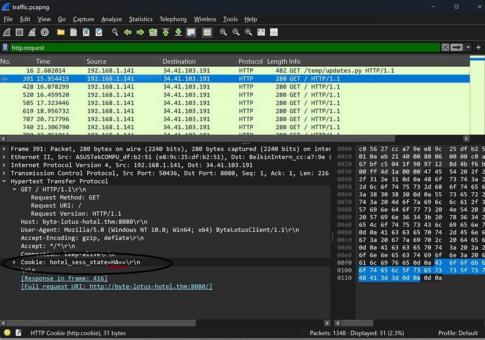

To see it, starting from packet 391, you need to expand Hypertext Transfer Protocol. The first value is HA==

Now, expand the next packet:

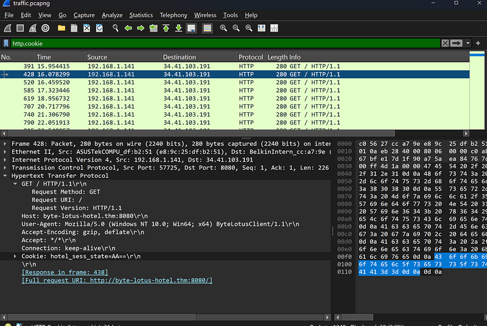

The value is AA==

Move to the next one until you collect all values. I saved them all in my notepad

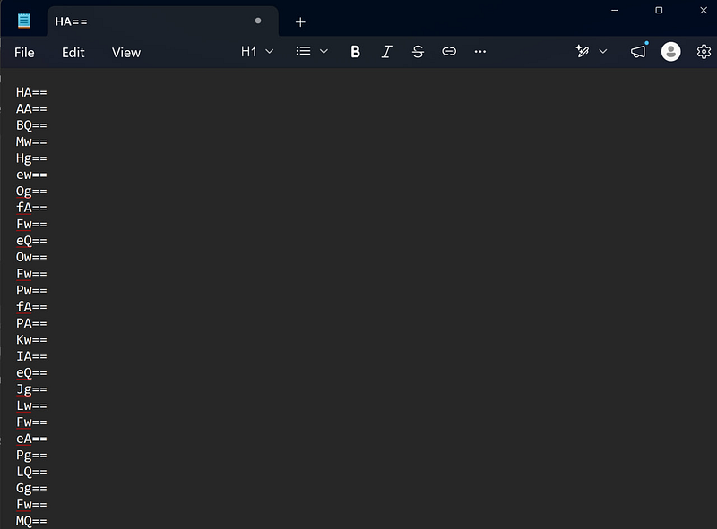

## Step 5: Decode Base64

Paste the values into CyberChef and apply:


```text
From Base64
```


At this point you **will not** see readable text.

Instead you’ll get strange symbols or control characters.

This is expected.

Why?

Because the data is **still XOR-encrypted**.

Remember the order used by the script

## Step 6: Find the XOR key

Go back to the script and you will find the key there:

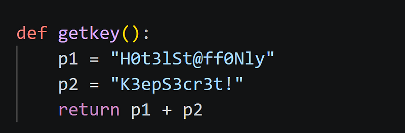

The key is:


```text
H0t3lSt@ff0NlyK3epS3cr3t!
```


## Step 7: Decryption

As you can see, I copied all the characters and put the key there choosing UTF-8 as the script reveals. It didn’t work

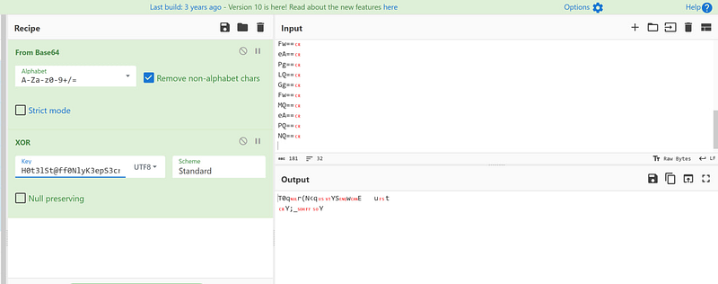

But knowing the THM flag structure I noticed that the first letter was H > T. probably THM? I kept reducing they key until only the first letter was remaining. And it worked!

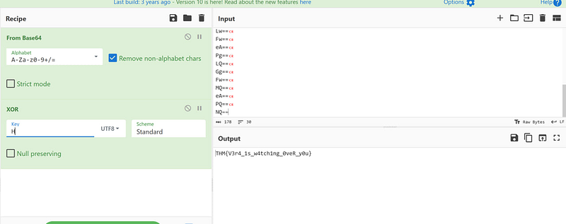

If you haven’t read my previous walkthroughs, you can find the solutions for [**Day 1**](day-01-the-concierge-knows-too-much-tryhackme-walkthrough.md) , [**Day 2**](day-02-room-404-tryhackme-walkthrough.md) and[**Day 3**](day-03-complimentary-tryhackme-walkthrough.md).

