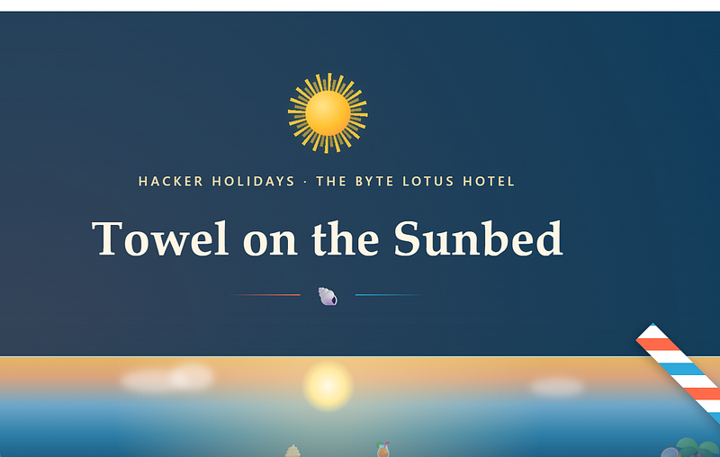
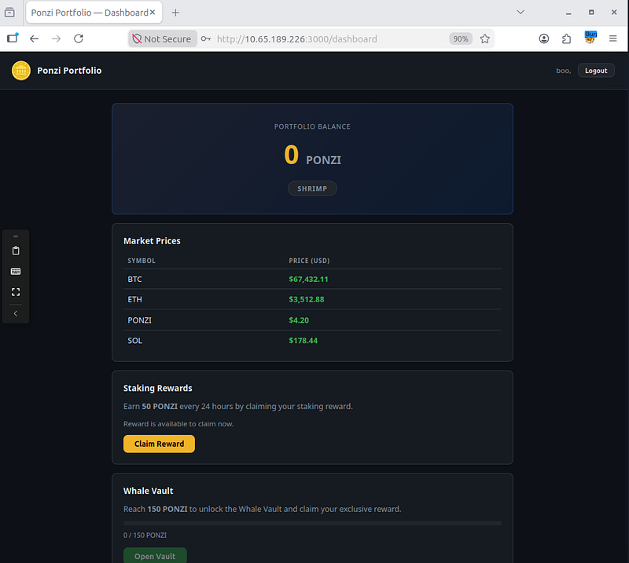
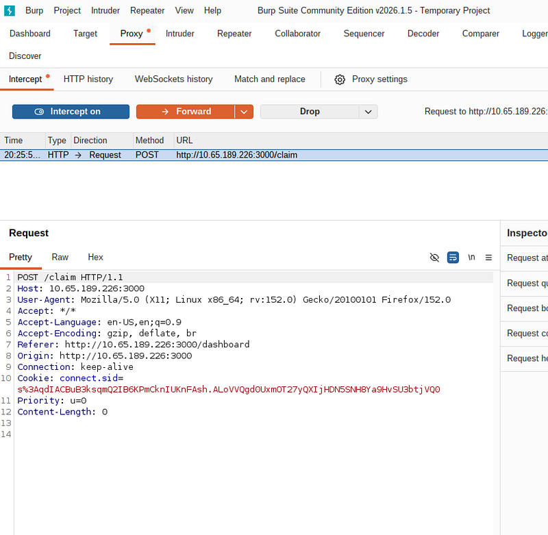
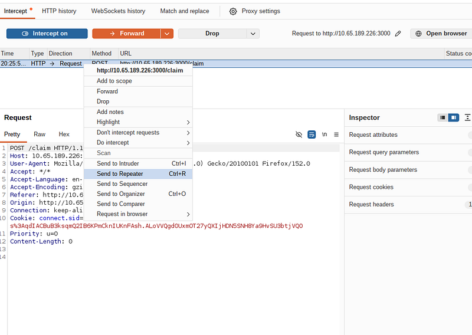
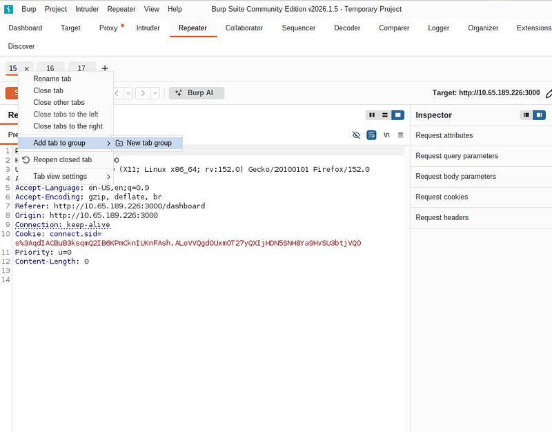
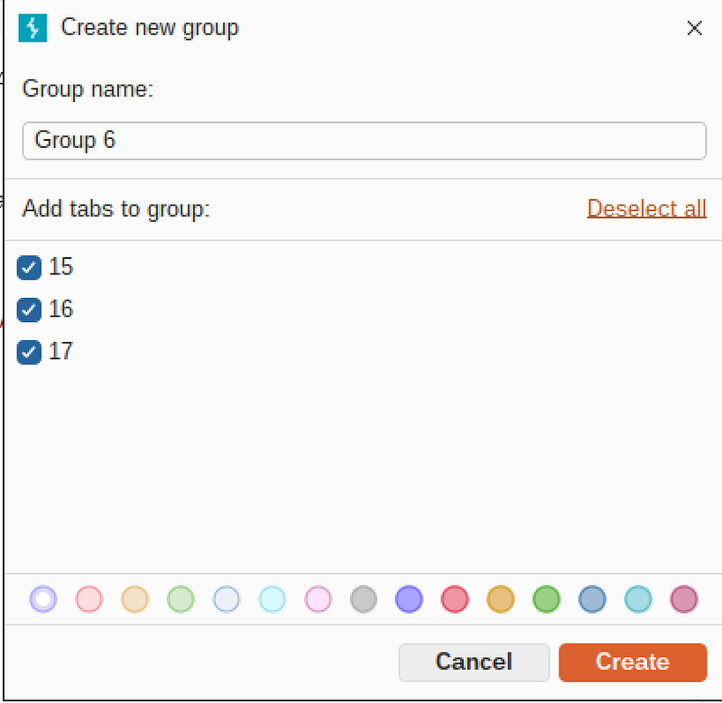
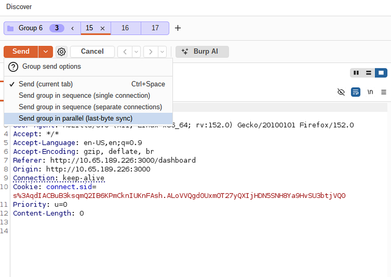
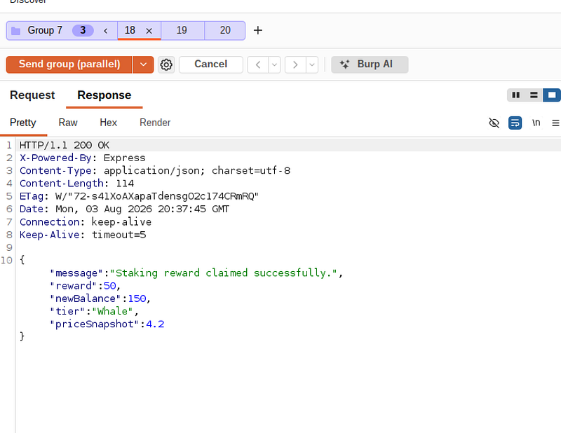
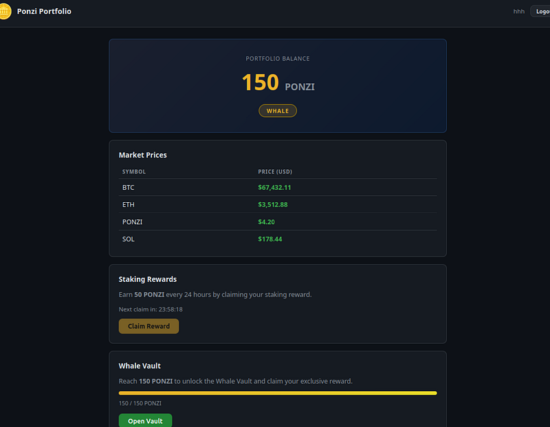
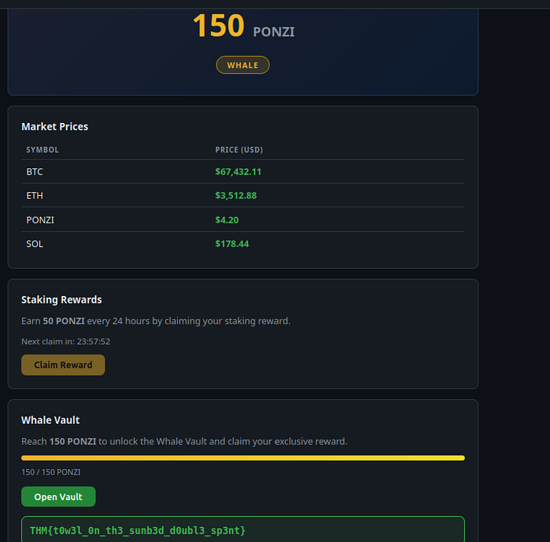

# Towel on the Sunbed TryHackMe Walkthrough

---

**Day 8** of the Hacker Holidays challenge focuses on a classic business logic vulnerability. Today we’ll abuse a race condition in a cryptocurrency staking application to unlock the Whale Vault.



## **Step 1: Explore the application**

After registering an account, we’re presented with a simple cryptocurrency dashboard. The staking mechanism allows users to claim **50 PONZI every 24 hours**, while access to the Whale Vault requires **150 PONZI**.

Under normal conditions, reaching Whale status would require waiting three days.



## Step 2: Inspect the reward request

Before clicking **Claim Reward**, enable Burp Suite and capture the request.

The application sends a very simple request:



After than I decided to to observe the cooldown.

Claiming the reward once returns:


```json
{
    
"message"
:
"Staking reward claimed successfully."
,
    
"reward"
:
50
,
    
"newBalance"
:
50
}
```


Any subsequent request immediately returns:


```text
HTTP/1.1 429 Too Many Requests
```


At first glance, the cooldown appears impossible to bypass. But we will create three requests and will send them in parallel.

## Step 3: Group the requests and send them in parallel

To bypass the cooldown period you will need to send the intercepted HTTP request to the Repeater three times.



As soon as all three are ready to go in the Repeater, you need to organize them in a group:





Now, choose the function “send in parallel” and hit “send”:



Observer the response from all three. Notice, that the reward increases each time:



## Step 4: Yank the flag

To get the flag you’ll need to turn intercept off, go back to your web page and refresh it. Observe the result:



You can see the button “Open vault” is active now. Clicking on it will reveal the flag:



This challenge demonstrates how a race condition can lead to unexpected behavior. Because the application processed several reward requests at the same time, it granted multiple rewards instead of just one, allowing us to unlock the Whale Vault instantly.

Missed the previous challenges? You can find the solutions for [**Day 1**](day-01-the-concierge-knows-too-much-tryhackme-walkthrough.md) , [**Day 2**](day-02-room-404-tryhackme-walkthrough.md), [**Day 3**](day-03-complimentary-tryhackme-walkthrough.md), [**Day 4**](day-04-packed-light-tryhackme-walkthrough.md), [**Day 5**](day-05-beach-bar-tryhackme-walkthrough.md)**,** [**Day 6**](day-06-overheard-at-breakfast-tryhackme-walkthrough.md) **and** [**Day 7**](day-07-do-not-disturb-tryhackme-walkthrough.md)**.**

