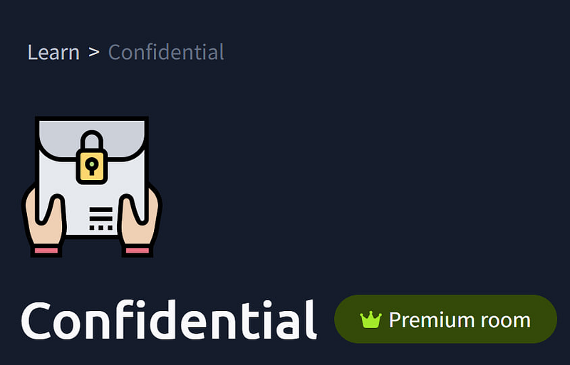
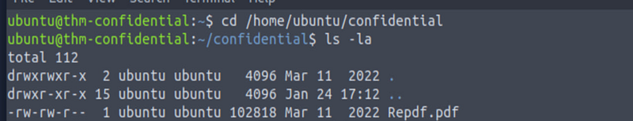
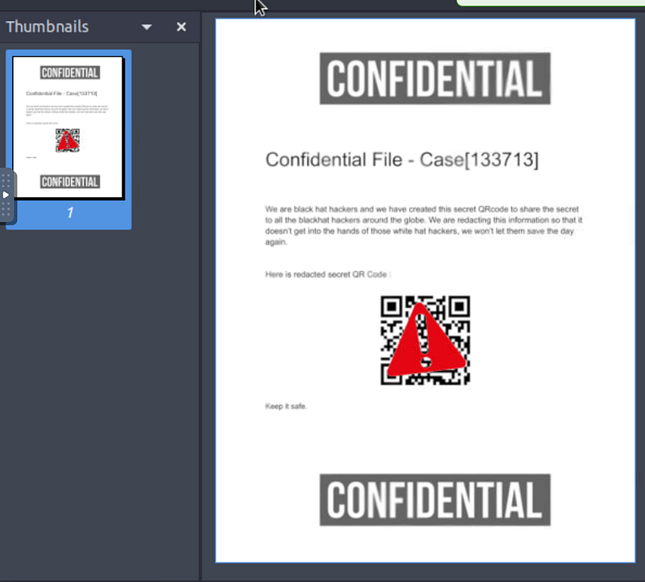
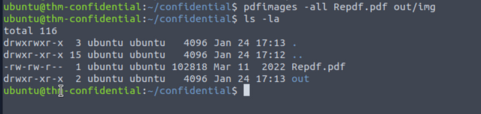
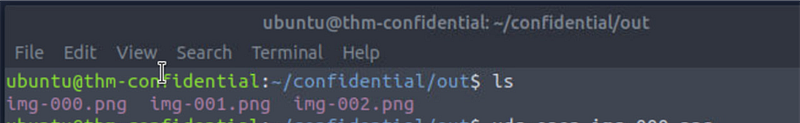
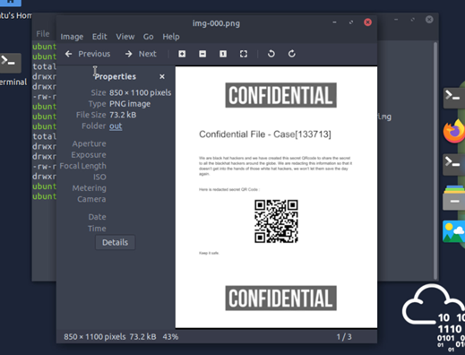
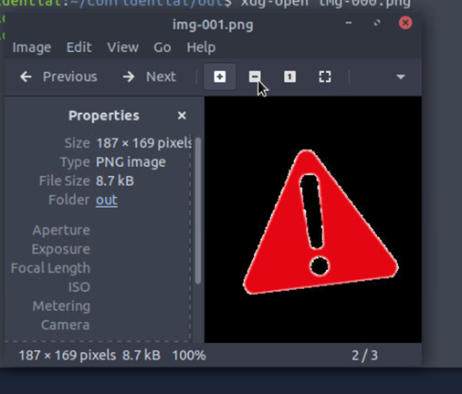

# Confidential TryHackMe Walkthrough (PDF Image Extraction)

---

This challenge is designed to practice digital forensic skills. The goal is to recover a QR code that has been obscured by an image overlay.



#### Step 1.

Let’s go to the directory /confidential. Here we are given a PDF file with a QR-code which is covered by a picture of an exclamation mark.


```bash
cd /home/ubuntu/confidential and ls -la
```






#### Step 2.

Make another directory where we will store our new PDF and everything that was used to cover it.


```bash
mkdir -p out
```


#### Step 3

Extract images from the PDF


```text
pdfimages -all Repdf.pdf out/img
```


This command extracts every image embedded in this PDF and save them as separate files



#### Step 4

Now change to the `out` directory containing the extracted image and check what was extracted:


```bash
cd
 out
ls
```




We can see that we have three .png files

#### Step 5

Open the files with xdg


```text
xdg-open img-000.png
```


Here we are — the original is recovered:



If you try to open the next one with xdg — you will see — the triangular that covered the picture:



**Hackers’ mistake:**

They tried to “redact” the QR code by placing something on top of it, like:

- a rectangle;

- an image overlay;

- a block shape;

That hides the QR on the screen, but it does NOT remove it from the file. So, the QR image was still stored inside the PDF. This is the same reason why “bad redaction” in real life is dangerous.

