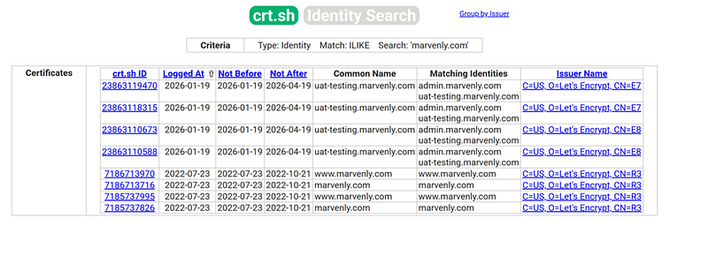
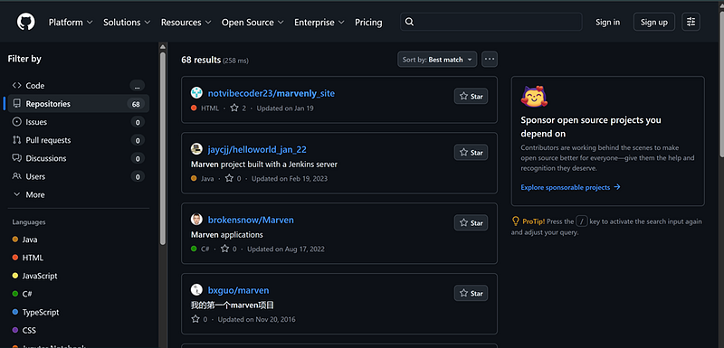
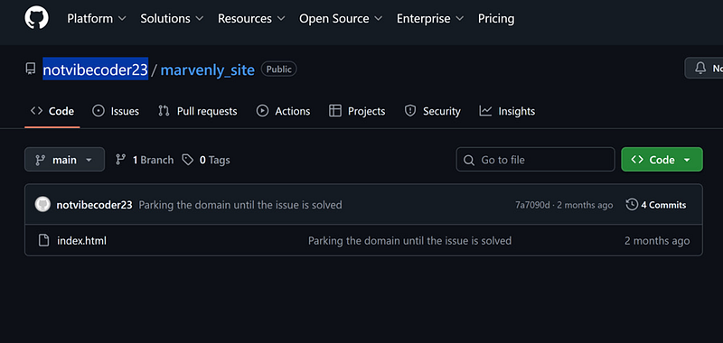
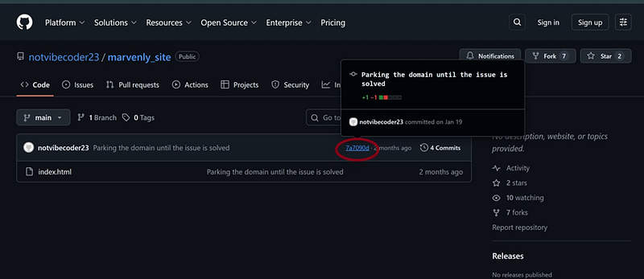
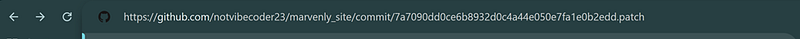
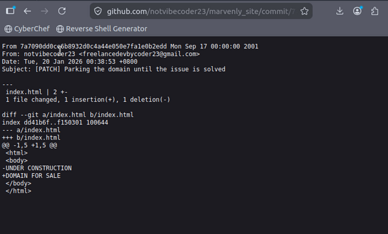
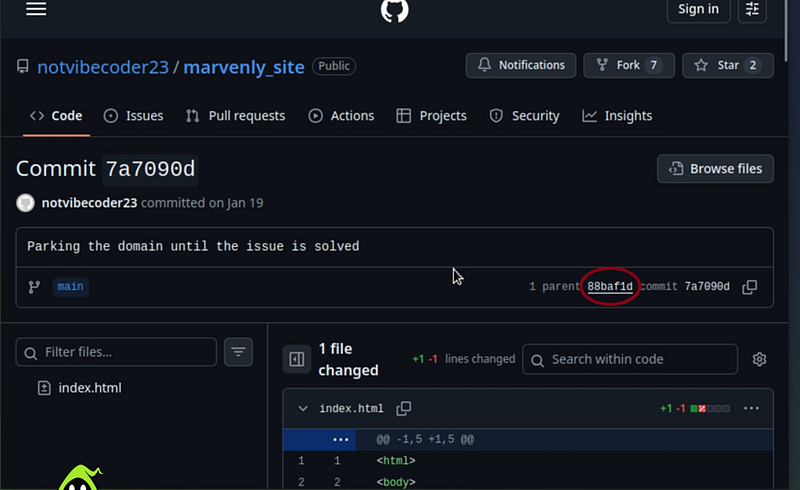
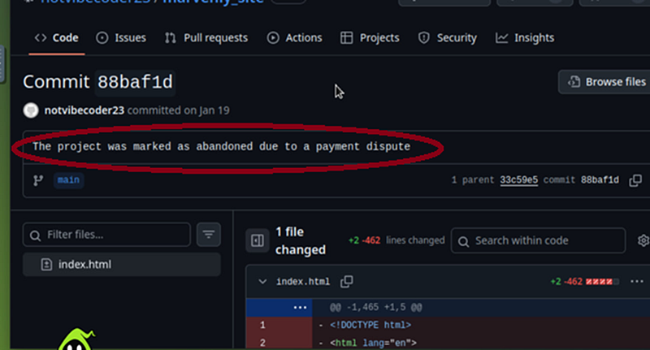
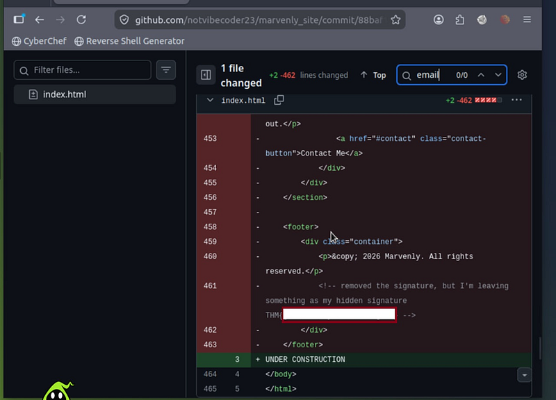

# Dev Diaries Tryhackme walkthrough

---

OSINT challenge to find out the information about the developer of the website marvenly.com. No Kali is necessary.

#### **Q#1: What is the subdomain where the development version of the website is hosted?**

Because the website is not reachable from the browser, we need to resort to *crt.sh* website. Just paste it in any browser and them put the next in search:

*%.marvenly.com*

Why *%.*? Because it basically means “Show me everything that ends with marvenly.com.”

The subdomain is *uat-testing.marvenly.com*

#### **Q#2: What is the GitHub username of the developer?**

Just open github and put “marvenly” in the search bar. The first user is yours — *notvibecoder23*

#### **Q#3: What is the developer’s email address?**

From a github page that we found earlier, we need to:

1. open a notvibecoder23 commit page

2. click the address bar in your browser

3. Go to the very end of the URL

4. Add *.patch*

5. Press Enter

The email is *freelancedevbycoder23@gmail.com*

Why *.patch*?

A patch is basically the commit shown as a text file: commit metadata, author, date, subject, and the exact lines that changed.

#### **Q#4 What reason did the developer mention in the commit history for removing the source code?**

Go back to the commit. Click on parent:

The reason is “The project was marked as abandoned due to a payment dispute.”

#### **Q#5 What is the value of the hidden flag?**

If you scroll down the index.html of the page that you opened in a previous step, you will find the flag down below:

