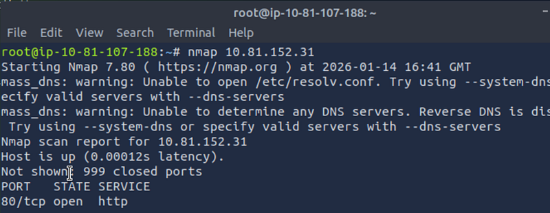
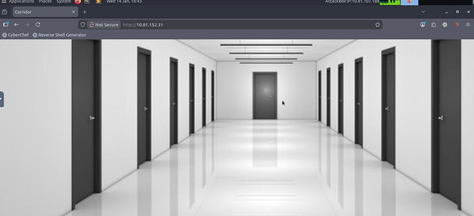
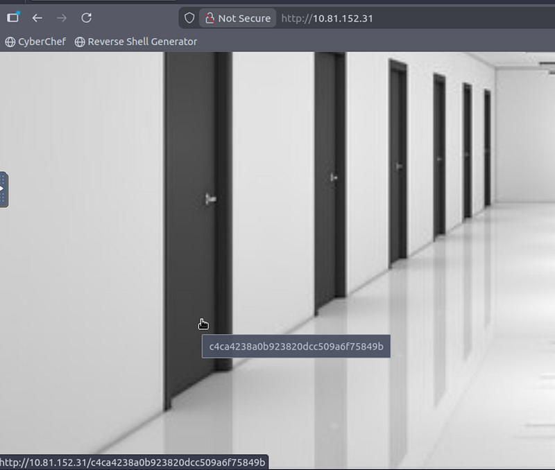
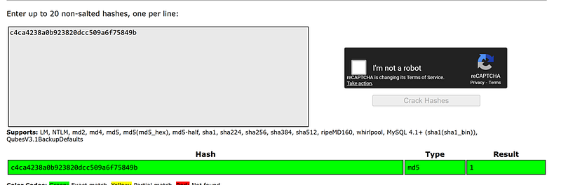
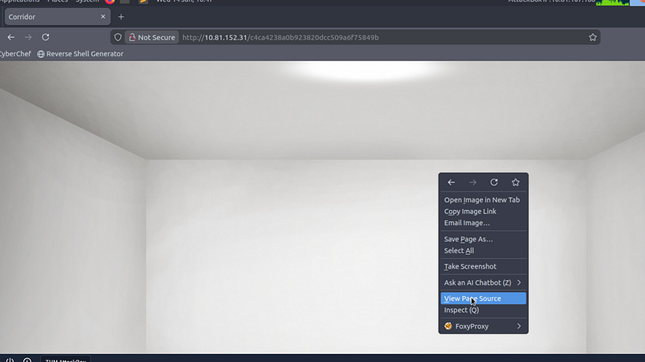
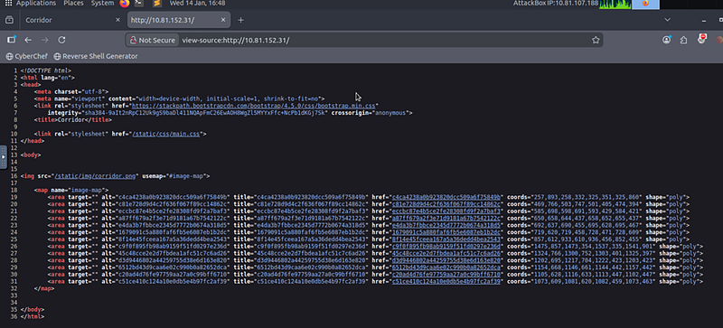
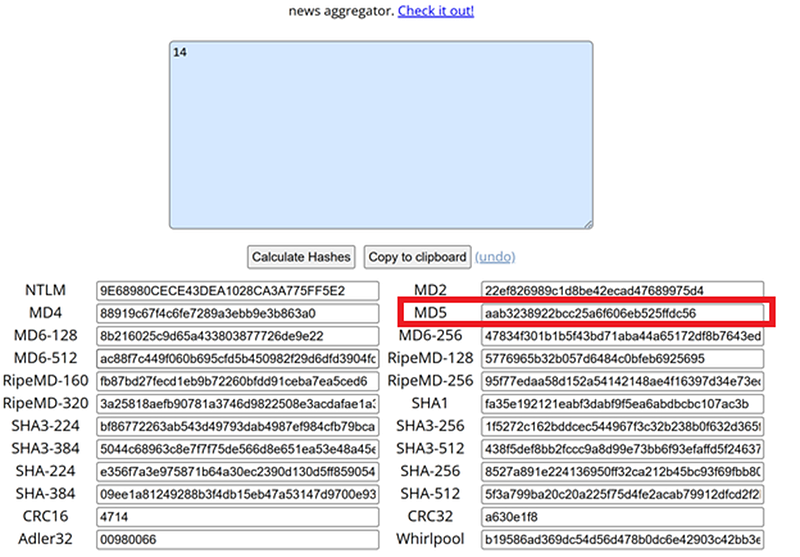
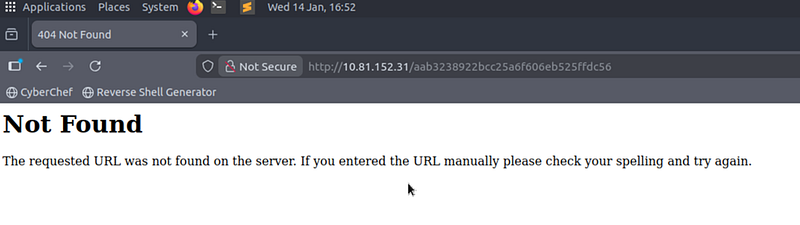
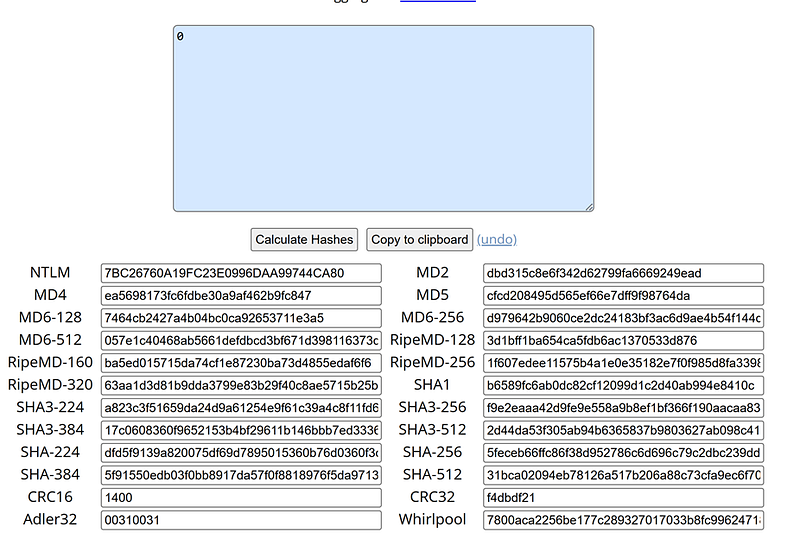
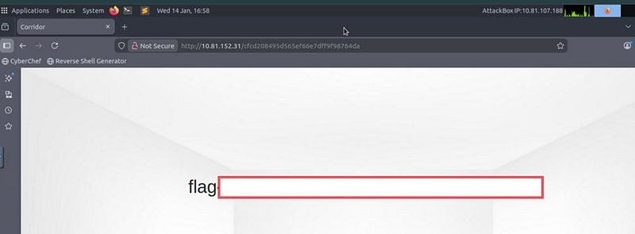

# TryHackMe Corridor Walkthrough

---

## This guide provides a complete walkthrough for the TryHackMe Corridor room, including enumeration, vulnerability discovery, and exploitation steps.

## Step 1. Enumeration.

After running an Nmap scan, we discovered that port 80 is open.


```text
Nmap 10.81.152.31
```


Don’t forget to replace the IP with you victim machine’s IP.



Let’s open the IP address in the browser and see what’s there. If you click on each door, you’ll enter an empty room.



So… what’s next?

## Step 2. Hints

When you hover your mouse over one of the doors, you’ll notice this:



Looks like an MD5 hash, doesn’t it?

Let’s click on one of the doors, copy the hash and crack it [here](https://crackstation.net/).



## Step 3. Speeding up

If you manually check all the doors, you’ll find hashes corresponding to numbers from **1 to 13.**

To save time, click on any door and **view the page source**.



Now remove the hash from the URL in your browser, leaving only the IP address. Here we are — all the hashes in one place:



## Step 4. Checking options

Let’s hash number 14 and try to put it in the browser — may be this is our escape? We need the value of MD5. To generate hashes, I usually use [this](https://www.browserling.com/tools/all-hashes) tool.



Looks like it doesn’t work:



## Step 5. Think in the opposite direction

If moving up doesn’t work, let’s move down and hash the number 0. Repeat the same process



And this time…

Here is our flag:



