# Anthem walkthrough (TryHackMe) 2026

---

Showing how to exploit a Windows machine in this beginner-friendly challenge

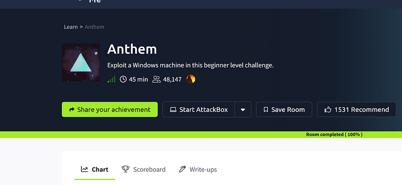

## Task 1

#### Step 1

We perforemd an nmap scan to identify open ports. Since the scan without the `-Pn` flag did not work, we did it again using `-Pn`.


```text
Nmap -Pn 10.82.173.232
```


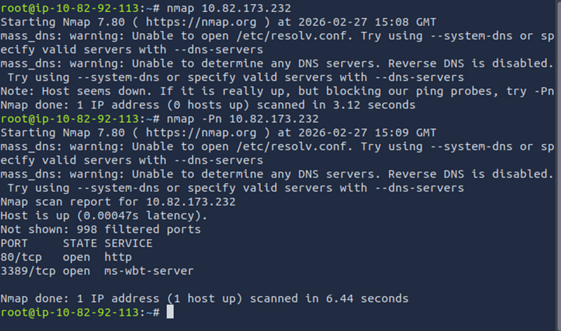

What port is for the web server?

80

What port is for remote desktop service?

3389

#### Step 2

For Q2 we, follow a classic Ejpt methodology by inspecting robots.txt file.

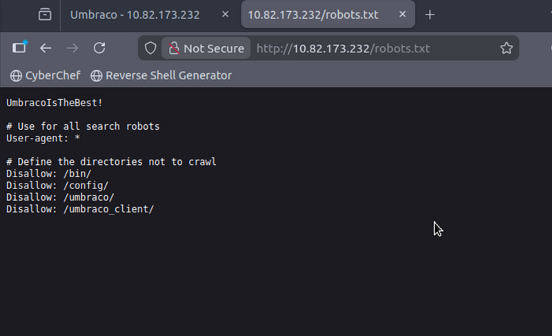

What is a possible password in one of the pages web crawlers check for?

UmbracoIsTheBest!

#### Step 3

What CMS is the website using?

To retrieve the answer, we will launch gobuster.


```bash
gobuster dir -u http://10.80.173.232 -w /usr/share/wordlists/SecLists/Discovery/Web-Content/directory-list-2.3-medium.txt -o gobuster_http.txt
```


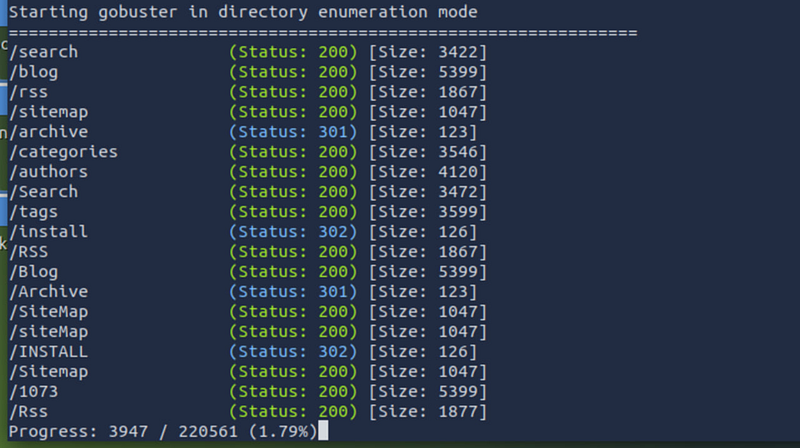

Having checked all the directories, we found out a CMS system under the directory /INSTALL

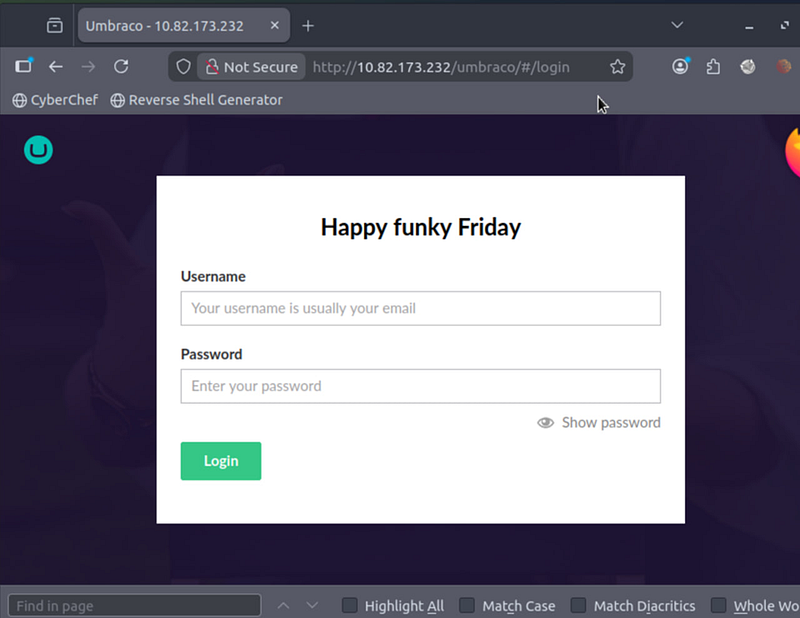

What CMS is the website using?

Umbraco

#### Step 4

What is the domain of the website?

Anthem.com

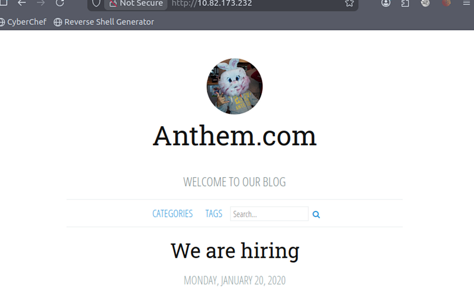

#### Step 5

Identifying the name of the Administrator.

Next, we examine the posts on the website:

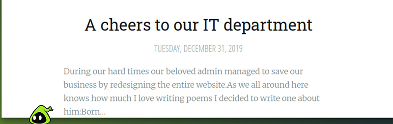

Copy the poem from the blog post and search for it in Google

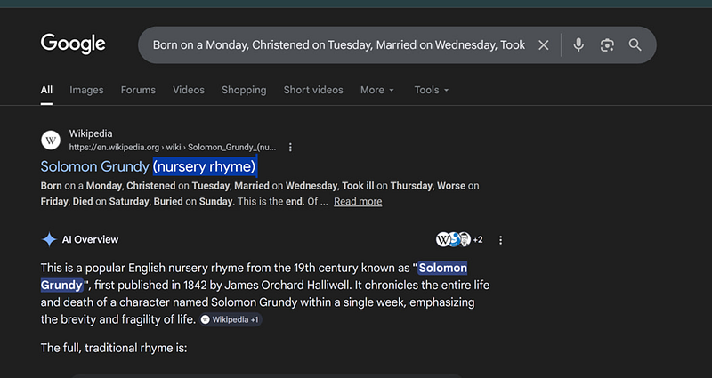

What’s the name of the Administrator

Solomon Grundy

#### Step 6

Following the same naming analogy (JD — first letter of the name, first letter of the surname) the email is [SG@anthem.com](mailto:SG@anthem.com)

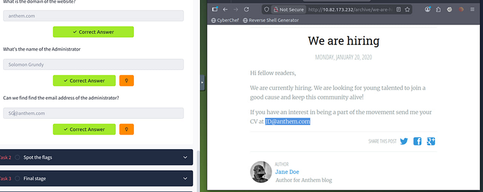

Can we find find the email address of the administrator?

SG@ anthem.com

## Task 2

#### Flag 1

Enter the system using credentials obtained in previous steps.

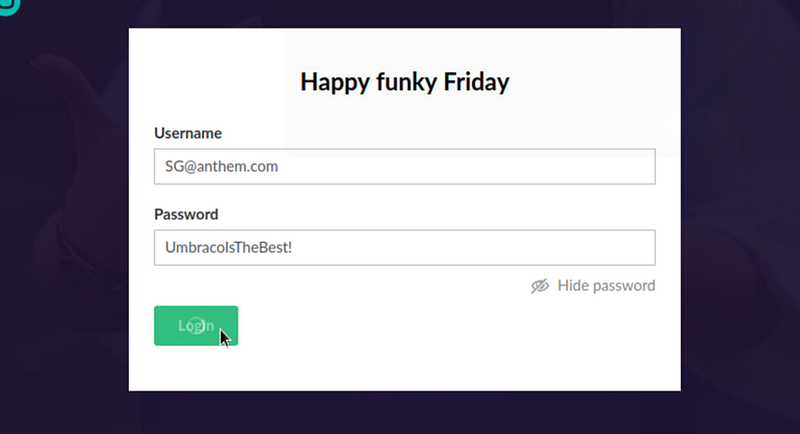

Browse the system.

Flag 1 is in: content — archive — we are hiring — meta tags

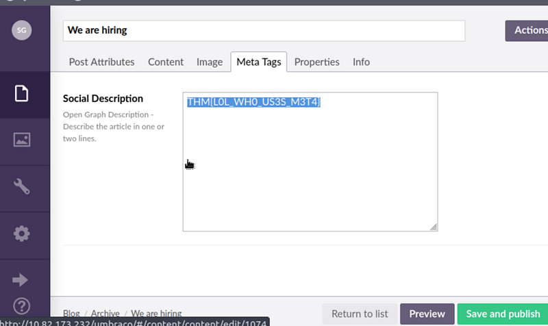

What is flag 1?

THM{L0L\_WH0\_US3S\_M3T4}

#### Flag 2

Open the new tab of your machine. Right click and view source of Anthem.com website

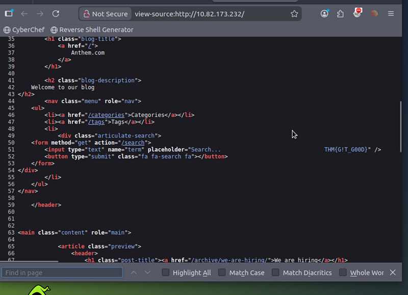

What is flag2?

THM{G!T\_G00D}

#### Flag 3

There are two ways to obtain it:

First way: check the website Anthem.com/authors (this directory was found earlier in gobuster)

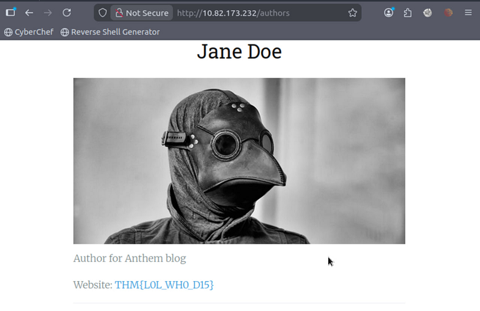

Or

Withing the CMS system dashboard, navigate to Content — Authors — Jane Doe — Author info:

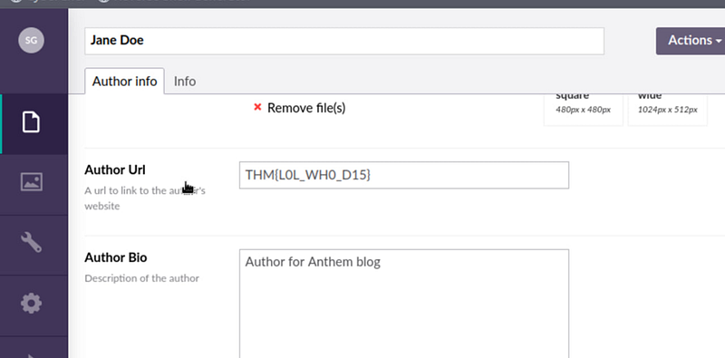

What is flag 3?

THM{L0L\_WH0\_D15}

#### Flag 4

Within the system, proceed to: Content — Archive — A cheers to IT department — Meta Tags

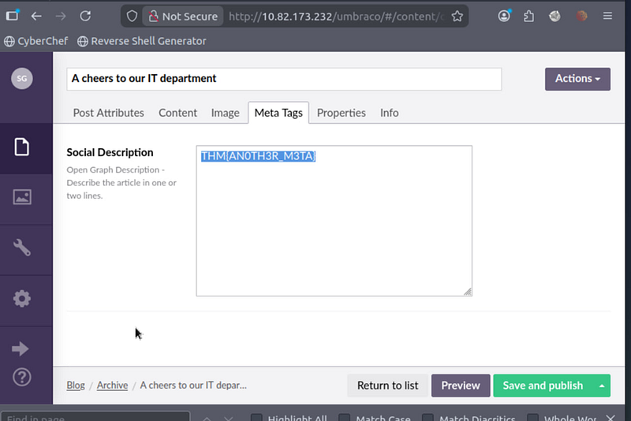

What is flag 4?

THM{AN0TH3R\_M3TA}

## Task 3

#### Step 1

Let’s figure out the username and password to log in to the box. (The box is not on a domain)

**Credentials for RDP:**

User: SG

Password: UmracoIsTheBest!

Connect to the machine through RDP:


```bash
xfreerdp /v:10.82.173.232 /u:SG /p:’UmbracoIsTheBest!’
```


Find the user file on the Desktop:

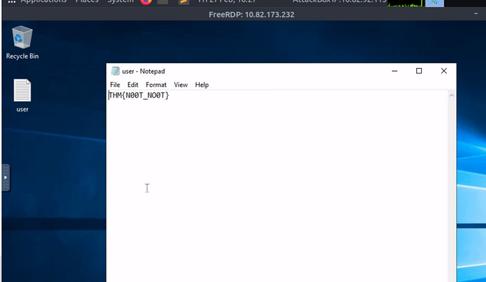

#### Step 2

Admin Password retrieval

Let’s access CMD terminal.

Since I didn’t have working hotkeys, I created a new folder on the Desktop, opened it, and used the File Explorer address bar to launch *cmd.*

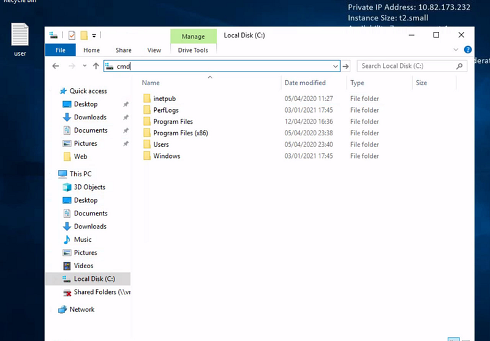

Now we need to navigate upward in the directory structure. So use:


```bash
cd ../.. 
```


or cd ..\.. for older Windows versions

Explanation:

· `cd ..` moves one level up

· `cd ../..` moves two levels

and


```bash
dir /a
```


Explanation:

· `dir` lists files in the current directory

· `/a` tells CMD to display **all files**, including hidden and system files

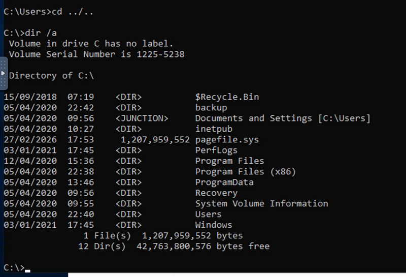

Using `dir /a`, a backup file was found. However, it is not visible if we try to browse directories through File Explorer. The hint in THM says that it is hidden.


Let’s make it visible.

View — Options — View — Show hidden files, folders, and drives — Apply — Ok

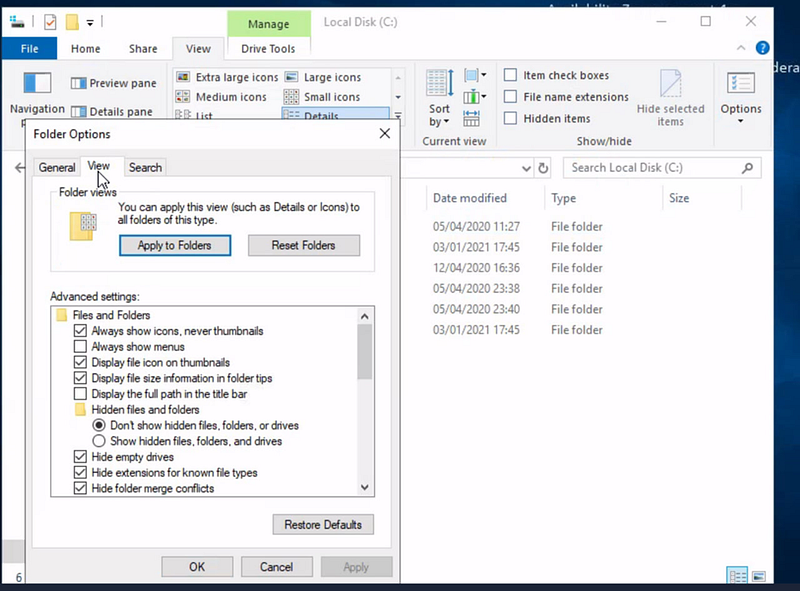

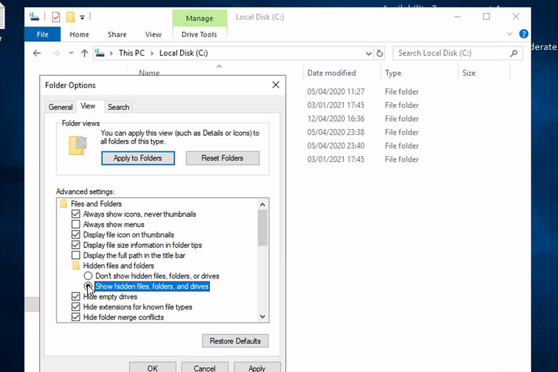

Now we will attempt to access the backup folder.

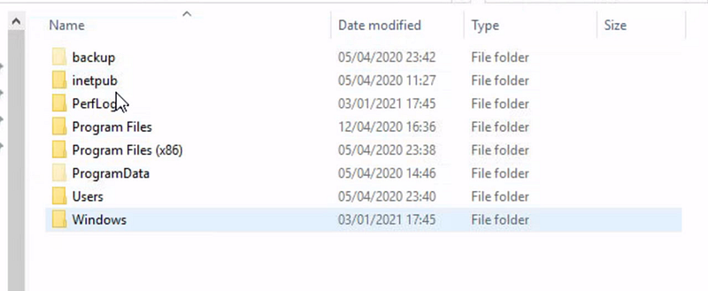

One more hindrance — no access. Let’s grant our user — SG — necessary permissions so we can open the file.

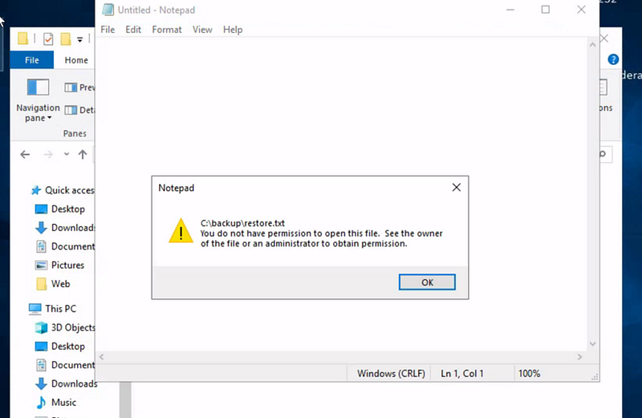

To change the permissions, we will need to right click the text file backup, then go to Properties — Security — Edit — Add. After that, write SG here and click “Check names”:

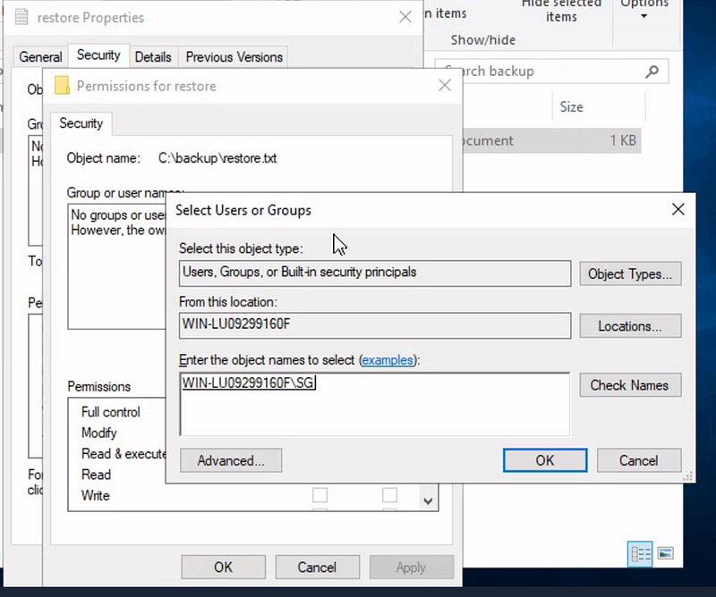

Click OK and then enable full control, ticking all of the boxes.

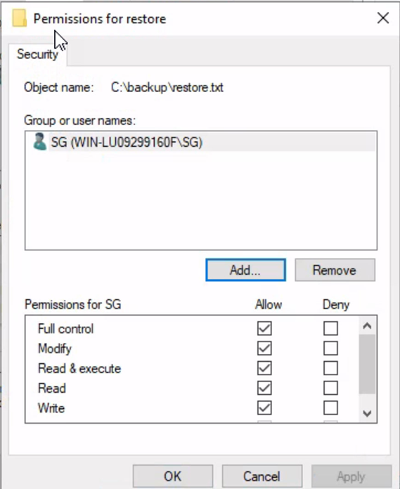

Now the file is accessible.

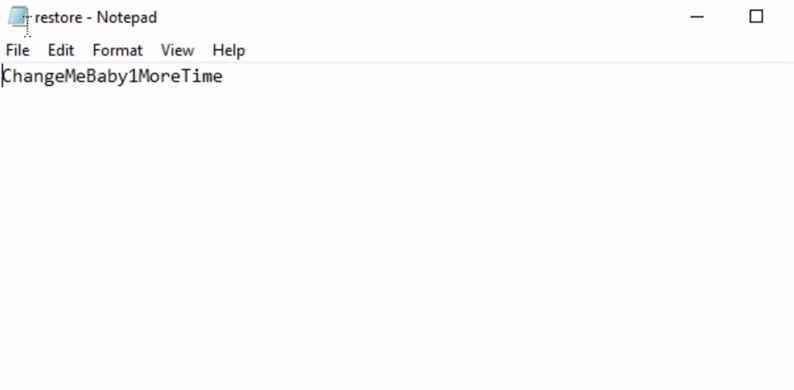

Can we spot the admin password?

ChangeMeBaby1MoreTime

#### Step 3

Searching for root

Navigate to the Administrator user directory to verify elevated access.

Local disk — Users — Administrator

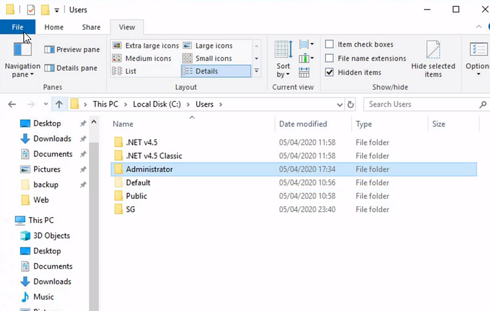

The window will prompt us to insert the password

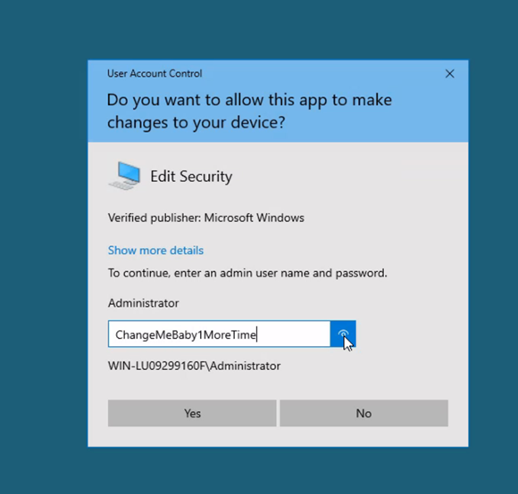

After this, Administrator’s desktop is accessible and we can open the file root.txt

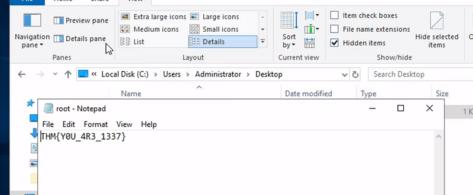

Escalate your privileges to root, what is the contents of root.txt?

THM{Y0U\_4R3\_1337}
