# Brooklyn Nine Nine walkthrough

---

## TryHackMe Brooklyn Nine Nine walkthrough

Nice and easy TryHackMe room for beginners.


#### Step 1 — run Nmap


```bash
nmap 10.81.161.125 
```


(don’t forget to change 10.81.161.125 to your target machine’s IP)

Nmap scan showed that we have three ports open: FTP — 21, SSH — 22, HTTP — 80:

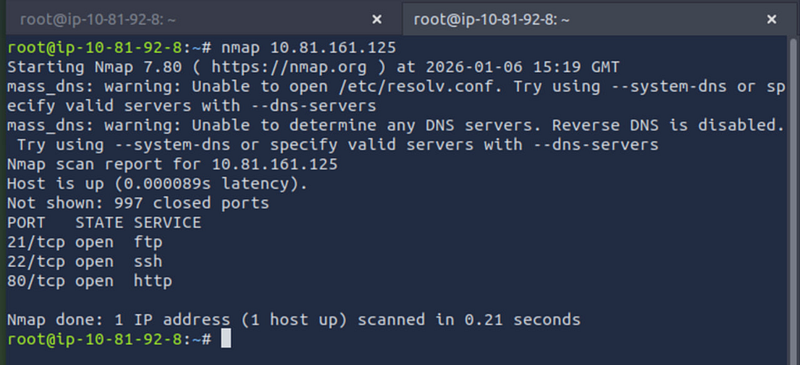

#### Step 2 — Connect to ftp using anonymous connection

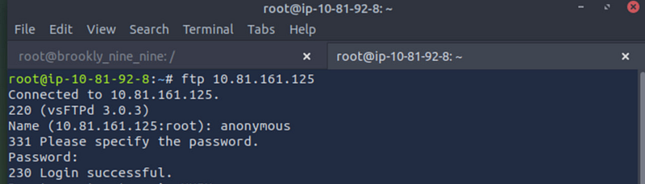

It worked. Let’s see what we have here. Do ls. We found the file “note\_to\_jake.txt”. Get it.

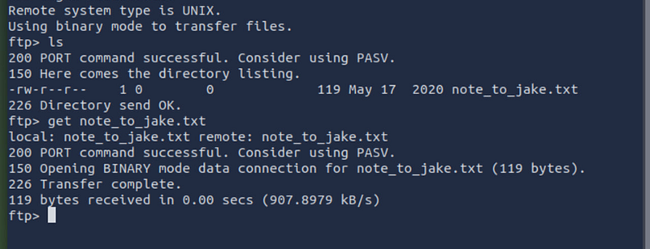

#### Step 3. Exit ftp after and open the note

Exit ftp after we get the note. Go back to the machine. Cat the note. See the text:

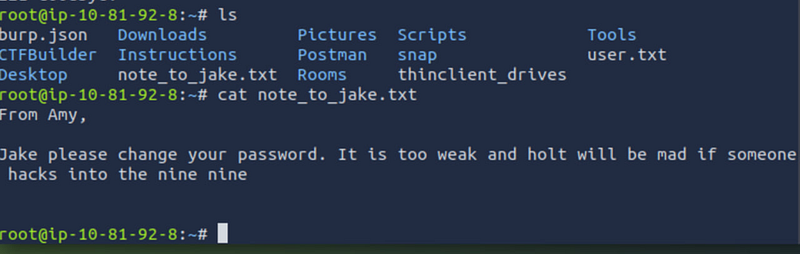

Sounds like we have a user jake whose password is weak. Let’s try to bruteforce. We know that the machine also has ssh (see step 1). Let’s start from bruteforcing Jake’s ssh password.

#### Step 4. Bruteforce the password using hydra.

Step 4.1: right now we need only one user — jake. For this we need to create with the nano editor a file named user.txt and add there only one name — jake. Save and exit.

Step 4.2 for passwords we are using rockyou.txt located in directory /usr/share/wordlists/rockyou.txt.

The full command:


```bash
hydra -L user.txt -P /usr/share/wordlists/rockyou.txt -t 4 ssh
```


Run

password is found!

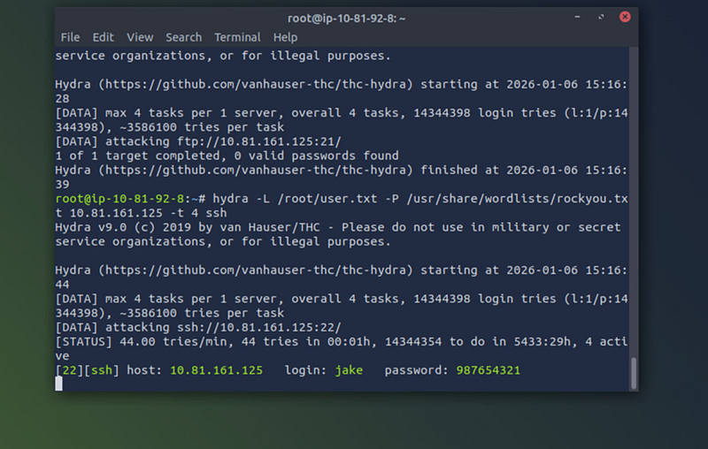

#### Step 5. Connect to ssh

Using credentials from step 4 connect to SSH


```bash
ssh jake@10.81.161.125 
```


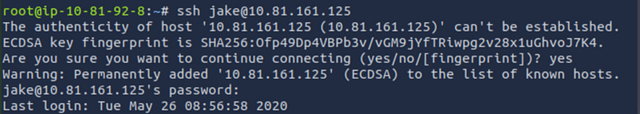

#### Step 6. Explore SSH

Use ls -la command to see what user jake has:

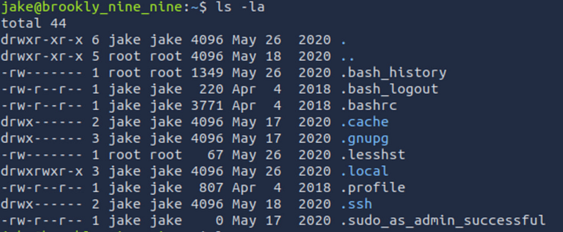

#### Step 7. Try to read bash.history

In previous step we noticed that there is .bash\_history. Let’s try to open it.

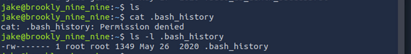

Permission denied. Let’s check permissions with ls -l. So only root can read/write it that’s why Jake got “Permission denied”.

#### Step 8. Run sudo -l

Run sudo -l to see which commands Jake can execute with elevated privileges.

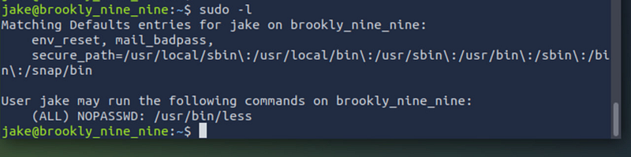

The output reveals a misconfiguration: Jake is allowed to run /usr/bin/less as root without a password (NOPASSWD). That’s great news!

#### Step 9. Exploit the misconfiguration

Run sudo /usr/bin/less


What this does:

- Jake is allowed to run /usr/bin/less as root (NOPASSWD)

#### Step 10: check the users

We can see that there are users amy, holt and jake.

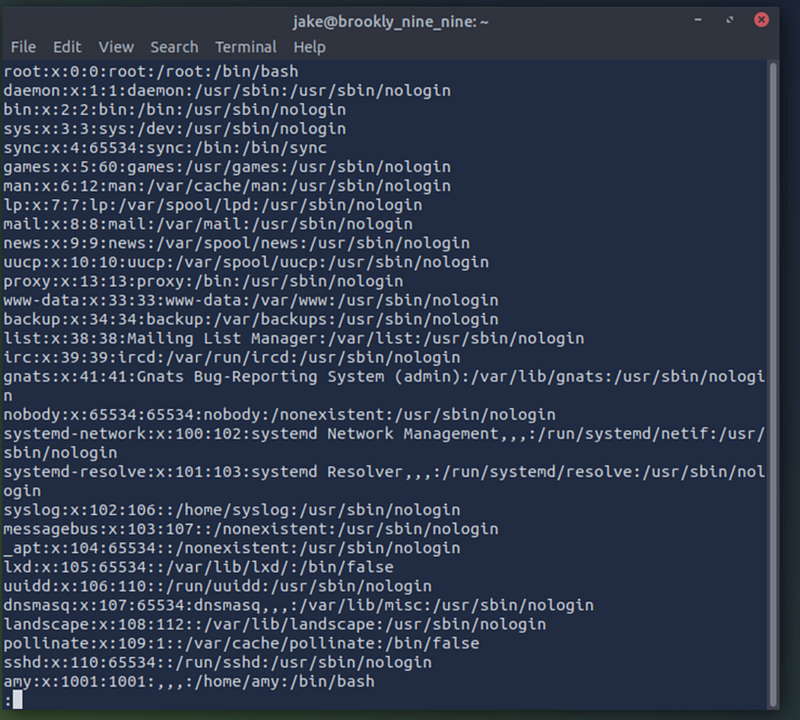

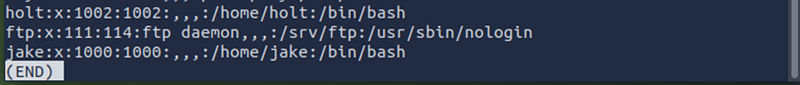

#### Step 11: check user’s directories

Close it, get back and check amy, holt and jake to find the file user.txt. Eventually, we found out that user holt has it. cat it. capture the flag

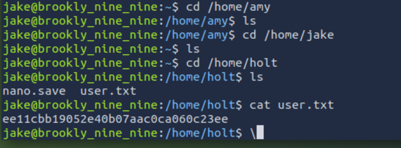

#### Step 12: escalate to root

Run again:


```bash
sudo /usr/bin/less /etc/passwd 
```


See our usrs again. Now we need to spawn a root shell from inside. For this just press ! and Enter. This results in a root shell

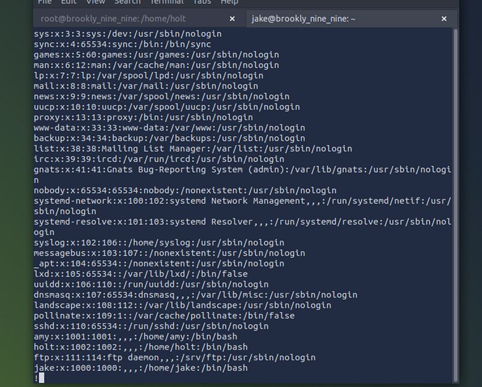

After pressing ! and Enter we can see that we have escalated to root:

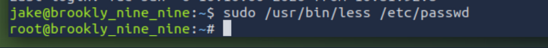

#### Step 13: access root.txt

Navigate to /root, find, and read the file root.txt.

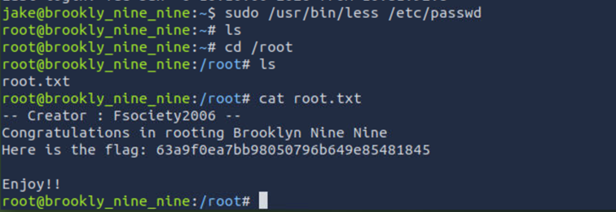
