# Checkmate TryHackMe walkthrough

---

A hands-on walkthrough of the TryHackMe **Checkmate** room, covering Burp Suite, Hydra, CUPP, Hashcat, custom wordlists, and practical password attack techniques.

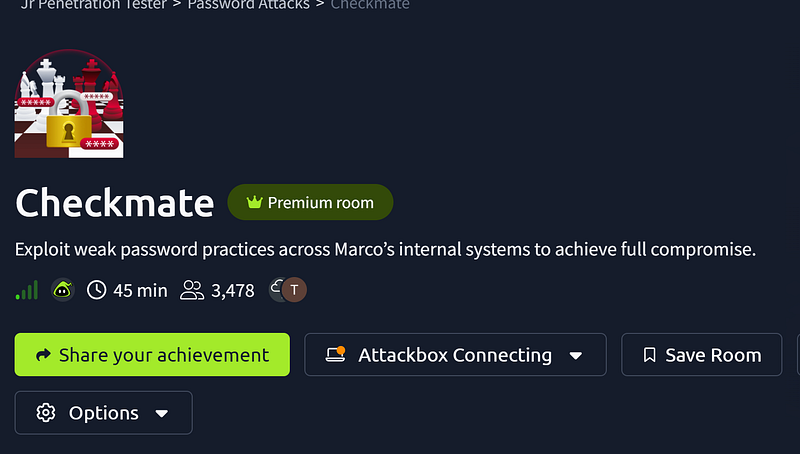

## **Level 1**

To brute-force the password on this level I used Burp Suite and xató-net-10-million-passwords-10.txt wordlist that is located in AttackBox under /usr/share/wordlists/SecLists/Passwords.

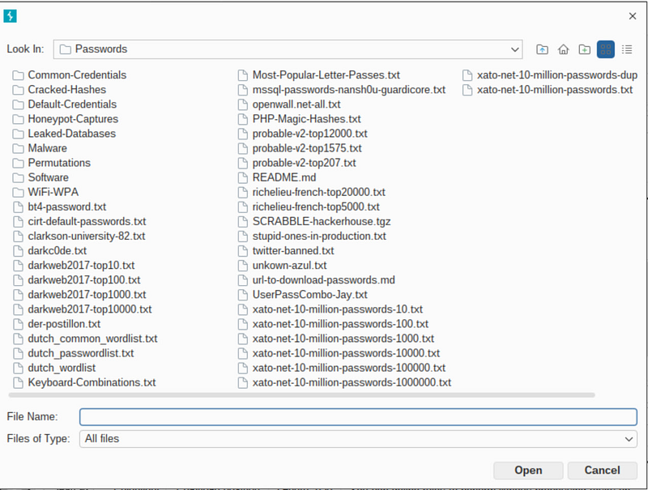

So, first we launch Burp and intercept a POST request. We need to open Burp’s browser first. If Burp doesn’t let you, you will have to go to the Settings > Burp browser and tick the box “Allow Burp’s browser”.

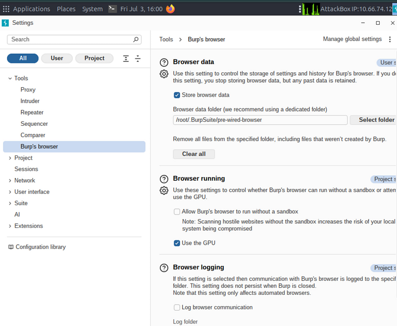

Then navigate to the page, enable proxy and intercept a POST request, trying to login with admin/admin credentials. Send your intercepted request to Intruder, choose positions for password, and load the wordlist xató-net-10-million-passwords-10.txt. Start the attack and monitor the Status column. The correct password returns HTTP 302, while incorrect passwords return HTTP 200.

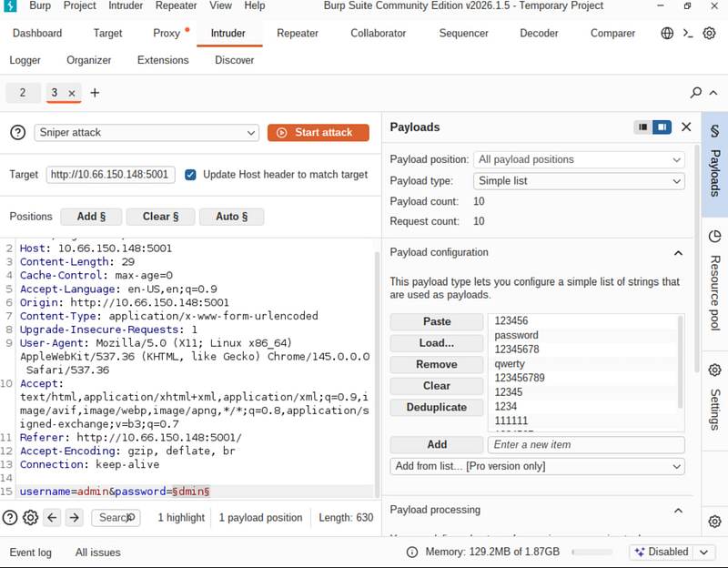

The status code for the password 12345 shows 302, which means this is what we need.

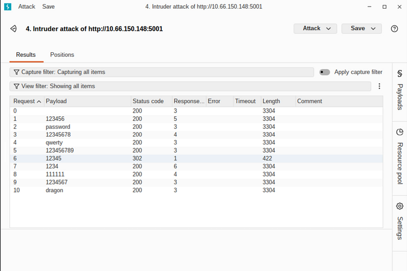

## Level 2

As we know, we need to create a custom wordlist with the keywords from the website.

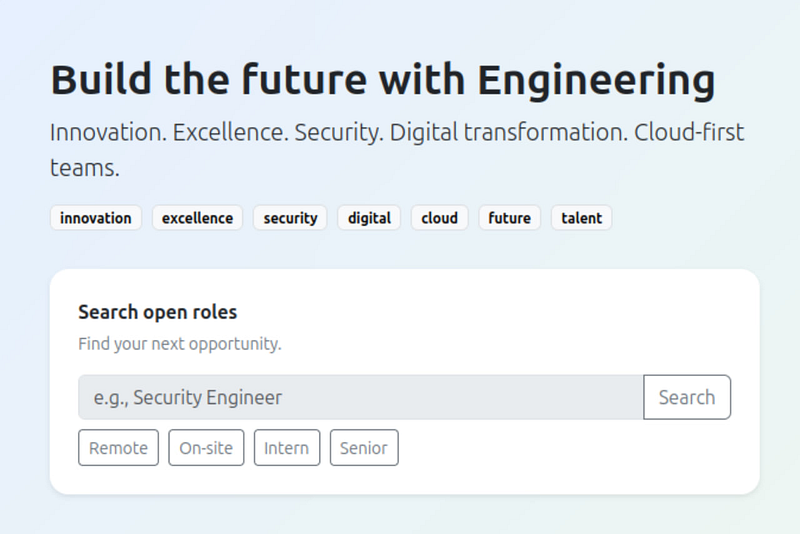

I called my file with the words “innovation”, “excellence”, “security”, “digital”, “cloud”, “future”, “talent” > pass.txt.

We will use Burp again, and the procedure here is the same. Intercept POST request, send it to Intruder, set the positions, and upload your newly created pass.txt

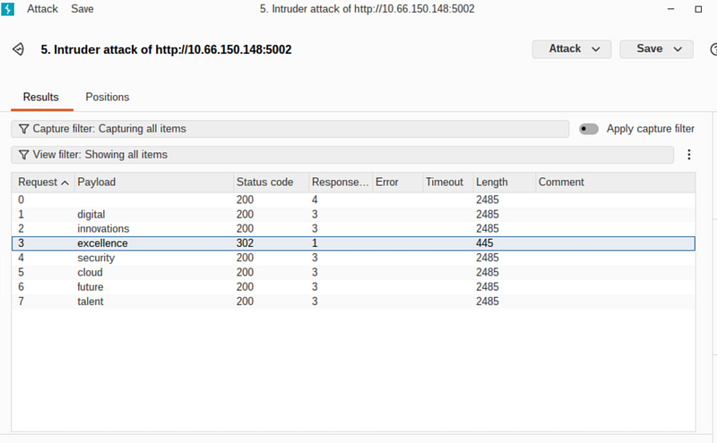

The server returns HTTP status code 302 for the password “excellence”. This is our password.

## Level 3

For Level 3 we need to gather Marco’s personal info. Let’s log in to his page in jobs.thm.

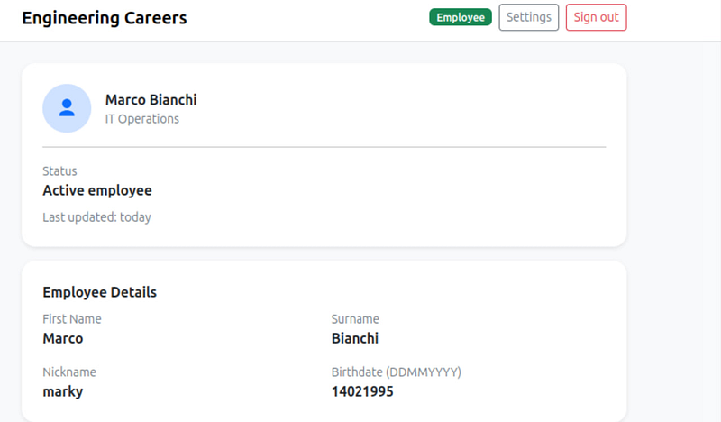

For this task we will use CUPP tool that will help us to generate custom passwords based on personal data.


```bash
git clone https://github.com/Mebus/cupp.git
```

```bash
cd cupp
```

```bash
python3 cupp.py -i
```


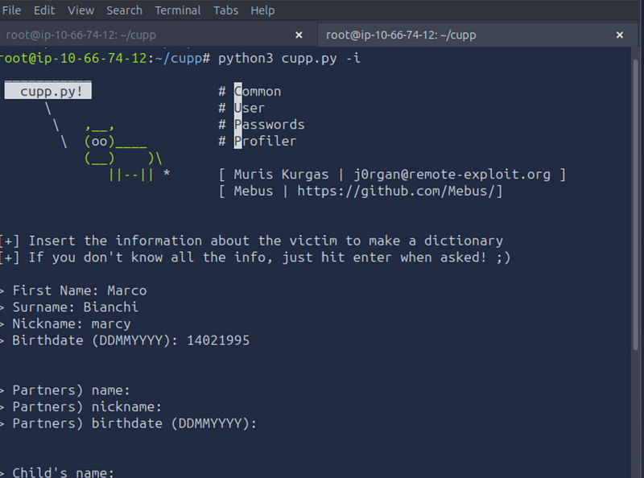

Here we will fill the form, skipping the information we don’t know with Enter. Generation of the list will take some time, so be patient.

As soon as it is ready, we will launch hydra (Burp is also possible here, but it took me much more time).


```text
hydra -l marco -P marco.txt 10.66.150.148 -s 5003 http-post-form “/login:username=^USER^&password=^PASS^:Invalid” -V
```


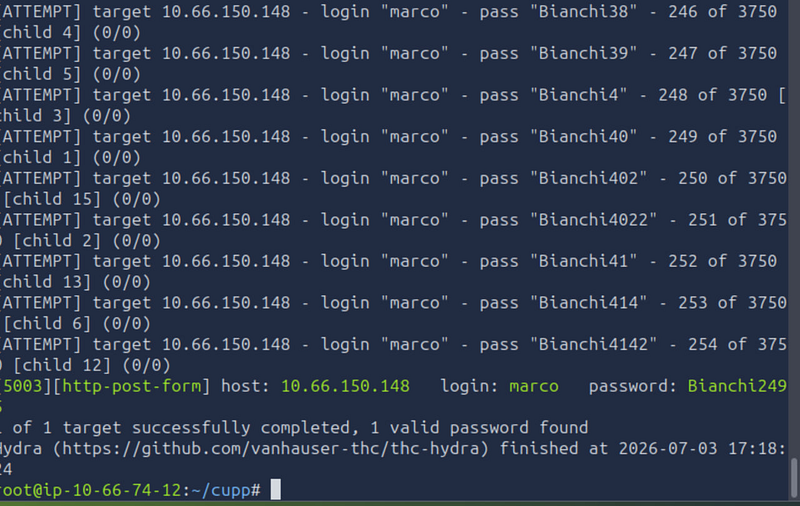

## Level 4

After the password retrieval from the previous step, we need to log in and locate some picture.

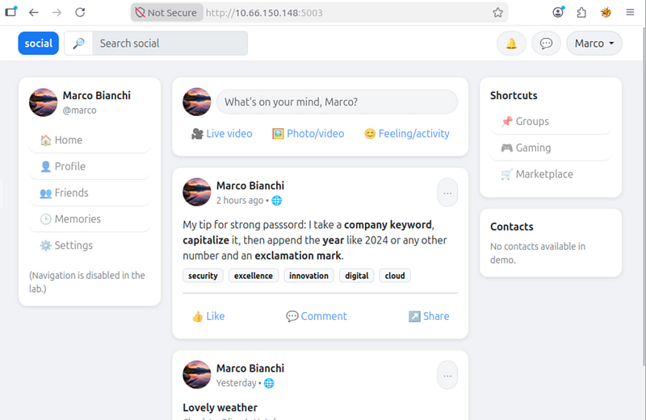

Right click > dev tools > Network

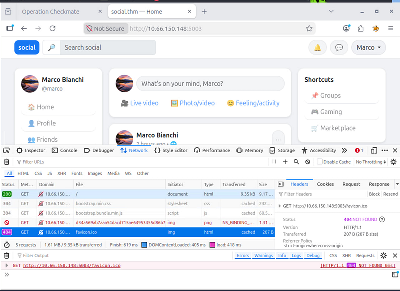

The red one is our target. Copy and save this hash in a file:


```text
d34a569ab7aaa54dacd715ae64953455d86b768846cd0085ef4e9e7471489b7b
```


Crack the hash using hashcat. For SHA-256 we need to use mode 1400 + rockyou.txt wordlist.

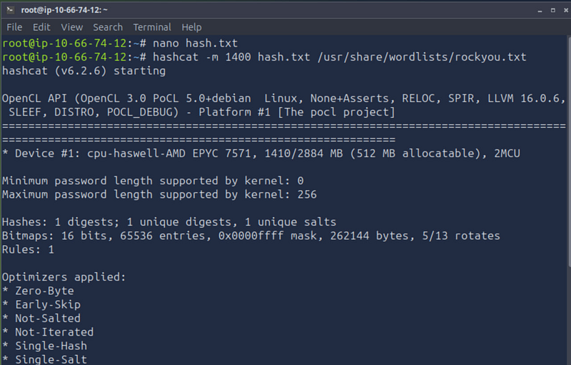

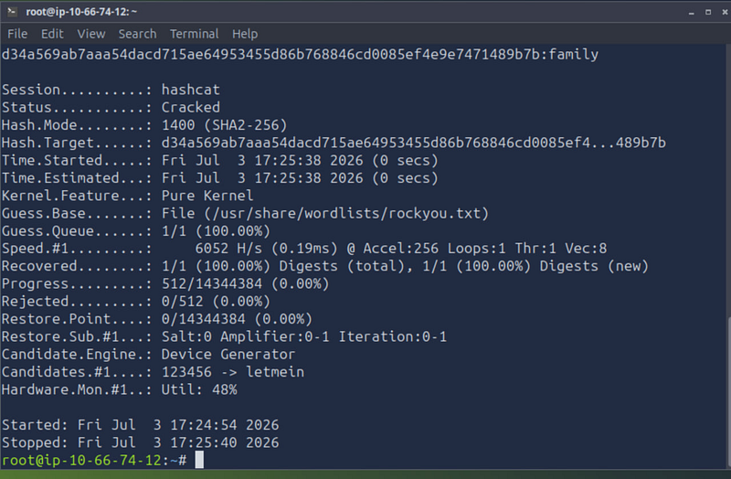

The password is “family”.

## Level 5

If you remember, in Task 2 we created a wordlist of company keywords and saved it as keywords.txt. For this task, we need to capitalize each keyword. I did it manually because the list is short.

Then, I created a small Python script that appends a year and an exclamation mark (!) to the end of each keyword, creating a targeted password list.


```python
numbers = [“
2024
”, “
2025
”, “
2023
”, “
1995
”, “
95
”, “
14021995
”]
with
 
open
(
"keywords.txt"
, 
"r"
) 
as
 keywords_file, 
open
(
"passwords.txt"
, 
"w"
) 
as
 output_file:
    
for
 keyword 
in
 keywords_file:
        keyword = keyword.strip().capitalize()
        
for
 number 
in
 numbers:
            output_file.write(
f"
{keyword}
{number}
!\n"
)
print
(
"passwords.txt created successfully."
)
```


Run the script:


```bash
python3 script.py
```


Passwords.txt is ready to be used

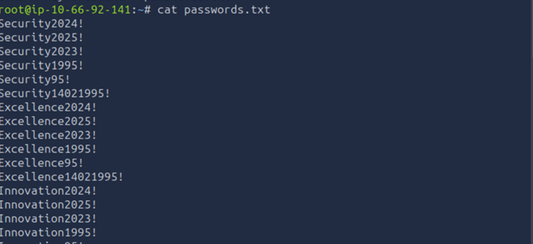

Now we will brute-force ssh login using the list


```cpp
hydra -l marco -P passwords.txt ssh://10.66.150.148 -V
```


The password is Security2024!

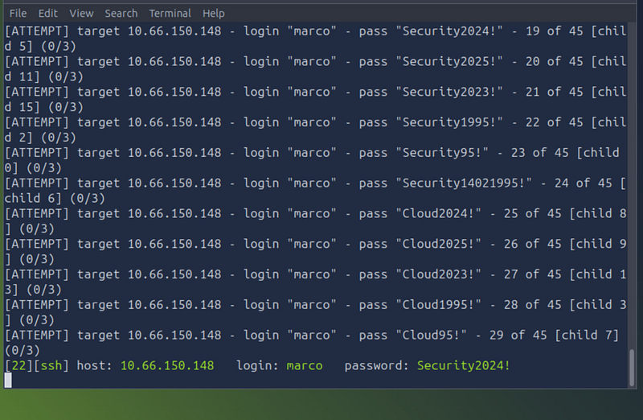
