# Digital Footprint walkthrough (TryHackMe)

---

Beginner-friendly OSINT challenge which forces you to think outside the box.


## Task 1

We need to understand in which city the photo was taken

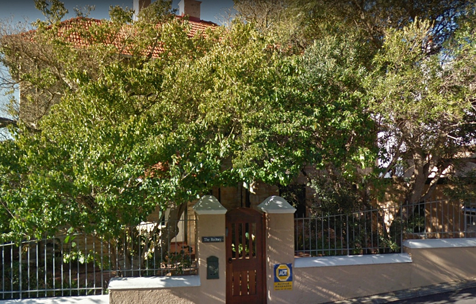

#### Step 1. Look closely at the distinguishing features

In the pic we can see a table on the house — ADT Armed Response. Let’s Google what it is.

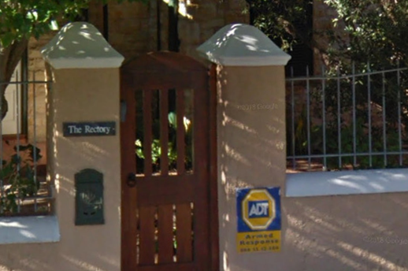

Google says this is a company that works in South Africa.


This is the first clue.

#### Step 2. Look at metadata

For this, upload the image in <https://exif.tools/> and see the coordinates.

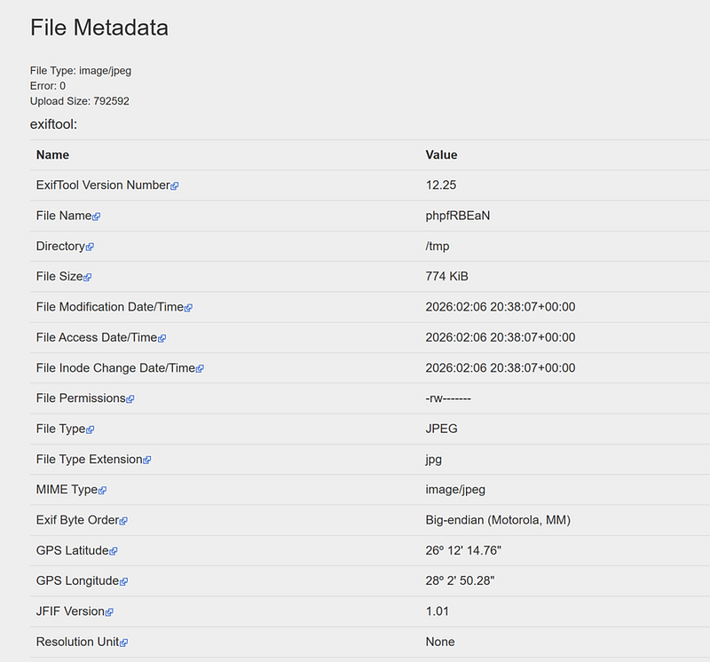

#### Step 3. Let’s paste these coordinates into Google Maps

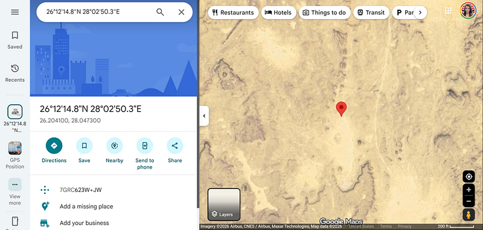

It points us to Egypt, in the middle of the desert where there are no houses. Hmmm… Let’s try to experiment with coordinates.

Why did Egypt appear?

Latitude: 26° 12' 14.76"

Longitude: 28° 2' 50.28"

If no hemisphere is shown, GPS defaults to **North/East**.

We know that South Africa is on the South from the equator, so let’s try to change N into S in out GPS coordinates. This places us in Johannesburg, South Africa.

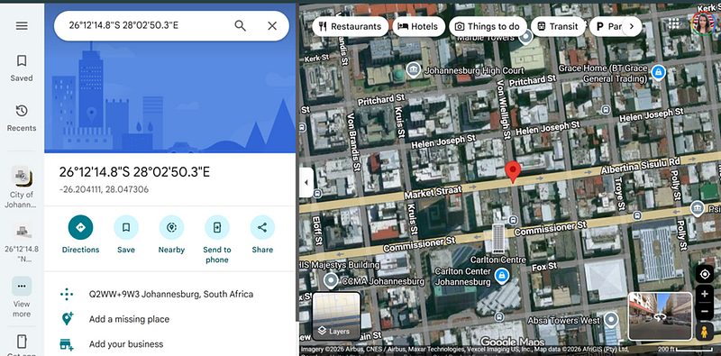

26°N, 28°E = Egypt

26°S, 28°E = Johannesburg

## Task 2

We need to identify when the website was first published on the internet. Let’s check the archive, which is given to us — warc-acme.com/jef/

For this we need to go to archive.org

Remove /jef/ from the URL and search only for warc-acme.com in archive.org to view the domain’s earliest snapshots.

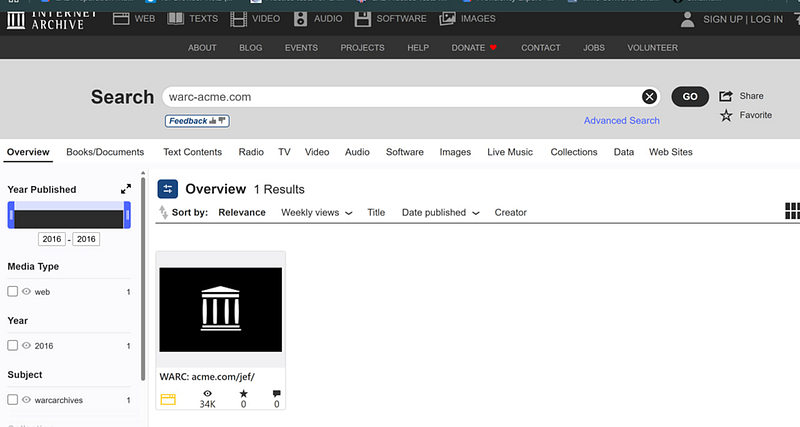

Let’s click on it:

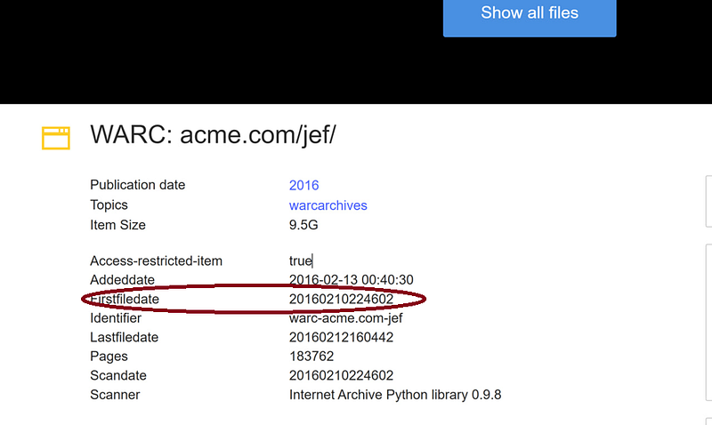

Firstfiledata’s data is the answer.

## Task 3. Mysterious Landmark search

#### Step 1. Upload the image into Google

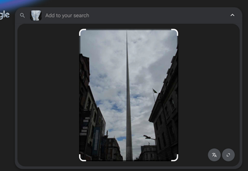

Get the result:

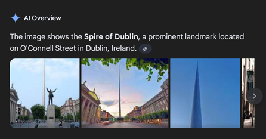

It is the Spire of Dublin.

#### Step 2. Go to Google maps

Let’s search for another landmark whose text on the wall will provide us the name.

Drag the yellow human (Street View) right near the Spire of Dublin.

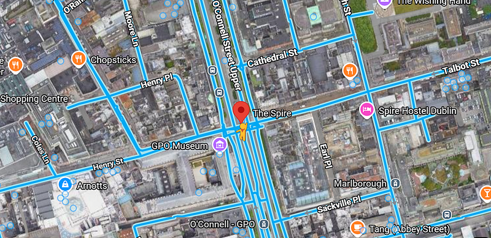

On the right you will find this building. Let’s explore it

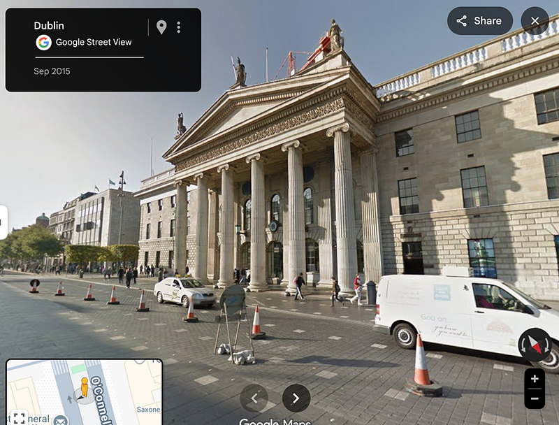

If you approach closer to the Roman colonnade, you will discover a text on the wall. The text appears to be blurred and not in English. Let’s try to look at it from a different angle.

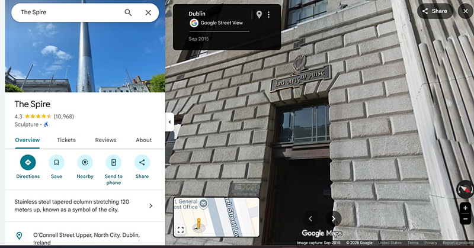

Here is a closer look. Still a bit uneven.

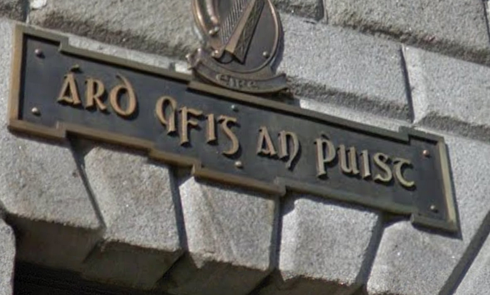

One more look from another angel. Combining all three we can retrieve the text.

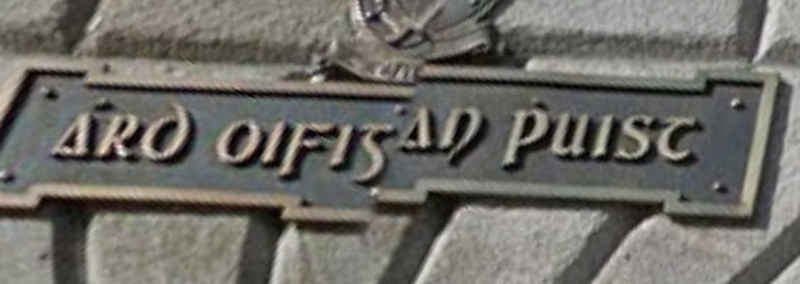

I put this text into Google Translate and chose the option to automatically detect the language. This is what it showed:

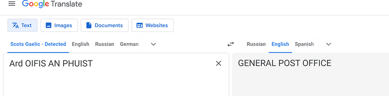

## Task 4. Analysis of internal documents

This is where Kali Linux comes into play.

#### Step 1. Install exiftool in your Kali Linux if you don’t have it.

Step 2 — Run exiftool filename.ext on the file in Kali Linux. Update your package first


```bash
sudo apt update
```

```bash
sudo apt install libimage-exiftool-perl
```


#### Step 2. Run exiftool filename.ext on the file in Kali Linux.

Run exiftoll from the directory where you saved the document


```csharp
exiftool internal-docs-1769695301727.odt
```


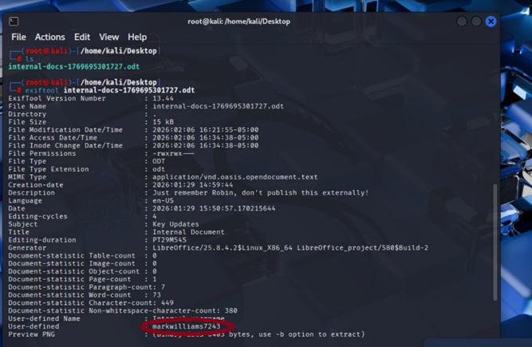

We can see that it was created by the user markwilliams7243.

#### Step 3 . Google the name

A Google search did not return useful results. Instagram return a weird result withouts the opportunity to access the page. Let’s try YouTube

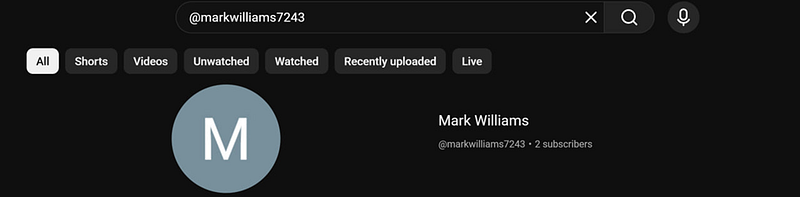

Click on *Read More*


Here is our flag.
