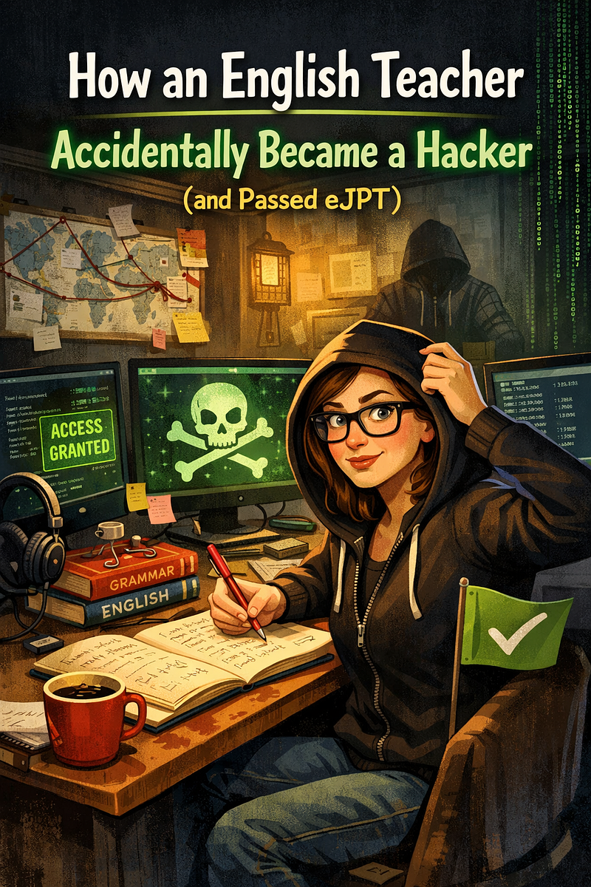

# How an English Teacher Unexpectedly Became a Hacker (and Passed eJPT)

---

## How an English Teacher Unexpectedly Became a Hacker (and Passed eJPT)

**Whoami**

“Tech, math and science is not for you”

That’s what I heard for my entire life — firstly from my parents, later from my teachers. Honestly? I believed them. I’ve never been “a tech kid” and was convinced that my place is in humanities: social sciences, journalism or teaching. No wires. No coding. No intimidating black screens raining weird symbols.

At 35, after moving to the USA and realizing that my ESL teacher’s income translated into peanuts by American standards (*unsalted*), I decided to pivot into cybersecurity. With zero tech background. Literally.

As a teacher, I learned that the easiest way to measure progress is through exams: IELTS, TOEFL scores, Cambridge certs, etc. Clear criteria, transparent requirements, and structured preparation. Hard — but fair. So, when I started looking for my first cybersecurity certification, eJPT felt familiar: practical, structured, skills-based and painfully educational.

So, I chose eJPT, fully expecting suffering — but organized suffering.

**Prep**

Before touching the INE course I had already had about 9 months of hands-on practice with TryHackMe and completed four paths:

- Pre-Security

- Cyber Security 101

- Web Fundamentals

- Jr Penetration tester

The last one was the most enjoyable, as it seemed like this is what I want to do when I 𝚐̶𝚛̶𝚘̶𝚠̶ ̶𝚞̶𝚙̶ finish my studies.

At the same time, I was enrolled in a college cybersecurity programme, taking a few courses part-time (a story for another article — and possibly a support group).

Still, I wanted a clear exam-oriented roadmap — something tailored specifically to what I’d face during the actual exam. So, I went straight to the source and subscribed to the eJPT path from INE, taught by the excellent Alexis Ahmed. I completed it in about two and a half months.

However, I’d be dishonest not to mention that I didn’t struggle. I did. The main course content was clear, and most consecutive course labs felt easy — mostly because I’d already seen similar material elsewhere. But then came the infamous Skill Check 15 labs, scattered throughout the course like a firewall rule you only notice once traffic stops flowing.

At first, I thought that I’d done something wrong. Or that I was simply stupid. Possibly both. Nothing worked.

Reddit eventually reassured me: these labs often have little to do with what was just taught. For example, Lab 1 in *Assessment Methodologies: Information Gathering* has almost no relation to the actual content of the same-name course. As a teacher, I found it deeply offensive. Teachers who ask their students to do something they never taught deserve a separate cauldron in hell. A very hot one.

**Conflicting Advice (and Doing Everything Anyway)**

I read a lot of controversial reviews online about the content and difficulty of eJPT. Some people claim that simply doing INE course is enough to pass; others are convinced that candidates should also do TryHackMe, Hack the Box CTFs. Or even hire a private tutor for help.

I went hard and did all of it.

No regrets.

**Day X**

I decided to take eJPT on Saturday morning so I could have all weekend to 𝚎̶𝚗̶𝚓̶𝚘̶𝚢̶ suffer. After my last English lesson, I clicked “Start Exam”**,** and the 48-hour countdown began.

The first ten questions were suspiciously easy. Enumeration, Nmap scripts, networks, vulnerabilities, CVEs — I had cleared them before my first cuppa was finished.

“So… that’s it?” I thought.

An hour later, reality set in. I was quickly brought back to Earth — or rather, to the kitchen, where I tried to cool my overheating brain with an unreasonable amount of sweets.

I saved all scan results to revisit later, but around question #11, I realized something important: the exam questions are scattered.

Basically, the way it works is that you’re dealing with three main machines:

- Two Windows servers (server-1 and server-3)

- One Linux server (server-2)

Plus, several other discovered but irrelevant machines — just to keep you humble.

Questions don’t come in order. One question about server-1, then server-3, then back to server-1, then server-2. I ended up mapping IPs to servers on paper like a human Nmap with a pen — to see the order clearly.

**Overthinking and traps**

This is where things got interesting.

As soon as I discovered WordPress and phpMyAdmin running on one of the machines, I proudly wore my hacker’s hood — very *Mr. Robot*: directory brute-forcing, source-code inspection, credential hunting, and an internal pep talk on repeat.

Nothing worked.

Because they were traps. Beautiful, shiny traps. Completely irrelevant.

After hours of frustration and a growing pile of chocolate wrappers across the kitchen counter, my increasingly worried husband offered to help. Important context: he works in finance. Cybersecurity is not even adjacent to his daily life.

And yet.

The question that nearly gave me diabetes asked for the password of user Mike, with four multiple-choice options like:

butterfly

leaves

guardian

bakery

Instead of simply trying *Mike* with each password, I went full ESL teacher: locate the rule, explain the logic, and only then check the options. Meanwhile, my husband glanced at me bewilderedly and asked:

“Can you simply try “Mike” and all four passwords one by one?”

A horrifyingly reasonable suggestion.

Lesson learned: stop overthinking when the task is begging for simplicity.

**Privilege escalation**

PrivsEsc is the topic that I personally found the most difficult so far and this is the area where I felt that INE didn’t teach you enough. Luckily, the day before the exam I did the “Linux PrivEsc Arena” room in TryHackMe that saved me from failure. Thanks to my notes, I recognized a suspicious binary, abused it, escalated to root, and yanked the flag.

Yes — there *are* CTF-style tasks in eJPT, despite what some people say.

That realization pushed me to supplement my prep, including a few lessons with a private tutor — a 17-year-old gentleman who casually taught me LFI/RFI and several privilege escalation shortcuts (LFI/RFI wasn’t needed for eJPT, but the PrivEsc tips were).

Being taught by someone half your age is humbling. And effective.

**Timeline**

In total, eJPT took me 15 hours, a couple of nervous breakdowns, and +300 grams to my actual bodyweight. Although the exam is open-book and not proctored — and yes, you *can* use Google or AI, but they are almost completely useless. Banal as it sounds, I’ll say it anyway: practice makes 𝚙̶𝚎̶𝚛̶𝚏̶𝚎̶𝚌̶𝚝̶ the hacker.

What helped most:

- TryHackMe

- Hack The Box

- INE videos and labs

- Private tutoring to solidify challenging concepts

- My 67-page notes document, organized by topic: scanning, vulns, PrivEsc, SMB, EternalBlue, SSH, Metasploit, Hydra, binaries, RDP, reverse shells, Linux commands, exploits, and explanations I gathered during the last 9 month of playing a hacker.

**The psychology behind this entire experience**

All in all, eJPT was my first certification and the sole fact that I could do it made me cautiously proud of myself. Even though the certification itself is very basic and isn’t highly valued by HR, it is a practical and useful exam that I’d gladly do again instead of multiple-choice questions that other basic certs propose.

As a teacher, I am not a big fan of testing knowledge by simply learning theory and memorizing information, especially if it is Googleable. What I find important is understanding what you are doing, why you are doing it and how you can do it next time again. And better yet: being able to explain the concepts to someone that has ZERO knowledge of cybersecurity. Because life never asks you multiple choice questions: it peppers you with 𝚜̶𝚑̶𝚒̶𝚝̶ problems and expects solutions.

As for my next certification? I haven’t decided yet.

But I’m all ears.
