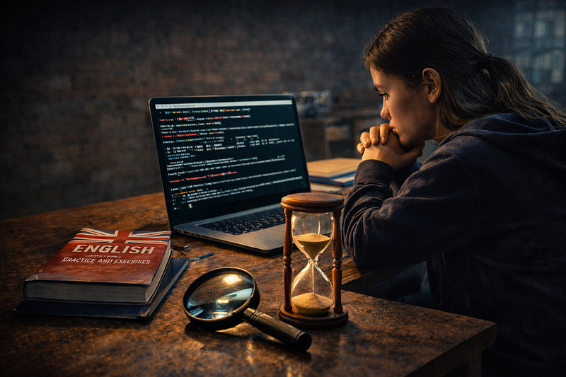
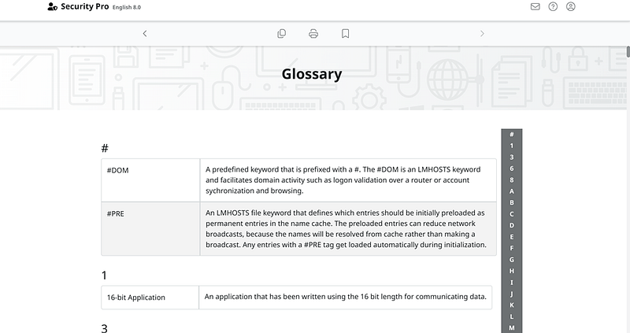

# I Thought Cybersecurity Was About Intelligence. It’s About Patience

---

## **I Thought Cybersecurity Was About Intelligence. It’s About Patience**

I came to cybersecurity from English teaching with high hopes: to do something more intellectually stimulating — and, of course, to earn more money. I expected it to be difficult but “I am a tough cookie” — or so I thought.

I’d lived through war, changed careers twice, made my dog an immigrant three times, and still believed — quite naively — that my new chosen field was all about intelligence.

I was wrong.

## **Cybersecurity job openings**

Before deciding that cyber was *for me*, I checked what job websites were offering to young cybersecurity specialists. The first couple of ads made me realize that I should’ve started learning cybersecurity in kindergarten.

Entry-level roles for pentesters or information security specialists on Indeed required 10 years of experience, government security clearance, OSCP, and several other acronyms you’re apparently expected to be born with. In return, they generously offered $19 an hour.

Very promising, I thought.

At this rate, acquiring all of that would only take the next 15 years. I just needed to be patient.

## **Terminology and acronyms**

Once I accepted this timeline, I met my next challenge: terminology.

Every college lecture and every CompTIA+ course drowned me in acronyms I was supposed to process faster than AI just to qualify for certifications like A+ or Security+. To make things even more exciting, some abbreviations had *multiple* meanings.

For example:  
 **IR** = *Incident Response*  
 **IR** = *Information Risk*

Very convenient.

For additional student enjoyment, CompTIA provided a glossary at the end of the course with all the terms and acronyms I was expected to know for Security+. It was over 150 pages long. I had 2.5 months to absorb it together with understanding the concepts and doing all the labs, because that was the timeframe my college gave me to complete the Network Security course based on CompTIA+.

Nothing difficult. I just needed to be patient.

## **“Easy” TryHackMe challenges**

Every TryHackMe challenge room labeled “easy” with an estimate completion time of 20 minutes on average took me 2 hours. I frequently encountered rooms that imply “you just don’t know it yet — but you will learn it here”, which forced me to open walkthroughs or YouTube.

Despite completing multiple learning paths on THM, during my first 6 months of studying I managed to complete only one room entirely on my own — without any outside help.

I was moving like a turtle.

Later, I learned that this is how it’s *supposed to be*. I just needed to be patient.

## **Learn cybersecurity like the English language**

After 9 months of daily studying — Linux, Python, and pentesting methodologies — I was on the verge of quitting. Everything was a struggle.

Learning English from scratch was much faster and easier than this.

However, confidence came with time. After my first year in college and an accumulation of knowledge from TryHackMe, Hack the Box, Python, INE and Udemy courses, I started encountering the concepts I dealt with in the past more and more often. This time, I met them with cautious reassurance instead of frustration.

As an ESL teacher, I am used to taking notes on everything. It worked here too.

I created separate files for:

- **Linux commands** (use it only occasionally now);

- **Python concepts and syntax** (use daily);

- **tools** (Metasploit, Hydra, Sherlock);

- **common vulnerabilities** (IDOR, Broken Access control, Path Traversal, SQL injection).

All of it was written in my own words — no heavy terminology, just my understanding. I did exactly the same when I was studying English: one notebook for vocabulary (by topic), one for grammar, and another one for exercises.

Once I applied the same approach for cybersecurity, things became easier. Those notes helped me to pass the eJPT, after which I started completing TryHackMe rooms without consulting anything.

It was an unexpected breakthrough.

I knew I just had to be patient!

## **When patience pays off**

As probably many humans, I wanted quick solutions — even though, as an ESL teacher, I hate marketing promises like “English from 0 to C1 level in two months.”

Approaching cybersecurity as a science, I realized the methodology should be exactly the same as language learning.

You go through stages.

**- A1 — beginner**

You progress quickly but feel overwhelmed by how much there is to learn. It seems impossible to hold all that information in your head, so you constantly mix up “he” and “she” — or IPS and IDS — and still freeze when someone asks you to spell your name (or run types of Nmap scans).

**- A2 — elementary**

You already know something and can “communicate,” but grammar is still painful (Linux commands, Python syntax). You can handle small talk, but the moment something changes, you panic and reach for a translator.

This is I think where I am now. When I reach B1 I will share how it feels.

The main thing I’ve learned during this 1-year cybersecurity journey is… well, I think you can figure it out by now😊

Nobody is born with expertise. It comes with experience, which Cambridge dictionary defines as “*the process of getting knowledge or skill from doing, seeing, or feeling things.”* Couldn’t have said it better.

I would just add two words:

**with time**

You just need to be patient.
