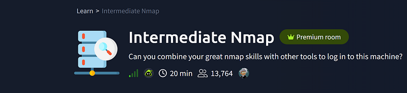
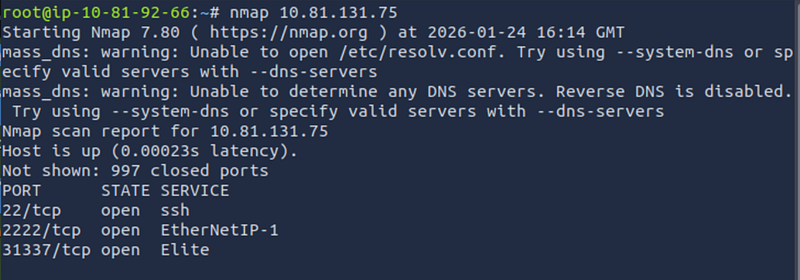
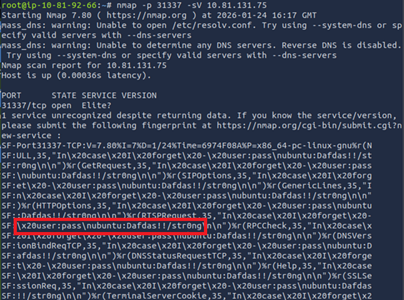
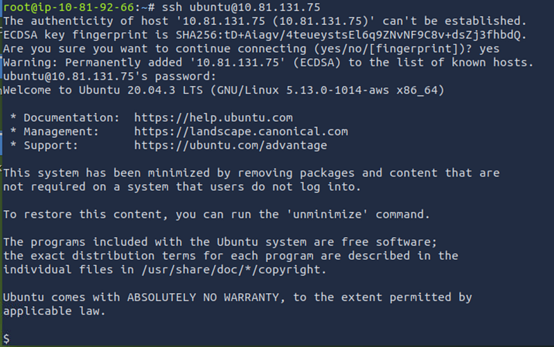
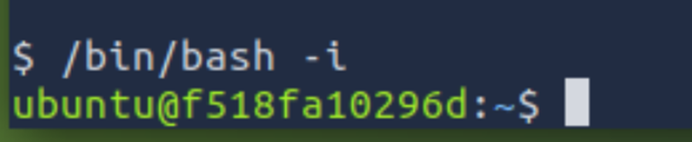
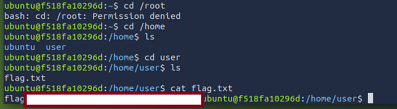

# Intermediate Nmap Walkthrough (TryHackMe)

---

TryHackMe room for beginners



## Step 1. Basic Nmap scan

Scan for open ports and services:


```bash
nmap 10.81.131.75
```


Don’t forget to replace this IP with your machine’s IP.



We discovered three ports: 22, 2222 and 31337. The last two may have something interesting. Let’s scan them separately.

## Step 2. Scan 31337

Let’s get more info on what is running on 31337:


```bash
nmap -p 31337 -sV 10.81.131.75
```




Here we go — the service banner leaked credentials:

**Username:** ubuntu

**Password:** Dafdas!!/str0ng

## Step 3. SSH

From a previous scan we know that port 22 is open. Let’s SSH and try these credentials:


```bash
ssh ubuntu@10.81.131.75
```




We got a connection!

Step 4. Spawn an interactive bash session:


```bash
/bin/bash -i
```




## Step 5. Search the system:


```bash
cd /root
```


permission denied

Let’s try to:


```bash
cd /home/user
```




Here is the flag!
